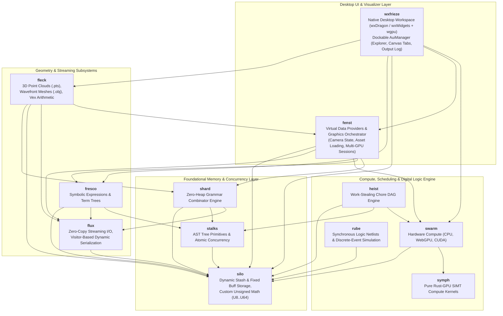

# Kosh: Native 3D GPU, Symbolic Computing & Digital Logic Workspace

**Kosh** is a high-performance, zero-heap-AST computational framework, digital logic simulation engine, and 3D geometric processing platform written in modern Rust. It is engineered for maximum memory efficiency, deterministic CPU cache locality, and heterogeneous SIMT hardware execution across multithreaded CPU, WebGPU (via `rust-gpu` SPIR-V bytecodes), and NVIDIA CUDA backends.

---

## Architecture & Subsystem Graph



---

## Subsystem & Module Matrix

| Module | Core Purpose | Primary Structs & Enums | Primary Traits & Macros | Wiki Reference |
| :--- | :--- | :--- | :--- | :--- |
| **`silo`** | Memory management, custom unsigned numerics, dynamic/fixed arrays | `U8`, `U16`, `U32`, `U64`, `Buff<T>`, `Stash<T>`, `Arr<'a, T>`, `Stk<'a, 'b, T>`, `USeg` | `IAccess`, `IArr`, `ICastExt`, `ISliceExt`, `Buff!`, `Stash!` | [Silo.md](wiki/Silo.md) |
| **`stalks`** | Concurrency primitives, AST nodes, stackful coroutines, worker thread abstraction | `Atm<T>`, `Spinlock`, `UniNode<C, Op>`, `BinNode<L, R, Op>`, `BinOp`, `Coro<In, Y, Out>`, `CoroRes<Y, R>`, `WorkPtr<'a>`, `Worker` | `AtomicInt`, `INode`, `ICoro`, `IWork`, `IWorker`, `NodeTree!`, `Coro!` | [Stalks.md](wiki/Stalks.md) |
| **`shard`** | Recursive-descent grammar combinators and streaming JSON | `Parser<'p>`, `Charset`, `Str`, `UIntShard`, `IntShard`, `HexShard`, `RealShard`, `WSpc`, `JSon<'a>` | `IGrammar`, `INotify`, `ShardTree!` | [Shard.md](wiki/Shard.md) |
| **`fresco`** | Symbolic algebra expressions and term repositories | `ExprRepos`, `PolyExpr`, `SumExpr`, `ProdExpr`, `PowExpr`, `RealExpr`, `VarExpr`, `VarAttrib`, `Term` | `ITermNode`, `AsTermNode`, `BaseExpr`, `TermTree!` | [Fresco.md](wiki/Fresco.md) |
| **`flux`** | Dynamic visitor serialization, streaming I/O buffers | `FixedStream<'a>`, `BuffStream<R>`, `OutStream<'a, W>`, `JsonOutStream<W>`, `FieldExp<'a>`, `FieldImp<'a>` | `IStream`, `IFluxExportSource`, `IFluxImportSource`, `ImplFluxSource!` | [Flux.md](wiki/Flux.md) |
| **`swarm`** | Hardware compute engine across CPU, WebGPU, and CUDA | `SwarmEngine`, `SwarmDevice`, `SwarmBuffer`, `SwarmKernel`, `StandardOp`, `SwarmMath` | `IComputeDevice`, `IComputeBuffer`, `IComputeKernel`, `IGpuOp` | [Swarm.md](wiki/Swarm.md) |
| **`symph`** | Rust-GPU SPIR-V compute kernels and algorithms (`no_std` for SPIR-V builds) | Pure SIMT functions (`wang_hash`, `collatz`, `pointcloud_elem`, `double_elem`, `vector_add_elem`) | SPIR-V Shaders (`pts_pointcloud_cs`, `camera_transform_cs`, `frustum_cull_cs`, `scene_vs`, `scene_fs`) | [Swarm.md](wiki/Swarm.md) |
| **`heist`** | Asynchronous workflow DAG orchestrator, data-parallel map-reduce, coroutine framework and work-stealing scheduler | `Atelier<'a>`, `Maestro<'a>`, `Chore`, `CoroChore`, `MapCollectNode<'a, T>`, `WorkerFatPtr`, `ChoreTarget`, `JobInfo`, `AtelierInfo` | `IAtelier`, `IMaestro`, `IChore`, `ICoroChore`, `IChoreNode`, `ChoreTree!`, `Chore!`, `CpuChore!`, `GpuAutoChore!`, `WeightedChore!`, `CoroChore!`, `WeightedCoroChore!`, `MapCollect!`, `CpuMapCollect!`, `GpuMapCollect!` | [Heist.md](wiki/Heist.md) |
| **`rube`** | Synchronous digital logic simulation and discrete-event dataflow framework | `Reg`, `TriggerState`, `TriggerWad`, `Layout`, `NetCompiler`, `SimEngine`, `SimContext`, `FastModule`, `CustomModule`, `Adder<N>` | `NandGate`, `AndGate`, `OrGate`, `NotGate`, `XorGate`, `CRSLatch`, `DLatch`, `RSLatch` | [Rube.md](wiki/Rube.md) |
| **`fleck`** | 3D Point Cloud (.pts) & Wavefront (.obj) mesh parsing, spatial bounding boxes, `Vex` | `PtsPoint`, `PtsCloud`, `WaveObjMesh`, `WaveObjFace`, `Vex<N, T>`, `Pt3f`, `WPt3f`, `Point32`, `RGB` | `ParsePts`, `ParsePtsStream`, `ParseWaveObj`, `ToDto` | [Fleck.md](wiki/Fleck.md) |
| **`fenst`** | Virtual data provider framework, graphics session & camera orchestrator | `XplrEntry`, `XplrContent`, `XplrLeafInfo`, `FsBranch`, `FsLeaf`, `FrescoBranch`, `ShardBranch`, `XplrRegistry`, `PtsSessionState`, `PtsFrameDto` | `Xplr`, `LeafXplr`, `BranchXplr`, `XplrProvider`, `CreateDefaultRegistry` | [Fenst.md](wiki/Fenst.md) |
| **`wxfrieze`** | Native desktop workspace built with `wxdragon` (wxWidgets 3.2+) and `wgpu` | `AppState`, `AppTheme`, `OpenTab`, `AuiManager`, `AuiPaneInfo`, `Notebook`, `ExplorerPanel`, `PtsView`, `ObjView`, `FrescoView` | `run()` | [Frieze.md](wiki/Frieze.md) |

---

## Key Architectural Pillars

### 1. Dual Memory Architecture: `Stash` (Dynamic) & `Buff` (Fixed Storage)
Kosh strictly rejects uncontrolled heap vector reallocation. Instead, all dynamic collections use a two-phase memory lifecycle:
1. **Dynamic Construction (`Stash<T>`)**: Uses raw pointer growth with amortized $O(1)$ push/pop (`PushX`, `Pop`, `Reserve`, `AppendStash`), avoiding per-element reallocation overhead.
2. **Immutable Final Storage (`Buff<T>`)**: Once mutation completes, `Stash::IntoBuff()` transfers ownership to an immutable, fixed-size `Buff<T>` with zero reallocations or wasted trailing capacity.
3. **No `std::vec::Vec`**: Standard vectors are completely eliminated across the entire codebase.

### 2. Zero-Heap AST Allocation Policy
In traditional AST designs, recursive trees require heap indirection (`Box<dyn Node>`), leading to allocator contention and memory fragmentation.
Kosh solves this by compiling AST node trees directly into concrete nested generic structures (`BinNode<L, R, Op>`, `UniNode<C, Op>`) via declarative macros (`NodeTree!`, `ShardTree!`, `TermTree!`, `ChoreTree!`).
Because the tree expressions are evaluated directly in the caller's stack frame, Rust's temporary lifetime extension guarantees that all child references remain valid without allocating a single byte on the heap.

### 3. Project-Defined Transparent Unsigned Numeric Types
The `silo::uint` module defines custom integer wrappers (`U8`, `U16`, `U32`, `U64`) using `#[repr(transparent)]`.
These types enforce wrapping arithmetic semantics, eliminate implicit casting pitfalls, provide atomic interoperability with `Atm<T>`, and enable zero-copy slice and buffer transformations via `ICastExt` and `ISliceExt`.

### 4. Portable SIMT Compute (CPU, WebGPU, CUDA)
Compute algorithms in `symph` are implemented once in Rust. The crate uses `#![no_std]` when compiled for the SPIR-V target and uses the standard library for host builds:
- When running on GPU backends (`RustGpuDevice`), they are compiled to SPIR-V bytecodes via `rust-gpu` and dispatched over WebGPU compute pipelines.
- When running on CUDA backends (`CudaOxideDevice`), they execute with CUDA driver / PTX headers.
- When falling back to CPU (`CpuDevice`), they execute across multithreaded SIMT thread pools using 64-element workgroup chunks.

### 5. Work-Stealing Chore DAG Engine, Data-Parallel MapCollect & Coroutines (`heist`)
Asynchronous workflows, data streams, and cooperative fibers are represented as DAG expressions via `ChoreTree!`, `MapCollect!`, and `CoroChore!`:
- **Sequential & Parallel DSL**: `A < B` guarantees that job `B` will only run after `A` decrements `B`'s atomic predecessor counter (`_SzPreds`) to zero; `A | B` posts tasks simultaneously across worker threads.
- **Chore-Weight & Automatic Sequential Fusion**: Nodes carry estimated execution weights (`_Weight: U32`). Sequences whose cumulative weight is $\le \text{atelier.FusionThres()}$ (default `2`, runtime configurable via `_FusionThres`) are automatically fused into a single contiguous task (`FusedChore`), avoiding scheduler queue round-trips.
- **Adaptive Data-Parallel Slicing**: `MapCollectNode` splits contiguous `Arr<'a, T>` payloads dynamically across $2 \times N_{maestros}$ chunks with automatic work-stealing, joining at an explicit collect synchronization barrier.
- **Cooperative Stackful Coroutines (`CoroChore`)**: Zero-overhead fibers (`corosensei`) execute multi-phase tasks that yield checkpoints back to the scheduler, dynamically re-enqueuing continuations across thread boundaries without dropping DAG barrier synchronization.
- **Work Stealing**: Worker threads (`Maestro`) execute pending jobs from thread-local queues and dynamically steal tasks from peers using Knuth multiplicative hash pseudo-random distribution.

### 6. Strict Graphics Ownership Pipeline
- **`wxfrieze` is Presentation Only**: `wxfrieze` manages native window events, user input, dockable AUI layout panes, and paints backend-projected primitives. It strictly does not parse raw geometry, compute camera matrices, cull primitives, or execute heavy graphics shaders.
- **`fenst` Orchestrates Graphics**: `fenst` owns graphics sessions, asset loading, camera state, and frame serialization. All heavy graphics computations and 3D projections are delegated through `swarm` to `symph` compute kernels.

### 7. Synchronous Digital Logic & Discrete-Event Simulation (`rube`)
- **Unified 16-Byte Multi-Value Register (`Reg`)**: Bit-packed 2-state and 4-state logic (0, 1, X) with IEEE-1364 bitwise operators (`!`, `&`, `|`, `^`).
- **Array-of-Structures (AoS) Temporal Latching**: 48-byte `TriggerState` cells (`_Past`, `_Current`, `_Future`) fit within a single 64-byte L1 cache line.
- **Topological Net Compilation (`NetCompiler`)**: Merges connected ports via Disjoint-Set Union (DSU) in $O(P \cdot \alpha(P))$ time.
- **Dual Execution Modes**: Multicycle synchronous clock-ticking (`SimEngine`) and discrete-event delta-cycle propagation (`SimContext`) with flat 64-bit word bitmasks and inverted sensitivity indexes.

---

## Quickstart & CLI Commands

### Prerequisites
- **Rust Toolchain**: Modern Rust toolchain (Rust 2024 edition compatible).
- **CMake & Ninja / MSVC**: Required for compiling native wxWidgets libraries via `wxdragon-sys`.

### Build and Test
```powershell
# Build entire workspace
cargo build

# Run comprehensive test suite
cargo test

# Run tests in release mode with logging
cargo test --release -- --nocapture
```

### Running the Kosh Desktop Workspace
The root binary launches the native `wxfrieze` workspace:
```powershell
# Default launch: native wxWidgets AUI workspace with direct GPU canvas
cargo run

# Run in optimized release mode
cargo run --release
```

### Running Tests via Kosh CLI Harness
```powershell
# Run all internal unit tests through the Kosh CLI harness
cargo run -- --test

# Filter specific tests with verbose logging
cargo run -- --verbose --test Scene

# Run with test output visible
cargo run -- --nocapture --test QSort
```

---

## Complete Wiki Documentation

Explore the full in-depth documentation in the **[wiki/](wiki/Architecture.md)** folder:

- **[System Architecture Overview](wiki/Architecture.md)**
- **[Silo (Memory & Types)](wiki/Silo.md)**
- **[Stalks (Concurrency & AST Nodes)](wiki/Stalks.md)**
- **[Shard (Grammar & Parser)](wiki/Shard.md)**
- **[Fresco (Symbolic Algebra)](wiki/Fresco.md)**
- **[Flux (Streaming & Serialization)](wiki/Flux.md)**
- **[Swarm & Symph (GPU/CPU Compute)](wiki/Swarm.md)**
- **[Heist (Chore DAG Orchestration)](wiki/Heist.md)**
- **[Rube (Digital Logic & Discrete-Event Simulation)](wiki/Rube.md)**
- **[Fleck (Point Cloud & Mesh Parsing)](wiki/Fleck.md)**
- **[Fenst (Virtual Explorer & Graphics Orchestration)](wiki/Fenst.md)**
- **[Frieze / WxFrieze (Native Desktop Workspace)](wiki/Frieze.md)**
- **[Serialization Optimization Notes](wiki/Serialization_Optimization.md)**
