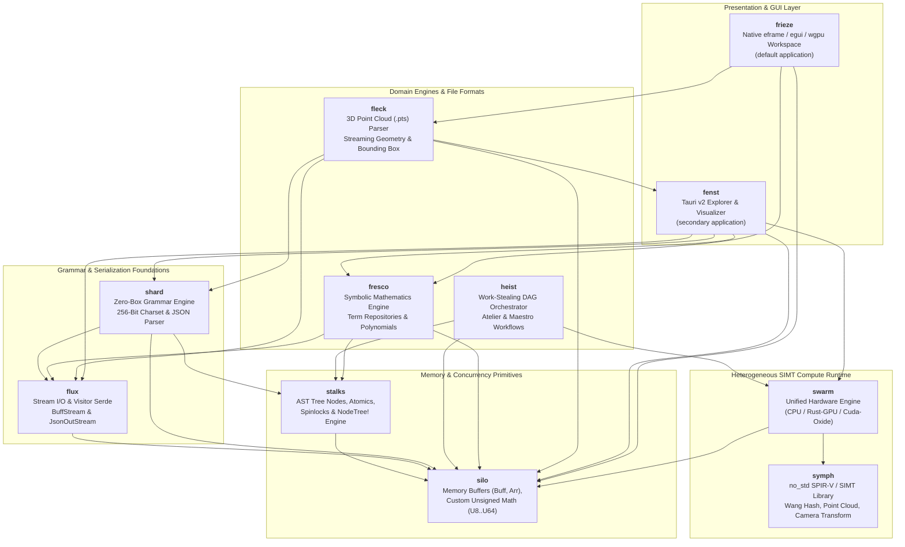

# Kosh — High-Performance Computational, Symbolic & Heterogeneous SIMT Engine

[](https://www.rust-lang.org)
[](LICENSE)
[]()
[]()

**Kosh** is a systems-level computational platform written in Rust. It combines a zero-heap-allocation recursive-descent grammar engine, a symbolic mathematical algebra repository, an asynchronous work-stealing DAG orchestrator, and a unified heterogeneous compute runtime targeting multithreaded CPU SIMT, WebGPU / Vulkan (Rust-GPU SPIR-V), and CUDA PTX.

---

## 🏛️ System Architecture



---

## 📦 Subsystem & Module Matrix

| Module | Core Purpose | Primary Structs & Enums | Primary Traits & Macros | Wiki Reference |
| :--- | :--- | :--- | :--- | :--- |
| **`silo`** | Memory management, custom unsigned numerics, contiguous arrays | `U8`, `U16`, `U32`, `U64`, `Buff<T>`, `Arr<'a, T>`, `Stk<'a, 'b, T>`, `Stash<T>`, `USeg` | `IAccess`, `IArr`, `ICastExt`, `ISliceExt`, `Buff!`, `Stash!` | [Silo.md](wiki/Silo.md) |
| **`stalks`** | Concurrency primitives, AST nodes, worker thread abstraction | `Atm<T>`, `Spinlock`, `UniNode<C, Op>`, `BinNode<L, R, Op>`, `BinOp`, `WorkPtr<'a>`, `Worker` | `AtomicInt`, `INode`, `IWork`, `IWorker`, `NodeTree!` | [Stalks.md](wiki/Stalks.md) |
| **`shard`** | Recursive-descent grammar combinators and streaming JSON | `Parser<'p>`, `Charset`, `Str`, `UIntShard`, `IntShard`, `HexShard`, `RealShard`, `WSpc`, `JSon<'a>` | `IGrammar`, `INotify`, `ShardTree!` | [Shard.md](wiki/Shard.md) |
| **`fresco`** | Symbolic algebra expressions and term repositories | `ExprRepos`, `PolyExpr`, `SumExpr`, `ProdExpr`, `PowExpr`, `RealExpr`, `VarExpr`, `VarAttrib`, `Term` | `ITermNode`, `AsTermNode`, `BaseExpr`, `TermTree!` | [Fresco.md](wiki/Fresco.md) |
| **`flux`** | Dynamic visitor serialization, streaming I/O buffers | `FixedStream<'a>`, `BuffStream<R>`, `OutStream<'a, W>`, `JsonOutStream<W>`, `FieldExp<'a>`, `FieldImp<'a>` | `IStream`, `IFluxExportSource`, `IFluxImportSource`, `ImplFluxSource!` | [Flux.md](wiki/Flux.md) |
| **`swarm`** | Hardware compute engine across CPU, WebGPU, and CUDA | `SwarmEngine`, `SwarmDevice`, `SwarmBuffer`, `SwarmKernel`, `StandardOp`, `SwarmMath` | `IComputeDevice`, `IComputeBuffer`, `IComputeKernel`, `IGpuOp` | [Swarm.md](wiki/Swarm.md) |
| **`symph`** | Rust-GPU SPIR-V compute kernels and algorithms (`no_std` for SPIR-V builds) | Pure SIMT functions (`wang_hash`, `collatz`, `pointcloud_elem`, `double_elem`, `vector_add_elem`) | SPIR-V Shaders (`pts_pointcloud_cs`, `camera_transform_cs`, `frustum_cull_cs`, `scene_vs`, `scene_fs`) | [Swarm.md](wiki/Swarm.md) |
| **`heist`** | Asynchronous workflow DAG orchestrator and scheduler | `Atelier<'a>`, `Maestro<'a>`, `Chore`, `ChoreTarget`, `JobInfo`, `AtelierInfo` | `IChoreNode`, `ChoreTree!`, `Chore!`, `CpuChore!`, `GpuAutoChore!` | [Heist.md](wiki/Heist.md) |
| **`fleck`** | 3D Point Cloud (.pts) parsing and spatial bounding boxes | `PtsPoint`, `Point32`, `RGB`, `PtsCloud`, `PtsShard<'a>` | `ParsePts`, `ParsePtsStream`, `ToDto` | [Fleck.md](wiki/Fleck.md) |
| **`fenst`** | Virtual data provider framework, Tauri desktop explorer, and 3D visualizer | `XplrEntry`, `XplrContent`, `XplrLeafInfo`, `FsBranch`, `FsLeaf`, `FrescoBranch`, `ShardBranch`, `XplrRegistry`, `PtsSessionState`, `PtsFrameDto` | `Xplr`, `LeafXplr`, `BranchXplr`, `XplrProvider`, `CreateDefaultRegistry`, Tauri command API | [Fenst.md](wiki/Fenst.md) |
| **`frieze`** | Primary native desktop workspace built with `eframe`, `egui`, and `wgpu` | `KoshApp`, application state, tab views | `run()` | [Frieze.md](wiki/Frieze.md) |
| **`aura`** | Tauri frontend assets, application icons, and GUI configuration | HTML/JavaScript/CSS files, PNG/ICO icons, capability manifests | N/A (static assets & config) | [Aura.md](wiki/Aura.md) |

---

## ⚡ Key Architectural Pillars

### 1. Zero-Heap AST Allocation Policy
In traditional AST designs, recursive trees require heap indirection (`Box<dyn Node>`), leading to allocator contention and memory fragmentation.
Kosh solves this by compiling AST node trees directly into concrete nested generic structures (`BinNode<L, R, Op>`, `UniNode<C, Op>`) via declarative macros (`NodeTree!`, `ShardTree!`, `TermTree!`, `ChoreTree!`).
Because the tree expressions are evaluated directly in the caller's stack frame, Rust's temporary lifetime extension guarantees that all child references remain valid without allocating a single byte on the heap.

### 2. Project-Defined Transparent Unsigned Numeric Types
The `silo::uint` module defines custom integer wrappers (`U8`, `U16`, `U32`, `U64`) using `#[repr(transparent)]`.
These types enforce wrapping arithmetic semantics, eliminate implicit casting pitfalls, provide atomic interoperability with `Atm<T>`, and enable zero-copy slice and buffer transformations via `ICastExt` and `ISliceExt`.

### 3. Portable SIMT Compute (CPU, WebGPU, CUDA)
Compute algorithms in `symph` are implemented once in Rust. The crate uses `#![no_std]` when compiled for the SPIR-V target and uses the standard library for host builds:
- When running on GPU backends (`RustGpuDevice`), they are compiled to SPIR-V bytecodes via `rust-gpu` and dispatched over WebGPU compute pipelines.
- When running on CUDA backends (`CudaOxideDevice`), they execute with CUDA driver / PTX headers.
- When falling back to CPU (`CpuDevice`), they execute across multithreaded SIMT thread pools using 64-element workgroup chunks.

### 4. Work-Stealing Chore DAG Engine (`heist`)
Asynchronous workflows are represented as DAG expressions via `ChoreTree!`.
- Sequential execution: `A < B` guarantees that job `B` will only run after `A` decrements `B`'s atomic predecessor counter (`_SzPreds`) to zero.
- Parallel branches: `A | B` posts tasks simultaneously across worker threads.
- Worker threads (`Maestro`) execute pending jobs from thread-local queues and dynamically steal tasks from peers using Knuth multiplicative hash pseudo-random distribution.

---

## 🚀 Quickstart & CLI Commands

### Prerequisites
- **Rust Toolchain**: The pinned `nightly-2026-05-22` toolchain, including `rust-src`, `rustc-dev`, and `llvm-tools`.
- **Cargo**: Included with the standard Rust toolchain.

### Build and Test
```powershell
# Build entire workspace
cargo build

# Run comprehensive test suite (80 unit tests)
cargo test

# Run tests in release mode with logging
cargo test --release -- --nocapture
```

### Running Kosh Applications
The root binary launches the native `frieze` workspace by default. `fenst` and its `aura` assets remain available as the secondary Tauri frontend:
```powershell
# Default launch: native eframe/egui/wgpu workspace
cargo run

# Run in optimized release mode
cargo run --release

# Launch the secondary Tauri explorer
cargo run -- --aura
```

### Running Tests
The CLI test flag delegates to `cargo test`; use `--nocapture` as a Kosh CLI option before the test filter:
```powershell
# Run all internal unit tests through the Kosh CLI harness
cargo run -- --test

# Filter specific tests (e.g. QSort) with verbose logging
cargo run -- --verbose --test QSort

# Run with test output visible
cargo run -- --nocapture --test Scene

# Direct Cargo equivalents
cargo test
cargo test Scene -- --nocapture
```

---

## 📖 Complete Wiki Documentation

Explore the full in-depth documentation in the **[wiki/](wiki/Architecture.md)** folder:

- **[System Architecture Overview](wiki/Architecture.md)**
- **[Silo (Memory & Types)](wiki/Silo.md)**
- **[Stalks (Concurrency & AST Nodes)](wiki/Stalks.md)**
- **[Shard (Grammar & Parser)](wiki/Shard.md)**
- **[Fresco (Symbolic Algebra)](wiki/Fresco.md)**
- **[Flux (Streaming & Serialization)](wiki/Flux.md)**
- **[Swarm & Symph (GPU/CPU Compute)](wiki/Swarm.md)**
- **[Heist (Chore DAG Orchestration)](wiki/Heist.md)**
- **[Fleck (Point Cloud Parsing)](wiki/Fleck.md)**
- **[Fenst (Virtual Explorer & Desktop GUI)](wiki/Fenst.md)**
- **[Frieze (Native Desktop Workspace)](wiki/Frieze.md)**
- **[Aura (Tauri Frontend Assets)](wiki/Aura.md)**
- **[Serialization Optimization Notes](wiki/Serialization_Optimization.md)**
