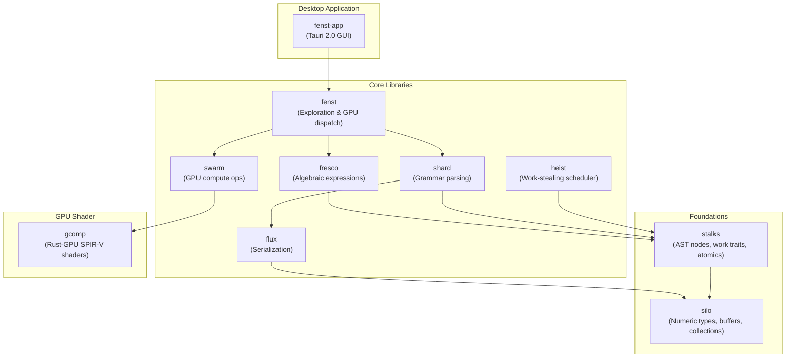

# Kosh

A high-performance geometry, constraints, and BRep kernel written in Rust. Kosh explores modern programming paradigms—zero-heap AST construction, Rust-GPU compute shaders, work-stealing parallelism, and unified zero-allocation data exchange—to build a fast, cache-friendly foundation for geometric computation.

## Architecture Overview

Kosh is organized as a layered workspace of tightly integrated modules. The dependency graph flows from low-level primitives upward to the desktop application:



## Module Inventory

| Module | Purpose | Key Source Files |
|--------|---------|-----------------|
| **silo** | Custom numeric types (`U8`, `U16`, `U32`, `U64`), contiguous buffers (`Buff`, `Arr`), stack collections (`Stk`, `Stash`), range segments (`USeg`), and zero-copy slice casting (`ISliceExt`). | [uint.rs](src/silo/uint.rs), [buff.rs](src/silo/buff.rs), [arr.rs](src/silo/arr.rs), [cast.rs](src/silo/cast.rs) |
| **stalks** | Unified AST node generics (`BinNode`, `UniNode`), the `NodeTree!` macro for operator-precedence parsing, atomic primitives (`Atm`, `Spinlock`), and the `IWork`/`IWorker` trait hierarchy. | [node.rs](src/stalks/node.rs), [atm.rs](src/stalks/atm.rs), [work.rs](src/stalks/work.rs) |
| **flux** | Zero-allocation serialization framework. `FluxOut` (export via `IFluxExportSource`) and `FluxIn` (import via `IFluxImportSource`) pipelines inject/extract data directly into struct memory layouts. Includes `JsonOutStream`, `FixedStream`, and `BuffStream`. | [fluxexport.rs](src/flux/fluxexport.rs), [fluximport.rs](src/flux/fluximport.rs), [instream.rs](src/flux/instream.rs) |
| **shard** | Zero-heap-allocation grammar parsing AST. Leaf nodes (`StrShard`, `Charset`), binary nodes (`BinShard`), unary modifiers (`RepeatShard`, `ActionShard`), and the `ShardTree!` DSL macro. Includes a JSON parser (`JsonShard`). | [leaves.rs](src/shard/leaves.rs), [binshard.rs](src/shard/binshard.rs), [parser.rs](src/shard/parser.rs), [jsonshard.rs](src/shard/jsonshard.rs) |
| **fresco** | Algebraic expression repository. `TermTree!` builds symbolic math ASTs on the stack; `ExprRepos` flattens and compiles them into efficient multi-operand expressions (`SumExpr`, `ProdExpr`, `PowExpr`, `VarExpr`). | [termtree.rs](src/fresco/termtree.rs), [exprrepos.rs](src/fresco/exprrepos.rs) |
| **heist** | Work-stealing task scheduler with DAG-based dependency resolution. `Atelier` manages a thread pool, `Maestro` workers steal jobs via randomized Knuth hashing, and `ChoreTree!` defines dependency graphs with `<` (sequencing) and `\|` (parallelism). | [atelier.rs](src/heist/atelier.rs), [maestro.rs](src/heist/maestro.rs), [choretree.rs](src/heist/choretree.rs) |
| **swarm** | Unified CPU and GPU compute abstraction layer across **CPU** (multi-threaded SIMT), **Rust-GPU / WebGPU** (SPIR-V & WGSL via `wgpu`), and **Cuda-Oxide** (CUDA / PTX). Provides hardware discovery, `SwarmEngine`, `IComputeDevice`, and `IGpuOp`. | [mod.rs](src/swarm/mod.rs), [engine.rs](src/swarm/engine.rs), [traits.rs](src/swarm/traits.rs) |
| **gcomp** | Rust-GPU `#![no_std]` compute shader crate. Contains the `pts_pointcloud_cs` kernel using Wang Hash PRNG for deterministic 3D point generation. Compiled to SPIR-V at build time. | [lib.rs](src/gcomp/src/lib.rs) |
| **fenst** | Multi-scheme file exploration engine (`file://`, `ast://`, `fresco://`, `shard://`). `XplrProvider` trait, `XplrRegistry`, content chunking, and GPU point cloud pipeline dispatch via `wgpu`. | [mod.rs](src/fenst/mod.rs), [provider.rs](src/fenst/provider.rs), [xplr.rs](src/fenst/xplr.rs) |
| **fenst-app** | Tauri 2.0 desktop application. Interactive file explorer frontend, dedicated `.pts` point cloud viewer window with Rust-GPU-powered 3D rendering, and backend-driven projection/depth-sorting. | [xplrcmds.rs](src/fenst-app/src/xplrcmds.rs), [pts_viewer.js](src/fenst-app/frontend/pts_viewer.js) |

## Unified AST Architecture

Kosh features a unified Abstract Syntax Tree (AST) design defined in [stalks/node.rs](src/stalks/node.rs) that consolidates the binary and unary node structures across all modules:

* **Unified Nodes**: Generics `BinNode<L, R, Op>` and `UniNode<C, Op>` represent binary and unary nodes across the entire AST framework.
* **Unified Binary Operators**: The `BinOp` enum defines all binary operators:
  - Arithmetic operators: `Sum = 0`, `Prod = 1`, `Sub = 2`, `Div = 3`, `Pow = 4`.
  - Traversal/Structural operators: `Less = 6` (`<`), and `Bor = 7` (`|`).
* **Centralized Parser (`NodeTree!`)**: A generic, highly optimized recursive macro `NodeTree!` handles infix operator precedence and prefix rule parsing. Domain-specific macros (`ChoreTree!`, `TermTree!`, `ShardTree!`) delegate parsing to `NodeTree!` and only contain leaf/node construction calls.
* **Readable AST Output**: Implementations of `std::fmt::Display` and `std::fmt::Debug` format the unified node trees into readable symbolic infix expressions (e.g. `(a < (b | c))`).

## Documentation

| Document | Description |
|----------|-------------|
| [Fenst Architecture](wiki/FenstArch.md) | Multi-scheme file exploration provider framework and Tauri desktop application. |
| [Flux Architecture](wiki/FluxArch.md) | Zero-allocation injection/extraction data exchange standard. |
| [Heist Architecture](wiki/HeistArch.md) | Work-stealing scheduling & dependency resolution framework. |
| [Rust-GPU Architecture](wiki/RustGpuArch.md) | Native Rust to SPIR-V compute shader compilation pipeline and `wgpu` integration. |
| [Shard Architecture](wiki/ShardArch.md) | Zero-heap allocation AST framework for recursive grammar parsing. |
| [Swarm GPU Tests](wiki/SwarmTests.md) | GPU compute test demonstrations with `wgpu` and inline WGSL shaders. |
| [TermTree Architecture](wiki/TermArch.md) | Standalone algebraic term AST and compilation framework. |

## Build & Run

### Prerequisites

- **Rust nightly** — required by the `rust-gpu` compiler backend. The project pins the toolchain via [`rust-toolchain.toml`](rust-toolchain.toml).
- **Vulkan SDK** — required for GPU compute shader execution (both `gcomp` SPIR-V compilation and `swarm` tests).

### Compile

```bash
cargo build
```

This compiles the `kosh` library and CLI, the `gcomp` shader crate to SPIR-V, and the `fenst-app` Tauri desktop application.

### Test

```bash
cargo test
```

For GPU compute tests (swarm), run with a single test thread to avoid concurrent GPU adapter contention:

```bash
cargo test -- --test-threads=1 swarm
```

### Run CLI

```bash
cargo run -- --help           # Show CLI options
cargo run -- --test           # Run all unit tests via the CLI wrapper
cargo run -- --test shard     # Run tests matching "shard"
cargo run -- -v               # Enable verbose (debug) logging
```

### Run Desktop App (Fenst)

```bash
cargo tauri dev
```
