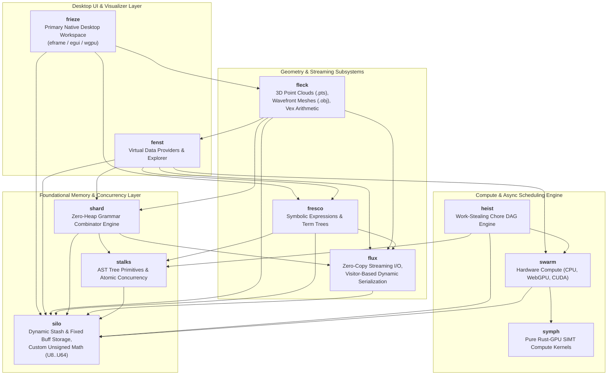

<div align="center">

# KOSH

**High-Performance Computational Framework, 3D Geometry Engine & Heterogeneous Compute Pipeline**

[](https://www.rust-lang.org/)
[](LICENSE)
[]()
[-success.svg)]()
[-blueviolet.svg)]()

</div>

---

## ?? System Overview

**Kosh** is an ultra-low-latency, zero-heap-AST computational framework and 3D geometric processing system written in modern Rust. It is architected for maximum memory efficiency, CPU cache locality, and heterogeneous SIMT execution across CPU, WebGPU, and CUDA hardware.

The codebase enforces strict, deterministic memory ownership:
- **No `std::vec::Vec` References**: All memory is explicitly managed via custom `silo` primitives (`Stash<T>` for amortized $O(1)$ growable dynamic buffers, `Buff<T>` for immutable fixed-size final storage, and `Arr<'a, T>` for zero-copy views).
- **Stack-Allocated Generic AST Trees**: Eliminates heap pointer indirection (`Box<dyn Node>`) using temporary lifetime extension across grammar combinators (`shard`), symbolic algebra (`fresco`), and chore schedulers (`heist`).
- **Unified SIMT Execution**: Write algorithms once in pure Rust within `symph`, executing natively as SPIR-V compute shaders on GPUs or multithreaded SIMT workgroups on CPU.
- **Native Visual Workspace**: Features **`frieze`** as the immediate-mode pure-Rust native desktop workspace (built with `eframe`, `egui`, and `wgpu`), with virtual explorer providers powered by **`fenst`**.

---

## ??? System Architecture



---

## ?? Subsystem & Module Matrix

| Module | Core Purpose | Primary Structs & Enums | Primary Traits & Macros | Wiki Reference |
| :--- | :--- | :--- | :--- | :--- |
| **`silo`** | Memory management, custom unsigned numerics, dynamic/fixed arrays | `U8`, `U16`, `U32`, `U64`, `Buff<T>`, `Stash<T>`, `Arr<'a, T>`, `Stk<'a, 'b, T>`, `USeg` | `IAccess`, `IArr`, `ICastExt`, `ISliceExt`, `Buff!`, `Stash!` | [Silo.md](wiki/Silo.md) |
| **`stalks`** | Concurrency primitives, AST nodes, worker thread abstraction | `Atm<T>`, `Spinlock`, `UniNode<C, Op>`, `BinNode<L, R, Op>`, `BinOp`, `WorkPtr<'a>`, `Worker` | `AtomicInt`, `INode`, `IWork`, `IWorker`, `NodeTree!` | [Stalks.md](wiki/Stalks.md) |
| **`shard`** | Recursive-descent grammar combinators and streaming JSON | `Parser<'p>`, `Charset`, `Str`, `UIntShard`, `IntShard`, `HexShard`, `RealShard`, `WSpc`, `JSon<'a>` | `IGrammar`, `INotify`, `ShardTree!` | [Shard.md](wiki/Shard.md) |
| **`fresco`** | Symbolic algebra expressions and term repositories | `ExprRepos`, `PolyExpr`, `SumExpr`, `ProdExpr`, `PowExpr`, `RealExpr`, `VarExpr`, `VarAttrib`, `Term` | `ITermNode`, `AsTermNode`, `BaseExpr`, `TermTree!` | [Fresco.md](wiki/Fresco.md) |
| **`flux`** | Dynamic visitor serialization, streaming I/O buffers | `FixedStream<'a>`, `BuffStream<R>`, `OutStream<'a, W>`, `JsonOutStream<W>`, `FieldExp<'a>`, `FieldImp<'a>` | `IStream`, `IFluxExportSource`, `IFluxImportSource`, `ImplFluxSource!` | [Flux.md](wiki/Flux.md) |
| **`swarm`** | Hardware compute engine across CPU, WebGPU, and CUDA | `SwarmEngine`, `SwarmDevice`, `SwarmBuffer`, `SwarmKernel`, `StandardOp`, `SwarmMath` | `IComputeDevice`, `IComputeBuffer`, `IComputeKernel`, `IGpuOp` | [Swarm.md](wiki/Swarm.md) |
| **`symph`** | Rust-GPU SPIR-V compute kernels and algorithms (`no_std` for SPIR-V builds) | Pure SIMT functions (`wang_hash`, `collatz`, `pointcloud_elem`, `double_elem`, `vector_add_elem`) | SPIR-V Shaders (`pts_pointcloud_cs`, `camera_transform_cs`, `frustum_cull_cs`, `scene_vs`, `scene_fs`) | [Swarm.md](wiki/Swarm.md) |
| **`heist`** | Asynchronous workflow DAG orchestrator and scheduler | `Atelier<'a>`, `Maestro<'a>`, `Chore`, `ChoreTarget`, `JobInfo`, `AtelierInfo` | `IChoreNode`, `ChoreTree!`, `Chore!`, `CpuChore!`, `GpuAutoChore!` | [Heist.md](wiki/Heist.md) |
| **`fleck`** | 3D Point Cloud (.pts) & Wavefront (.obj) mesh parsing, spatial bounding boxes, `Vex` | `PtsPoint`, `PtsCloud`, `WaveObjMesh`, `WaveObjFace`, `Vex<N, T>`, `Pt3f`, `WPt3f`, `Point32`, `RGB` | `ParsePts`, `ParsePtsStream`, `ParseWaveObj`, `ToDto` | [Fleck.md](wiki/Fleck.md) |
| **`fenst`** | Virtual data provider framework and 3D visualizer | `XplrEntry`, `XplrContent`, `XplrLeafInfo`, `FsBranch`, `FsLeaf`, `FrescoBranch`, `ShardBranch`, `XplrRegistry`, `PtsSessionState`, `PtsFrameDto` | `Xplr`, `LeafXplr`, `BranchXplr`, `XplrProvider`, `CreateDefaultRegistry`, Provider & session API | [Fenst.md](wiki/Fenst.md) |
| **`frieze`** | Primary native desktop workspace built with `eframe`, `egui`, and `wgpu` | `KoshApp`, `AppState`, `ViewTab`, `ExplorerView`, `PtsView`, `ObjView`, `FrescoView` | `run()` | [Frieze.md](wiki/Frieze.md) |

---

## ? Key Architectural Pillars

### 1. Dual Memory Architecture: `Stash` (Dynamic) & `Buff` (Fixed Storage)
Kosh strictly rejects uncontrolled heap vector reallocation. Instead, all dynamic collections use a two-phase memory lifecycle:
1. **Dynamic Construction (`Stash<T>`)**: Uses raw pointer growth with amortized $O(1)$ push/pop (`PushX`, `Pop`, `Reserve`, `AppendStash`), avoiding per-element reallocation overhead.
2. **Immutable Final Storage (`Buff<T>`)**: Once mutation completes, `Stash::IntoBuff()` transfers ownership to an immutable, fixed-size `Buff<T>` with zero reallocations or wasted trailing capacity.
3. **No `std::vec::Vec`**: Standard vectors are completely eliminated across the entire codebase.

### 2. Zero-Heap AST Allocation Policy
In traditional AST designs, recursive trees require heap indirection (`Box<dyn Node>`), leading to allocator contention and memory fragmentation.
Kosh solves this by compiling AST node trees directly into concrete nested generic structures (`BinNode<L, R, Op>`, `UniNode<C, Op>`) via declarative macros (`NodeTree!`, `ShardTree!`, `TermTree!`, `ChoreTree!`).
Because the tree expressions are evaluated directly in the caller's stack frame, Rust's temporary lifetime extension guarantees that all child references remain valid without allocating a single byte on the heap.

### 3. Project-Defined Transparent Unsigned Numeric Types
The `silo::uint` module defines custom integer wrappers (`U8`, `U16`, `U32`, `U64`) using `#[repr(transparent)]`.
These types enforce wrapping arithmetic semantics, eliminate implicit casting pitfalls, provide atomic interoperability with `Atm<T>`, and enable zero-copy slice and buffer transformations via `ICastExt` and `ISliceExt`.

### 4. Portable SIMT Compute (CPU, WebGPU, CUDA)
Compute algorithms in `symph` are implemented once in Rust. The crate uses `#![no_std]` when compiled for the SPIR-V target and uses the standard library for host builds:
- When running on GPU backends (`RustGpuDevice`), they are compiled to SPIR-V bytecodes via `rust-gpu` and dispatched over WebGPU compute pipelines.
- When running on CUDA backends (`CudaOxideDevice`), they execute with CUDA driver / PTX headers.
- When falling back to CPU (`CpuDevice`), they execute across multithreaded SIMT thread pools using 64-element workgroup chunks.

### 5. Work-Stealing Chore DAG Engine (`heist`)
Asynchronous workflows are represented as DAG expressions via `ChoreTree!`.
- Sequential execution: `A < B` guarantees that job `B` will only run after `A` decrements `B`'s atomic predecessor counter (`_SzPreds`) to zero.
- Parallel branches: `A | B` posts tasks simultaneously across worker threads.
- Worker threads (`Maestro`) execute pending jobs from thread-local queues and dynamically steal tasks from peers using Knuth multiplicative hash pseudo-random distribution.

---

## ?? Quickstart & CLI Commands

### Prerequisites
- **Rust Toolchain**: The pinned `nightly-2026-05-22` toolchain, including `rust-src`, `rustc-dev`, and `llvm-tools`.
- **Cargo**: Included with the standard Rust toolchain.

### Build and Test
```powershell
# Build entire workspace
cargo build

# Run comprehensive test suite (119 unit tests)
cargo test

# Run tests in release mode with logging
cargo test --release -- --nocapture
```

### Running Kosh Applications
The root binary launches the native `frieze` workspace:
```powershell
# Default launch: native eframe/egui/wgpu workspace
cargo run

# Run in optimized release mode
cargo run --release
```

### Running Tests
The CLI test flag delegates to `cargo test`; use `--nocapture` as a Kosh CLI option before the test filter:
```powershell
# Run all internal unit tests through the Kosh CLI harness
cargo run -- --test

# Filter specific tests (e.g. QSort) with verbose logging
cargo run -- --verbose --test QSort

# Run with test output visible
cargo run -- --nocapture --test Scene

# Direct Cargo equivalents
cargo test
cargo test Scene -- --nocapture
```

---

## ?? Complete Wiki Documentation

Explore the full in-depth documentation in the **[wiki/](wiki/Architecture.md)** folder:

- **[System Architecture Overview](wiki/Architecture.md)**
- **[Silo (Memory & Types)](wiki/Silo.md)**
- **[Stalks (Concurrency & AST Nodes)](wiki/Stalks.md)**
- **[Shard (Grammar & Parser)](wiki/Shard.md)**
- **[Fresco (Symbolic Algebra)](wiki/Fresco.md)**
- **[Flux (Streaming & Serialization)](wiki/Flux.md)**
- **[Swarm & Symph (GPU/CPU Compute)](wiki/Swarm.md)**
- **[Heist (Chore DAG Orchestration)](wiki/Heist.md)**
- **[Fleck (Point Cloud & Mesh Parsing)](wiki/Fleck.md)**
- **[Fenst (Virtual Explorer & Desktop GUI)](wiki/Fenst.md)**
- **[Frieze (Native Desktop Workspace)](wiki/Frieze.md)**
- **[Serialization Optimization Notes](wiki/Serialization_Optimization.md)**
