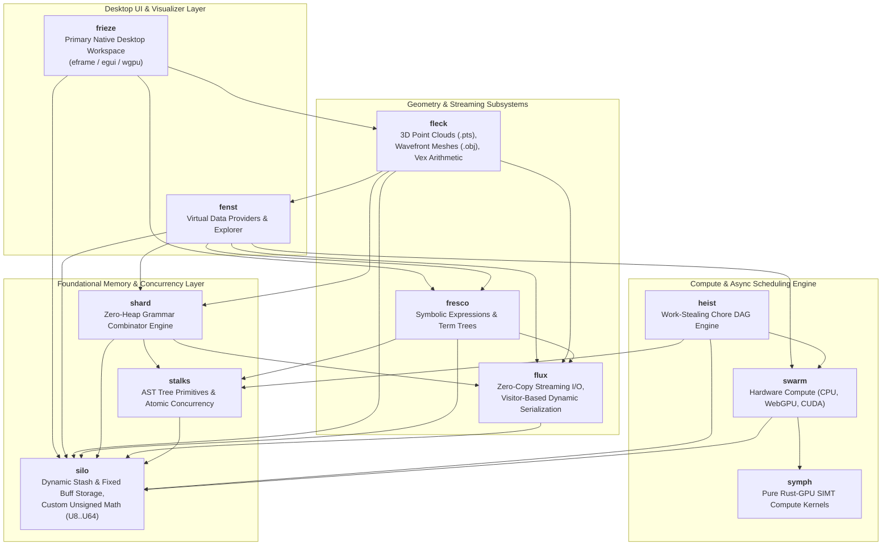

# Kosh Architecture & Design Principles

## 1. System Overview

Kosh is an ultra-low-latency, zero-heap-AST computational framework and 3D geometric processing system written in modern Rust. It is architected for maximum memory efficiency, CPU cache locality, and heterogeneous SIMT execution across CPU, WebGPU, and CUDA hardware.

---

## 2. Core Architectural Pillars

### Pillar 1: Two-Stage Memory Pipeline (`Stash` & `Buff`) with Zero `std::vec::Vec`
Kosh replaces unbounded standard vector allocations with explicit, deterministic memory ownership:
- **Phase 1 (Dynamic Growth)**: `silo::Stash<T>` allocates heap memory via raw pointers with amortized O(1) capacity growth (`PushX`, `Pop`, `Reserve`, `AppendStash`).
- **Phase 2 (Immutable Final Storage)**: `stash.IntoBuff()` transfers ownership to `silo::Buff<T>` without copying or leaving unused capacity.
- **Zero Standard Vectors**: `std::vec::Vec` is completely eliminated from the codebase.

### Pillar 2: Zero-Heap AST Allocation Policy
Recursive tree structures (such as grammar combinators in `shard`, symbolic algebra in `fresco`, and task DAGs in `heist`) do not use `Box<dyn Node>` heap pointers.
Instead, trees are compiled directly into concrete nested generic structures (`BinNode<L, R, Op>`, `UniNode<C, Op>`) via declarative macros (`NodeTree!`, `ShardTree!`, `TermTree!`, `ChoreTree!`).
Because expressions evaluate directly in the caller's stack frame, Rust's temporary lifetime extension guarantees that all child references remain valid without allocating a single byte on the heap.

### Pillar 3: Portable SIMT Compute (CPU, WebGPU, CUDA)
Algorithms in `symph` are written once in pure Rust. Using `#![no_std]` when targeting SPIR-V, compute kernels run across:
- **WebGPU / Rust-GPU**: Dispatched as compiled SPIR-V bytecode pipelines.
- **CUDA / Oxide**: Dispatched via PTX execution headers.
- **CPU SIMT**: Multithreaded execution across SIMT workgroup chunks.

### Pillar 4: Dual Workspace UI Architecture
- **`frieze` (Primary Workspace)**: High-performance immediate-mode desktop application built on `eframe`, `egui`, and `wgpu`. Direct in-process memory access, zero IPC serialization overhead, responsive at 60+ FPS.
- **`fenst` (Virtual Provider Subsystem)**: Virtual explorer providing pluggable provider schemes (`file://`, `expr://`, `ast://`).

---

## 3. Subsystems & Module Matrix

| Module | Core Purpose | Primary Structs & Enums | Primary Traits & Macros | Wiki Reference |
| :--- | :--- | :--- | :--- | :--- |
| **`silo`** | Memory management, custom unsigned numerics, dynamic/fixed arrays | `U8`, `U16`, `U32`, `U64`, `Buff<T>`, `Stash<T>`, `Arr<'a, T>`, `Stk<'a, 'b, T>`, `USeg` | `IAccess`, `IArr`, `ICastExt`, `ISliceExt`, `Buff!`, `Stash!` | [Silo.md](Silo.md) |
| **`stalks`** | Concurrency primitives, AST nodes, worker thread abstraction | `Atm<T>`, `Spinlock`, `UniNode<C, Op>`, `BinNode<L, R, Op>`, `BinOp`, `WorkPtr<'a>`, `Worker` | `AtomicInt`, `INode`, `IWork`, `IWorker`, `NodeTree!` | [Stalks.md](Stalks.md) |
| **`shard`** | Recursive-descent grammar combinators and streaming JSON | `Parser<'p>`, `Charset`, `Str`, `UIntShard`, `IntShard`, `HexShard`, `RealShard`, `WSpc`, `JSon<'a>` | `IGrammar`, `INotify`, `ShardTree!` | [Shard.md](Shard.md) |
| **`fresco`** | Symbolic algebra expressions and term repositories | `ExprRepos`, `PolyExpr`, `SumExpr`, `ProdExpr`, `PowExpr`, `RealExpr`, `VarExpr`, `VarAttrib`, `Term` | `ITermNode`, `AsTermNode`, `BaseExpr`, `TermTree!` | [Fresco.md](Fresco.md) |
| **`flux`** | Dynamic visitor serialization, streaming I/O buffers | `FixedStream<'a>`, `BuffStream<R>`, `OutStream<'a, W>`, `JsonOutStream<W>`, `FieldExp<'a>`, `FieldImp<'a>` | `IStream`, `IFluxExportSource`, `IFluxImportSource`, `ImplFluxSource!` | [Flux.md](Flux.md) |
| **`swarm`** | Hardware compute engine across CPU, WebGPU, and CUDA | `SwarmEngine`, `SwarmDevice`, `SwarmBuffer`, `SwarmKernel`, `StandardOp`, `SwarmMath` | `IComputeDevice`, `IComputeBuffer`, `IComputeKernel`, `IGpuOp` | [Swarm.md](Swarm.md) |
| **`symph`** | Rust-GPU SPIR-V compute kernels and algorithms (`no_std` for SPIR-V builds) | Pure SIMT functions (`wang_hash`, `collatz`, `pointcloud_elem`, `double_elem`, `vector_add_elem`) | SPIR-V Shaders (`pts_pointcloud_cs`, `camera_transform_cs`, `frustum_cull_cs`, `scene_vs`, `scene_fs`) | [Swarm.md](Swarm.md) |
| **`heist`** | Asynchronous workflow DAG orchestrator and scheduler | `Atelier<'a>`, `Maestro<'a>`, `Chore`, `ChoreTarget`, `JobInfo`, `AtelierInfo` | `IChoreNode`, `ChoreTree!`, `Chore!`, `CpuChore!`, `GpuAutoChore!` | [Heist.md](Heist.md) |
| **`fleck`** | 3D Point Cloud (.pts) & Wavefront (.obj) mesh parsing, spatial bounding boxes, `Vex` | `PtsPoint`, `PtsCloud`, `WaveObjMesh`, `WaveObjFace`, `Vex<N, T>`, `Pt3f`, `WPt3f`, `Point32`, `RGB` | `ParsePts`, `ParsePtsStream`, `ParseWaveObj`, `ToDto` | [Fleck.md](Fleck.md) |
| **`fenst`** | Virtual data provider framework and 3D visualizer | `XplrEntry`, `XplrContent`, `XplrLeafInfo`, `FsBranch`, `FsLeaf`, `FrescoBranch`, `ShardBranch`, `XplrRegistry`, `PtsSessionState`, `PtsFrameDto` | `Xplr`, `LeafXplr`, `BranchXplr`, `XplrProvider`, `CreateDefaultRegistry`, Provider & session API | [Fenst.md](Fenst.md) |
| **`frieze`** | Primary native desktop workspace built with `eframe`, `egui`, and `wgpu` | `KoshApp`, `AppState`, `ViewTab`, `ExplorerView`, `PtsView`, `ObjView`, `FrescoView` | `run()` | [Frieze.md](Frieze.md) |
