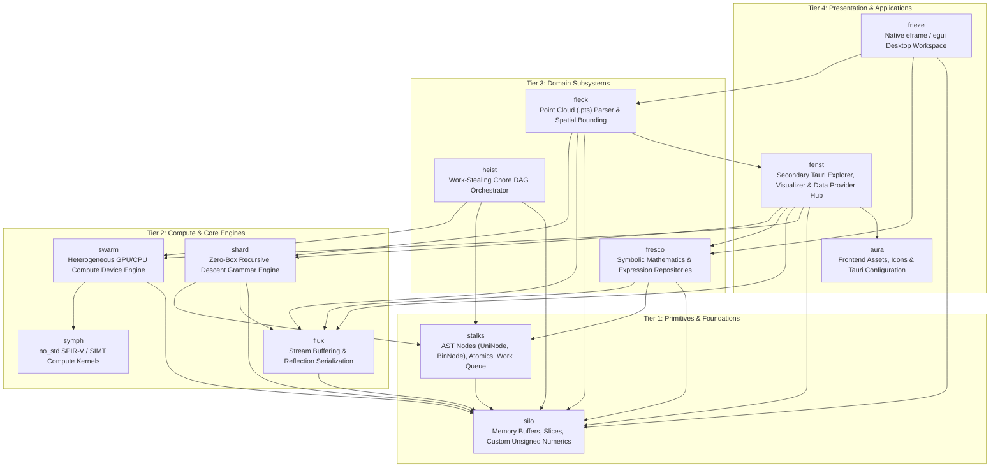
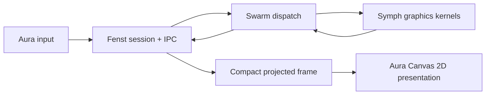

# Kosh Platform Architecture Overview

## 1. System Philosophy & Objectives

The **Kosh** platform is an ultra-high-performance computational, symbolic, grammar-parsing, and workflow-orchestration runtime written in Rust. It is engineered with three uncompromising architectural goals:

1. **Zero Heap Allocation in Recursive AST Structures**: Elimination of fine-grained heap allocations (`Box<DynINode>`) for parser grammars, expression trees, and chore pipelines via macro-driven inline stack lifetime extension.
2. **Explicit Memory Control & Cache Locality**: Replaces standard dynamic collections with contiguous buffers (`Buff<T>`), zero-copy slice wrappers (`Arr<'a, T>`), lock-free atomic stacks (`Stk<'a, 'b, T>`), and contiguous interval segments (`USeg`).
3. **Cross-Platform Heterogeneous SIMT Computing**: Unifies compute dispatch across multithreaded CPU SIMT, WebGPU / Vulkan (Rust-GPU SPIR-V), and CUDA / PTX (Cuda-Oxide) with zero-cost data representations.

---

## 2. Layered Architecture

The Kosh codebase is structured into four distinct functional tiers:



---

## 3. Subsystem Breakdown

### Tier 1: Foundation
- **[`silo`](Silo.md)**: Defines project-wide numeric wrappers (`U8`, `U16`, `U32`, `U64`) that wrap primitive types with wrapping arithmetic, atomic bridges, and explicit conversions. Provides `Buff<T>` (owned slice buffer), `Arr<'a, T>` (borrowed slice wrapper), `Stk<'a, 'b, T>` (lock-free CAS stack backed by an array), `Stash<T>` (growable buffer stack), and `USeg` (half-open/closed unsigned index intervals).
- **[`stalks`](Stalks.md)**: Universal AST tree nodes (`UniNode<C, Op>`, `BinNode<L, R, Op>`, `BinOp`), atomic synchronization (`Atm<T>`, `Spinlock`), type-erased work pointers (`WorkPtr<'a>`, `IWork`), and worker scheduling interfaces (`IWorker`, `DynIWorker`). Defines the core recursive macro engine `NodeTree!`.

### Tier 2: Core Engines & Compute
- **[`shard`](Shard.md)**: High-performance recursive-descent grammar combinator parsing engine. Built on `IGrammar` and `Parser<'p>`, it parses binary/text inputs with `ShardTree!` DSL without heap allocations. Features a 256-bit bitset character filter (`Charset`), numeric parsers (`UInt`, `Int`, `Hex`, `Real`), repetition/action combinators, and a streaming `JSon` parser.
- **[`flux`](Flux.md)**: Universal streaming and data conversion layer. Provides input streams (`IStream`, `FixedStream`, `BuffStream`), output streams (`OutStream`, `JsonOutStream`), and a reflection-style visitor import/export framework (`IFluxExportSource`, `IFluxImportSource`, `FieldExp`, `FieldImp`, `ImplFluxSource!`).
- **[`swarm`](Swarm.md)**: Hardware compute engine abstracting CPU SIMT thread pools, Rust-GPU (`wgpu` executing compiled SPIR-V bytecode), and Cuda-Oxide (CUDA driver / PTX execution). Unified through `SwarmEngine`, `SwarmDevice`, `SwarmBuffer`, and `SwarmKernel`.
- **[`symph`](Swarm.md)**: Portable compute library containing Wang Hash PRNG, Collatz sequence step calculators, element doubling, vector addition, and 3D point cloud generation. It is `#![no_std]` for SPIR-V builds and uses the standard library for host builds; its shaders include `pts_pointcloud_cs`, `camera_transform_cs`, `frustum_cull_cs`, `scene_vs`, and `scene_fs`.

### Tier 3: Domain Subsystems
- **[`heist`](Heist.md)**: Asynchronous Directed Acyclic Graph (DAG) chore orchestration system. Features `Atelier` (master workspace managing thread execution and job tracking) and `Maestro` (thread worker executing jobs and stealing work). Uses `ChoreTree!` to construct and schedule complex dependency graphs across CPU and GPU backends.
- **[`fresco`](Fresco.md)**: Symbolic algebra engine. Models mathematical terms (`ITermNode`, `Term`, `TermTree!`) and compiles them into flat indices within `ExprRepos`. Implements polynomial expressions (`PolyExpr`, `SumExpr`, `ProdExpr`, `PowExpr`), real constants (`RealExpr`), and variables (`VarExpr`, `VarAttrib`).
- **[`fleck`](Fleck.md)**: High-throughput 3D point cloud processing. Parses ASCII and binary `.pts` files into `PtsCloud` using custom `Shard` grammars (`PtsShard`), computing bounding boxes, intensity, and RGB color channels.

### Tier 4: Applications & Desktop Explorer
- **[`frieze`](Frieze.md)**: Primary native desktop workspace built with `eframe` and `egui`. It provides explorer, point-cloud, OBJ, and symbolic-expression views and is launched by `cargo run`.
- **[`fenst`](Fenst.md)**: Secondary Tauri desktop GUI subsystem. It defines unified tree interfaces (`Xplr`, `LeafXplr`, `BranchXplr`), pluggable provider registries (`XplrRegistry`) supporting filesystem (`FsProvider`), AST grammars (`ShardProvider`), and symbolic algebra (`FrescoProvider`), plus 3D point-cloud windows and IPC commands (`xplrcmds`). Launch it with `cargo run -- --aura`; `--test` dispatches test execution.
- **[`aura`](Aura.md)**: Frontend resources, icons, and Tauri application configuration. Contains HTML/JavaScript/CSS UI assets, multi-resolution platform icons, Tauri capability manifests, and `tauri.conf.json` metadata. Built into the desktop application bundle during `cargo build`.

---

## 4. Graphics Ownership Rule

Aura is intentionally a thin presentation layer. It forwards user input to Fenst, receives compact IPC display frames, and paints already-projected primitives through Canvas 2D. Aura must not parse geometry, own camera state, calculate transforms or projection, cull, shade, depth-sort, or create WebGL/WebGPU contexts.

Fenst owns graphics sessions, asset loading, camera updates, frame packing, and IPC. It delegates graphics computation and render preparation to Swarm, which dispatches the corresponding Symph kernel across GPU or CPU-SIMT backends. CPU fallback is permitted only within that Fenst → Swarm → Symph path.



---

## 5. Data Serialization & IPC Optimization

When data flows between the desktop frontend (`aura`) and heterogeneous compute backend (`swarm`), serialization efficiency is critical for real-time performance.

**Problem**: The `XplrProjectPts` IPC command serializes millions of 3D→2D projected points every 60 FPS frame, creating significant bandwidth pressure. Current implementation lacks:
- Incremental/delta updates for unchanged geometry
- Float quantization for screen coordinates
- Change detection and state hashing
- Efficient string metadata packing

**Status**: Comprehensive optimization audit completed. See **[Serialization_Optimization.md](Serialization_Optimization.md)** for:
- Detailed inefficiency analysis with bandwidth measurements
- 6-phase optimization roadmap (Phase 1-3 provide 65% bandwidth reduction)
- Implementation guidance for each phase
- Impact projections (120 MB/s → 18 MB/s average)

**Key Opportunities**:
1. **Phase 1 (1-2h)**: Remove serde rename overhead (~5% savings)
2. **Phase 2 (3-4h)**: Separate static/dynamic frame data (~40% savings)
3. **Phase 3 (2-3h)**: Float quantization 16-bit coordinates (~65% savings)

---

### Pattern A: Stack-Allocated AST Lifetime Extension
Rather than wrapping child nodes in `Box<dyn INode>`, AST nodes are declared as concrete generic structs (`UniNode<C, Op>`, `BinNode<L, R, Op>`) via declarative macros (`NodeTree!`, `ShardTree!`, `TermTree!`, `ChoreTree!`).
Because expressions evaluate directly in the caller's stack frame, Rust's temporary lifetime extension preserves all child node references without incurring allocator traffic.

```
Caller Stack Frame
┌─────────────────────────────────────────────────────────────┐
│ BinNode {                                                   │
│   _Left: UniNode { _Child: Charset, _Op: USeg },           │
│   _Right: BinNode { _Left: Str, _Right: Real, _Op: Sum },  │
│   _Op: Bor                                                  │
│ }                                                           │
└─────────────────────────────────────────────────────────────┘
  ▲ Zero heap allocation, fully inlined, L1-cache friendly
```

### Pattern B: Lock-Free Stack Exchange
Inter-thread coordination in `heist` and memory reclamation in `silo` use atomic Compare-And-Swap (CAS) loops:
- `Stk` coordinates push/pop/import/export operations between private thread caches and global stashes via atomic index adjustments (`_Size: Atm<U32>`).
- If an allocation cache runs dry, workers export or import batches of indices with a single lock-free atomic CAS.

### Pattern C: Unified Visitor Flux Serialization
Instead of large proc-macro serialization dependencies, `flux` implements an efficient visitor pattern:
- Exporting traverses data via `FetchFieldExp` yielding `FieldExp::Obj` or `FieldExp::Arr`.
- Importing dynamically binds values into destination memory via `FetchFieldImp` and `FieldImp`.
- Macros (`ImplFluxSource!`, `ImplFluxSourceTyped!`) generate boilerplate-free import/export implementations for arbitrary structs.
