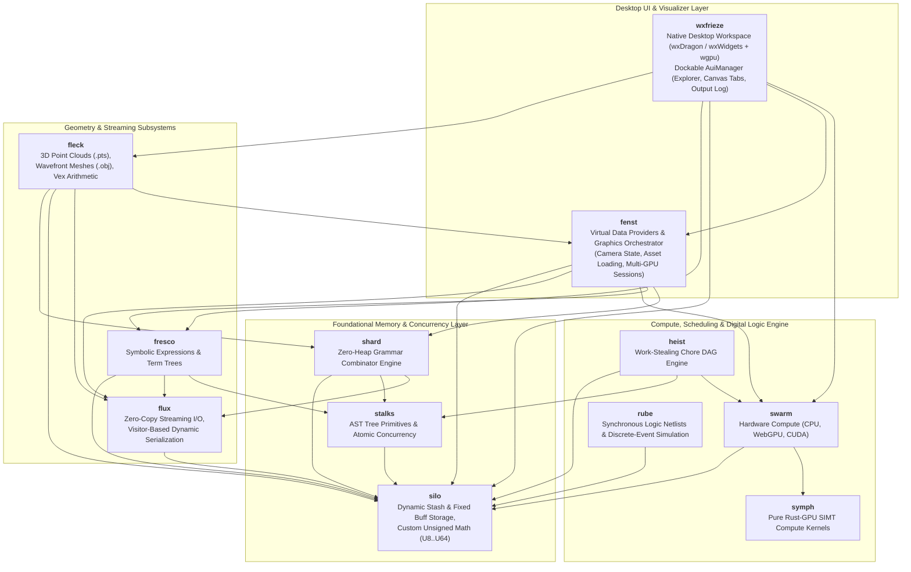

# Kosh Architecture & Design Principles

## 1. System Overview

Kosh is an ultra-low-latency, zero-heap-AST computational framework, digital simulation system, and 3D geometric processing engine written in modern Rust. It is architected for maximum memory efficiency, CPU cache locality, and heterogeneous execution across CPU, WebGPU, and CUDA hardware.

---

## 2. Core Architectural Pillars

### Pillar 1: Two-Stage Memory Pipeline (`Stash` & `Buff`) with Zero `std::vec::Vec`
Kosh replaces unbounded standard vector allocations with explicit, deterministic memory ownership:
- **Phase 1 (Dynamic Growth)**: `silo::Stash<T>` allocates heap memory via raw pointers with amortized $O(1)$ capacity growth (`PushX`, `Pop`, `Reserve`, `AppendStash`).
- **Phase 2 (Immutable Final Storage)**: `stash.IntoBuff()` transfers ownership to `silo::Buff<T>` without copying or leaving unused trailing capacity.
- **Zero Standard Vectors**: `std::vec::Vec` is completely eliminated from the codebase.

### Pillar 2: Zero-Heap AST Allocation Policy
Recursive tree structures (such as grammar combinators in `shard`, symbolic algebra in `fresco`, and task DAGs in `heist`) do not use `Box<dyn Node>` heap pointers.
Instead, trees are compiled directly into concrete nested generic structures (`BinNode<L, R, Op>`, `UniNode<C, Op>`) via declarative macros (`NodeTree!`, `ShardTree!`, `TermTree!`, `ChoreTree!`).
Because expressions evaluate directly in the caller's stack frame, Rust's temporary lifetime extension guarantees that all child references remain valid without allocating a single byte on the heap.

### Pillar 3: Project-Defined Transparent Unsigned Numeric Types
The `silo::uint` module defines custom integer wrappers (`U8`, `U16`, `U32`, `U64`) using `#[repr(transparent)]`.
These types enforce wrapping arithmetic semantics, eliminate implicit casting pitfalls, provide atomic interoperability with `Atm<T>`, and enable zero-copy slice and buffer transformations via `ICastExt` and `ISliceExt`.

### Pillar 4: Portable SIMT Compute (CPU, WebGPU, CUDA)
Algorithms in `symph` are written once in pure Rust. Using `#![no_std]` when targeting SPIR-V, compute kernels run across:
- **WebGPU / Rust-GPU**: Dispatched as compiled SPIR-V bytecode pipelines.
- **CUDA / Oxide**: Dispatched via PTX execution headers.
- **CPU SIMT**: Multithreaded execution across SIMT workgroup chunks.

### Pillar 5: Work-Stealing Chore DAG Engine & Data-Parallel MapCollect (`heist`)
Asynchronous workflows and high-throughput data streams are represented as DAG expressions via `ChoreTree!` and `MapCollect!`:
- **Sequential & Parallel DSL**: `A < B` guarantees that job `B` will only run after `A` decrements `B`'s atomic predecessor counter (`_SzPreds`) to zero; `A | B` posts tasks simultaneously across worker threads.
- **Chore-Weight & Automatic Sequential Fusion**: Nodes carry estimated execution weights (`_Weight: U32`). Sequences whose cumulative weight is $\le \text{atelier.FusionThres()}$ (default `2`, runtime configurable via `_FusionThres`) are automatically fused into a single contiguous task (`FusedChore`), avoiding scheduler queue round-trips.
- **Adaptive Data-Parallel Slicing**: `MapCollectNode` splits contiguous `Arr<'a, T>` payloads dynamically across $2 \times N_{maestros}$ chunks with automatic work-stealing, joining at an explicit collect synchronization barrier.
- **Work Stealing**: Worker threads (`Maestro`) execute pending jobs from thread-local queues and dynamically steal tasks from peers using Knuth multiplicative hash pseudo-random distribution.

### Pillar 6: Graphics Ownership Architecture
To ensure strict separation of concerns and maximum rendering throughput:
- **`wxfrieze` is Presentation Only**: Built on `wxdragon` (wxWidgets) and `wgpu`. It manages OS window frames, dockable AUI layout panes (`wxAuiManager`), user input dispatch (orbit/pan/zoom), and native Canvas 2D / WGPU rendering surfaces. It **must not** parse raw geometry, compute camera projection matrices, perform frustum culling, or execute compute kernels.
- **`fenst` Orchestrates Graphics**: `fenst` manages virtual data providers, active graphics sessions (`PtsSessionState`), asset caching, camera transformations, and multi-GPU frame dispatch. All heavy geometric projections are delegated through `swarm` to `symph` SIMT kernels.

### Pillar 7: Synchronous Digital Logic & Discrete-Event Simulation (`rube`)
Digital logic circuits and event-driven dataflow systems are simulated with zero allocations during execution:
- **Unified 16-Byte Multi-Value Register (`Reg`)**: Represents 2-state and 4-state logic (0, 1, X) with IEEE-1364 bitwise operators (`!`, `&`, `|`, `^`).
- **Array-of-Structures (AoS) Temporal Latching**: 48-byte `TriggerState` cells (`_Past`, `_Current`, `_Future`) fit within a single 64-byte L1 cache line.
- **Topological Net Compilation (`NetCompiler`)**: Merges connected ports via Disjoint-Set Union (DSU) in $O(P \cdot \alpha(P))$ time.
- **Dual Execution Modes**: Multicycle synchronous clock-ticking (`SimEngine`) and discrete-event delta-cycle propagation (`SimContext`) with flat 64-bit word bitmasks and inverted sensitivity indexes.

### Pillar 8: 1:1 Trait-per-Struct Pattern & Minimal Interface Design
Kosh establishes a strict interface decoupling model across all primary structs:
- **1:1 Trait-per-Struct**: For a concrete struct `Foo`, a corresponding trait `IFoo` defines strictly the **minimal set of public operational methods needed to interface** with the struct. Internal plumbing, runtime coordination mechanics, and diagnostic accessors remain inherent/private or `pub(crate)` on `Foo` rather than polluting `IFoo`.
- **Inherent Impl Limitation**: Inherent `impl Foo` blocks are reserved for constructors (`New`, `Create`, `From...`) and private/internal helper methods (`pub(crate)` or private).
- **Trait Implementation**: All functional and operational interface methods are implemented under `impl IFoo for Foo`.
- **Module Re-exporting**: Both `Foo` and `IFoo` are re-exported at module roots (`pub use foo::{Foo, IFoo};`) ensuring seamless scope availability.

---

## 3. Subsystems & Module Matrix

| Module | Core Purpose | Primary Structs & Enums | Primary Traits & Macros | Wiki Reference |
| :--- | :--- | :--- | :--- | :--- |
| **`silo`** | Memory management, custom unsigned numerics, dynamic/fixed arrays | `U8`, `U16`, `U32`, `U64`, `Buff<T>`, `Stash<T>`, `Arr<'a, T>`, `Stk<'a, 'b, T>`, `USeg` | `IAccess`, `IArr`, `ICastExt`, `ISliceExt`, `Buff!`, `Stash!` | [Silo.md](Silo.md) |
| **`stalks`** | Concurrency primitives, AST nodes, worker thread abstraction | `Atm<T>`, `Spinlock`, `UniNode<C, Op>`, `BinNode<L, R, Op>`, `BinOp`, `WorkPtr<'a>`, `Worker` | `AtomicInt`, `INode`, `IWork`, `IWorker`, `NodeTree!` | [Stalks.md](Stalks.md) |
| **`shard`** | Recursive-descent grammar combinators and streaming JSON | `Parser<'p>`, `Charset`, `Str`, `UIntShard`, `IntShard`, `HexShard`, `RealShard`, `WSpc`, `JSon<'a>` | `IGrammar`, `INotify`, `ShardTree!` | [Shard.md](Shard.md) |
| **`fresco`** | Symbolic algebra expressions and term repositories | `ExprRepos`, `PolyExpr`, `SumExpr`, `ProdExpr`, `PowExpr`, `RealExpr`, `VarExpr`, `VarAttrib`, `Term` | `ITermNode`, `AsTermNode`, `BaseExpr`, `TermTree!` | [Fresco.md](Fresco.md) |
| **`flux`** | Dynamic visitor serialization, streaming I/O buffers | `FixedStream<'a>`, `BuffStream<R>`, `OutStream<'a, W>`, `JsonOutStream<W>`, `FieldExp<'a>`, `FieldImp<'a>` | `IStream`, `IFluxExportSource`, `IFluxImportSource`, `ImplFluxSource!` | [Flux.md](Flux.md) |
| **`swarm`** | Hardware compute engine across CPU, WebGPU, and CUDA | `SwarmEngine`, `SwarmDevice`, `SwarmBuffer`, `SwarmKernel`, `StandardOp`, `SwarmMath` | `IComputeDevice`, `IComputeBuffer`, `IComputeKernel`, `IGpuOp` | [Swarm.md](Swarm.md) |
| **`symph`** | Rust-GPU SPIR-V compute kernels and algorithms (`no_std` for SPIR-V builds) | Pure SIMT functions (`wang_hash`, `collatz`, `pointcloud_elem`, `double_elem`, `vector_add_elem`) | SPIR-V Shaders (`pts_pointcloud_cs`, `camera_transform_cs`, `frustum_cull_cs`, `scene_vs`, `scene_fs`) | [Swarm.md](Swarm.md) |
| **`heist`** | Asynchronous workflow DAG orchestrator, data-parallel map-reduce and work-stealing scheduler | `Atelier<'a>`, `Maestro<'a>`, `Chore`, `MapCollectNode<'a, T>`, `ChoreTarget`, `JobInfo`, `AtelierInfo` | `IAtelier`, `IMaestro`, `IChore`, `IChoreNode`, `ChoreTree!`, `Chore!`, `CpuChore!`, `GpuAutoChore!`, `WeightedChore!`, `MapCollect!`, `CpuMapCollect!`, `GpuMapCollect!` | [Heist.md](Heist.md) |
| **`rube`** | Synchronous digital logic simulation and discrete-event dataflow framework | `Reg`, `TriggerState`, `TriggerWad`, `Layout`, `NetCompiler`, `SimEngine`, `SimContext`, `FastModule`, `CustomModule`, `Adder<N>` | `NandGate`, `AndGate`, `OrGate`, `NotGate`, `XorGate`, `CRSLatch`, `DLatch`, `RSLatch` | [Rube.md](Rube.md) |
| **`fleck`** | 3D Point Cloud (.pts) & Wavefront (.obj) mesh parsing, spatial bounding boxes, `Vex` | `PtsPoint`, `PtsCloud`, `WaveObjMesh`, `WaveObjFace`, `Vex<N, T>`, `Pt3f`, `WPt3f`, `Point32`, `RGB` | `ParsePts`, `ParsePtsStream`, `ParseWaveObj`, `ToDto` | [Fleck.md](Fleck.md) |
| **`fenst`** | Virtual data provider framework, graphics session & camera orchestrator | `XplrEntry`, `XplrContent`, `XplrLeafInfo`, `FsBranch`, `FsLeaf`, `FrescoBranch`, `ShardBranch`, `XplrRegistry`, `PtsSessionState`, `PtsFrameDto` | `Xplr`, `LeafXplr`, `BranchXplr`, `XplrProvider`, `CreateDefaultRegistry` | [Fenst.md](Fenst.md) |
| **`wxfrieze`** | Native desktop workspace built with `wxdragon` (wxWidgets 3.2+) and `wgpu` | `AppState`, `AppTheme`, `OpenTab`, `AuiManager`, `AuiPaneInfo`, `Notebook`, `ExplorerPanel`, `PtsView`, `ObjView`, `FrescoView` | `run()` | [Frieze.md](Frieze.md) |
