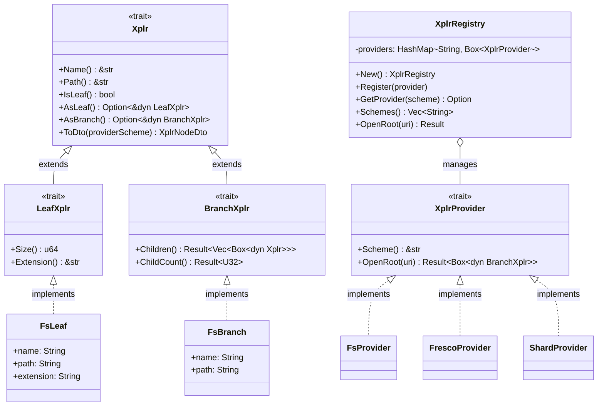
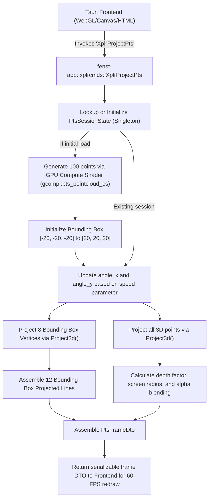

# Module Reference: `fenst` & `fenst-app`

## 1. Overview & Purpose

The `fenst` (core library) and `fenst-app` (Tauri desktop application) modules provide Kosh with an **extensible virtual explorer, document viewer, and GPU-accelerated 3D point cloud visualizer**. Key features include:
1. **Virtual Explorer Abstraction (`Xplr`, `LeafXplr`, `BranchXplr`)**: Uniform node interface across filesystems, AST grammar trees, and symbolic expressions.
2. **Provider Registry (`XplrRegistry`)**: URL scheme-based provider routing (`file://`, `expr://`, `ast://`).
3. **High-Performance Content Streaming**: Windowed chunk reading (`XplrFetchChunk`) and safe size-guarded file readers (`XplrFetchContent`).
4. **Desktop GUI Application (`fenst-app`)**: Tauri v2 desktop shell with native menus, multi-windowing, and IPC command handlers (`xplrcmds`).
5. **Interactive 3D Point Cloud Visualizer**: Real-time perspective projection (`Project3d`), rotating wireframe bounding box, and GPU-computed point rendering.

---

## 2. Architecture & Class Diagram

---

## 3. Desktop 3D Point Cloud Rendering Pipeline

---

## 4. 3D Camera Projection Math

Perspective projection is computed directly in Rust inside `fenst-app::xplrcmds::Project3d`:

$$\begin{aligned}
x_1 &= x \cos(\theta_y) + z \sin(\theta_y) \\
z_1 &= -x \sin(\theta_y) + z \cos(\theta_y) \\
y_2 &= y \cos(\theta_x) - z_1 \sin(\theta_x) \\
z_2 &= y \sin(\theta_x) + z_1 \cos(\theta_x) \\
\text{scale} &= \frac{\text{FOV}}{\text{Distance} + z_2} \quad (\text{FOV} = 350.0, \, \text{Distance} = 250.0) \\
\text{screen}_x &= \frac{\text{width}}{2} + x_1 \cdot \text{scale} \\
\text{screen}_y &= \frac{\text{height}}{2} - y_2 \cdot \text{scale}
\end{aligned}$$

---

## 5. Struct & DTO Reference

### DTOs (`fenst::mod.rs` & `fenst::xplr.rs`)
- `XplrEntry`: Directory entry (`name`, `path`, `is_dir`, `size`, `extension`).
- `XplrContent`: Full text file payload (`path`, `content`, `size`, `line_count`).
- `XplrLeafInfo`: File metadata (`path`, `name`, `size`, `is_dir`, `modified`, `extension`, `readonly`).
- `XplrNodeDto`: Virtual provider node (`id`, `name`, `is_leaf`, `provider`, `size`, `extension`).
- `StreamChunkDto`: Chunk slice (`path`, `offset`, `length`, `total_size`, `is_eof`, `content`).
- `PtsPointsDto`: Raw point cloud data (`points: Vec<[f32; 3]>`, `count`, `bbox_min`, `bbox_max`).

### GUI Frame DTOs (`fenst-app::xplrcmds.rs`)
- `ProjectedPoint`: 2D projected point (`x`, `y`, `radius`, `core_radius`, `color`).
- `ProjectedLine`: 2D projected line segment (`x1`, `y1`, `x2`, `y2`).
- `PtsFrameDto`: Complete frame payload containing points, wireframe lines, status text, and bounding box labels.

---

## 6. Tauri IPC Commands Reference (`xplrcmds`)

| Command | Signature | Description |
| :--- | :--- | :--- |
| `XplrListEntries` | `(path: String) -> Result<Vec<XplrEntry>, String>` | Lists files in a directory sorted directories-first. |
| `XplrFetchContent`| `(path: String) -> Result<XplrContent, String>` | Reads full text file up to 10 MB limit using `BuffStream`. |
| `XplrFetchChunk`  | `(path, offset, size) -> Result<StreamChunkDto, String>` | Reads windowed slice of a file. |
| `XplrLeafInfo`    | `(path: String) -> Result<XplrLeafInfo, String>` | Retrieves detailed filesystem metadata. |
| `XplrSelectBranch`| `() -> Result<Option<String>, String>` | Shows native OS folder picker dialog (`rfd`). |
| `XplrChildren`    | `(uri: String) -> Result<Vec<XplrNodeDto>, String>` | Queries virtual explorer provider for child nodes. |
| `XplrListProviders`| `() -> Result<Vec<String>, String>` | Returns registered URI schemes (`"file"`, `"expr"`, `"ast"`). |
| `XplrFetchPtsPoints`| `() -> Result<PtsPointsDto, String>` | Generates 100 random 3D points via `rust-gpu` compute shader. |
| `XplrOpenContentWindow`| `(app, path) -> Result<(), String>` | Opens file in separate dedicated webview window. |
| `XplrOpenPtsGraphicsWindow`| `(app, path) -> Result<(), String>` | Opens dedicated 3D shader window for `.pts` point cloud files. |
| `XplrProjectPts`  | `(path, width, height, dpr, speed, color) -> Result<PtsFrameDto, String>` | Calculates 3D perspective projection and wireframe box for rendering. |
