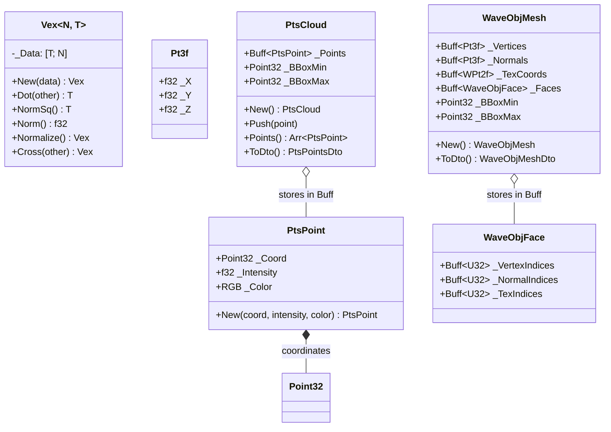

# Module Reference: `fleck`

## 1. Overview & Purpose

The `fleck` module provides high-throughput **3D geometric representations, vector arithmetic, and geometry file I/O**. It encompasses:
1. **Multidimensional Vector Math (`Vex<N, T>`)**: Generic N-dimensional vector algebra with compile-time dimension checking, vector space operations, scalar multiplication, inner products, normalization, and coordinate projections.
2. **Specialized 3D & 2D Types (`Pt3f`, `WPt3f`, `WPt2f`, `Dir3f`, `Point32`, `RGB`)**: High-performance representations for Euclidean positions, homogeneous coordinates, direction vectors, and colors.
3. **3D Point Cloud Processing (`PtsCloud`, `PtsPoint`, `PtsShard`)**: Parsing, bounding box calculation, intensity mapping, and streaming parsing for `.pts` point cloud files.
4. **Wavefront Mesh Processing (`WaveObjMesh`, `WaveObjFace`, `WaveObjMaterial`, `WaveObjShard`)**: Streaming parser for 3D polygonal `.obj` meshes with support for negative indexing, normals, texture coordinates, and DTO conversion.

---

## 2. Architecture & Class Diagram

---

## 3. Geometric Subsystems

### 3.1 Vector Space & Arithmetic Engine (`Vex`)
The `fleck::vex` module implements formal mathematical vector spaces over arbitrary dimensions:
- **Scalar Operations**: Add, subtract, multiply, divide across scalar values.
- **Inner Product & Norms**: Euclidean dot product (`Dot`), squared norm (`NormSq`), L2 norm (`Norm`), and unit normalization (`Normalize`).
- **3D Specialization**: Cross product (`Cross`) for 3-element vectors.
- **Type Aliases**:
  - `Pt3f`: 3D Cartesian position vector `(x, y, z)`.
  - `WPt3f`: 3D Homogeneous coordinate vector `(x, y, z, w)`.
  - `WPt2f`: 2D Homogeneous coordinate vector `(u, v, w)`.
  - `Dir3f`: 3D Direction vector with normalized ray semantics.

### 3.2 Point Cloud Parser (`PtsCloud`, `PtsShard`)
Zero-allocation streaming parser for `.pts` point cloud data:
- Streaming via `IStream` and `ShardTree!`.
- Extracts 3D coordinates, radar/lidar intensity floats, and 24-bit RGB color tuples.
- Dynamically maintains axis-aligned minimum and maximum bounding boxes (`_BBoxMin`, `_BBoxMax`).

### 3.3 Wavefront OBJ Parser (`WaveObjMesh`, `WaveObjShard`)
Grammar-based parser for polygonal 3D models:
- **Geometry Tokens**: Geometric vertices (`v`), vertex normals (`vn`), texture coordinates (`vt`), parameter space vertices (`vp`).
- **Polygonal Faces (`f`)**: Supports variable-valence faces (triangles, quads, polygons), `v/vt/vn` vertex triplets, and relative/negative indexing.
- **Materials & Groups**: Handles group identifiers (`g`), smoothing groups (`s`), and material library bindings (`usemtl`, `mtllib`).
- **Triangulation**: Convex fan triangulation converts arbitrary N-sided polygons into GPU-ready triangle lists.

---

## 4. Free Functions Reference

### Point Cloud I/O (`ptsio.rs`)
- **`ParsePts(path: &str) -> Result<PtsCloud, String>`**: Parses `.pts` file from disk using `BuffStream`.
- **`ParsePtsBytes(bytes: &[u8]) -> Result<PtsCloud, String>`**: Parses in-memory byte slice using `FixedStream`.
- **`ParsePtsStream(stream: &mut dyn IStream) -> Result<PtsCloud, String>`**: Parses stream implementing `IStream`.

### Wavefront OBJ I/O (`waveobjio.rs`)
- **`ParseWaveObj(path: &str) -> Result<WaveObjMesh, String>`**: Parses `.obj` file from disk using `BuffStream`.
- **`ParseWaveObjBytes(bytes: &[u8]) -> Result<WaveObjMesh, String>`**: Parses in-memory byte slice using `FixedStream`.
- **`ParseWaveObjStream(stream: &mut dyn IStream) -> Result<WaveObjMesh, String>`**: Parses stream implementing `IStream`.
