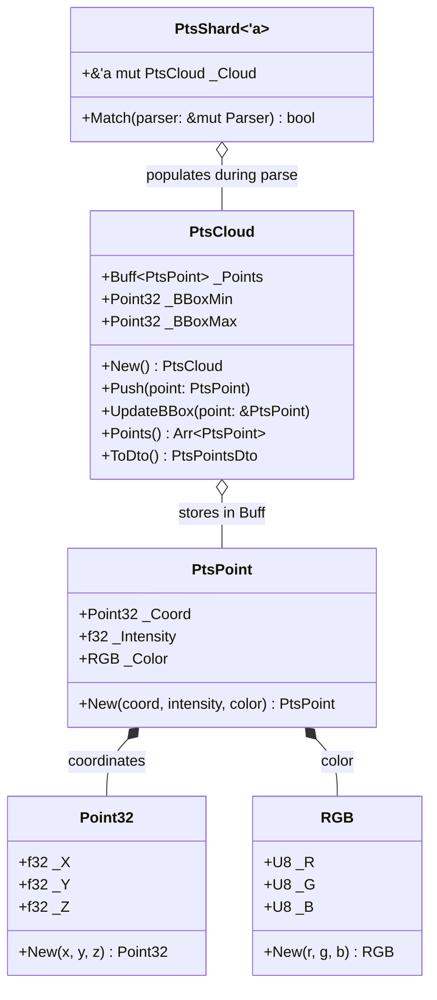
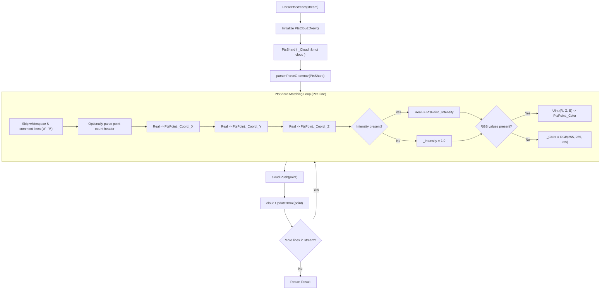

# Module Reference: `fleck`

## 1. Overview & Purpose

The `fleck` module provides high-throughput **3D Point Cloud I/O and processing** capabilities for `.pts` format files. Key features include:
1. **Compact Geometry Primitives (`Point32`, `RGB`, `PtsPoint`)**: High-density floating point and color structures for 3D coordinates, radar/lidar intensity, and RGB color channels.
2. **`PtsCloud` In-Memory Storage**: Contiguous point storage in `Buff<PtsPoint>` with bounding box tracking (`_BBoxMin`, `_BBoxMax`).
3. **Zero-Copy Stream Parser (`PtsShard`)**: Grammar-based streaming parser built on `ShardTree!` and `IStream` that handles comments, headers, coordinate floats, intensities, and RGB colors without intermediate string allocations.
4. **DTO Conversion (`ToDto`)**: Directly converts parsed clouds into serializable `fenst::PtsPointsDto` structures for desktop 3D rendering.

---

## 2. Architecture & Class Diagram

---

## 3. Point Cloud Parsing Pipeline

---

## 4. Struct Reference

### `Point32`
3D single-precision coordinate tuple (`#[repr(C)]`):
- `_X: f32`, `_Y: f32`, `_Z: f32`
- `New(x: f32, y: f32, z: f32) -> Self`: Constructs point.
- `Default()`: Initializes at origin `(0.0, 0.0, 0.0)`.

### `RGB`
24-bit color representation (`#[repr(C)]`):
- `_R: U8`, `_G: U8`, `_B: U8`
- `New(r: U8, g: U8, b: U8) -> Self`: Constructs color.
- `Default()`: Pure white `RGB(255, 255, 255)`.

### `PtsPoint`
Unified point record encapsulating coordinates, intensity, and color:
- `_Coord: Point32`: 3D position vector.
- `_Intensity: f32`: Reflectivity or signal strength value (normalized or raw float).
- `_Color: RGB`: Optional or synthetic color.
- `New(coord: Point32, intensity: f32, color: RGB) -> Self`: Full constructor.

### `PtsCloud`
In-memory contiguous container for 3D point clouds:
- `_Points: Buff<PtsPoint>`: Contiguous buffer of all points.
- `_BBoxMin: Point32`, `_BBoxMax: Point32`: Axis-aligned bounding box extremes.
- `New() -> Self`: Initializes cloud with infinite bounding box boundaries.
- `Push(&mut self, pt: PtsPoint)`: Appends point and updates bounding box in $O(1)$ time.
- `UpdateBBox(&mut self, pt: &PtsPoint)`: Extends `_BBoxMin` and `_BBoxMax` to encompass `pt`.
- `Points(&self) -> Arr<'_, PtsPoint>`: Returns zero-copy slice of all points.
- `Size(&self) -> U32`: Returns point count.
- `ToDto(&self) -> PtsPointsDto`: Converts cloud into GUI data transfer object.

### `PtsShard<'a>`
Grammar parser combinator implementing `IGrammar`:
- Parses raw stream tokens directly into `&'a mut PtsCloud` using `ShardTree!` action callbacks without intermediate memory allocations.

---

## 5. Free Functions Reference

- **`ParsePts(path: &str) -> Result<PtsCloud, String>`**: Opens file at `path` using `BuffStream` and parses it into `PtsCloud`.
- **`ParsePtsBytes(bytes: &[u8]) -> Result<PtsCloud, String>`**: Parses in-memory byte slice using `FixedStream`.
- **`ParsePtsStream(stream: &mut dyn IStream) -> Result<PtsCloud, String>`**: Parses any stream implementing `IStream`.
