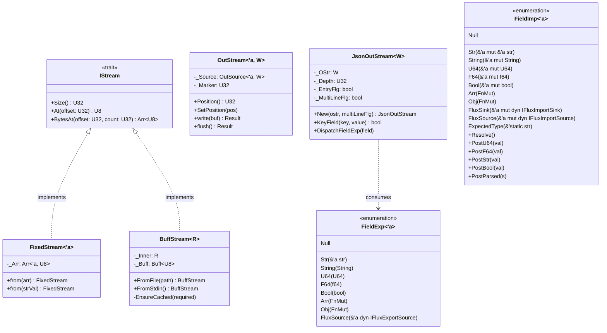
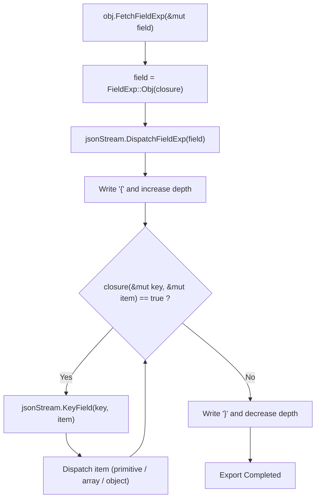
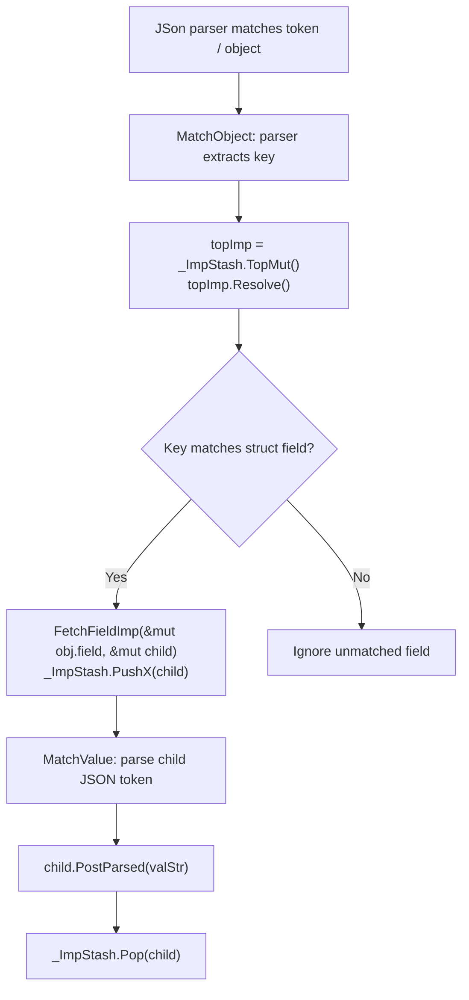

# Module Reference: `flux`

## 1. Overview & Purpose

The `flux` module is Kosh's **streaming I/O, serialization, and deserialization engine**. It provides:
1. **Zero-Copy Stream Input (`IStream`)**:
   - `FixedStream<'a>`: In-memory static slice input stream wrapping `Arr<'a, U8>`.
   - `BuffStream<R: Read>`: Dynamically cached input stream backed by `Buff<U8>` and any `std::io::Read` source (e.g. files, stdin).
2. **Buffered Stream Output (`OutStream<'a, W: Write>`)**:
   - Manages fixed memory buffer writes or auto-flushing stream writers (`std::fs::File`, `std::io::Sink`).
3. **Structured JSON Output (`JsonOutStream<W: fmt::Write>`)**:
   - Generates compact or indented JSON formatted output without third-party dependencies.
4. **Visitor-Based Dynamic Serialization / Deserialization**:
   - Export visitor: `IFluxExportSource`, `IFluxExportSink`, `FieldExp<'a>`.
   - Import visitor: `IFluxImportSource`, `IFluxImportSink`, `FieldImp<'a>`.
   - Code generation macros: `ImplFluxSource!`, `ImplFluxSourceTyped!`.

---

## 2. Architecture & Class Diagram

---

## 3. Serialization & Deserialization Flowcharts

### A. Flux Export Flowchart (`IFluxExportSource` $\to$ `JsonOutStream`)

### B. Flux Import Flowchart (`JSon` Parser $\to$ `IFluxImportSource`)

---

## 4. Struct & Enum Reference

### `FixedStream<'a>`
Zero-copy stream wrapping a borrowed slice `Arr<'a, U8>`:
- `Size(&self) -> U32`: Returns total byte length.
- `At(&mut self, offset: U32) -> U8`: Direct memory byte lookup.
- `BytesAt(&mut self, offset: U32, count: U32) -> Arr<'_, U8>`: Slices memory without copying.

### `BuffStream<R: Read>`
Dynamically cached input stream backed by `_Buff: Buff<U8>` and an underlying reader `_Inner: R`:
- `FromFile<P: AsRef<Path>>(path: P) -> io::Result<Self>`: Opens file and wraps it.
- `FromStdin() -> io::Result<Self>`: Wraps standard input.
- `EnsureCached(&mut self, required: usize)`: Lazily loads chunks (4 KB minimum) into `_Buff` until `required` bytes are in memory.

### `OutStream<'a, W: Write = io::Sink>`
Unified write buffer supporting either fixed slices or streaming writers:
- `Position(&self) -> U32`: Current write cursor position.
- `SetPosition(&mut self, pos: U32)`: Seeks within write buffer.
- `write(&mut self, buf: &[u8]) -> Result<usize>`: Writes into slice or caches into `Buff<U8>`, automatically flushing when full.
- `flush(&mut self) -> Result<()>`: Flushes cached bytes to the destination writer.

### `JsonOutStream<W: fmt::Write>`
Serializer sink writing formatted JSON into any `fmt::Write` destination (e.g. `String`):
- `New(ostr: W, multiLineFlg: bool) -> Self`: Constructs single-line or pretty-printed JSON stream.
- `KeyField(&mut self, key: &str, value: FieldExp<'_>) -> bool`: Writes key-value field.
- `DispatchFieldExp(&mut self, field: FieldExp)`: Recursively serializes primitives, arrays, and objects.

### `FieldExp<'a>` & `FieldImp<'a>`
Dynamic visitor enums:
- `FieldExp`: Encapsulates scalar data (`U64`, `F64`, `Str`, `Bool`), nested arrays (`Arr`), nested objects (`Obj`), or nested sources (`FluxSource`).
- `FieldImp`: Encapsulates destination references (`&mut U64`, `&mut f64`, `&mut String`, `&mut &'a str`, `&mut bool`), array push callbacks (`Arr`), object property routers (`Obj`), or sinks (`FluxSink`).

---

## 5. Macros Reference

- **`ImplFluxSource!( StructName, field1, field2, ... )`**: Generates both `IFluxExportSource` and `IFluxImportSource` for a named-field struct.
- **`ImplFluxSourceTyped!( StructName, "TypeName", field1, ... )`**: Generates export/import with an explicit `"Type": "TypeName"` discriminator field.
- **`ImplFluxPrimitive!( $T => U64 / F64 via SINK )`**: Bridges narrow primitive types (`U8`, `U16`, `U32`, `f32`) into flux's standard 64-bit visitors.
