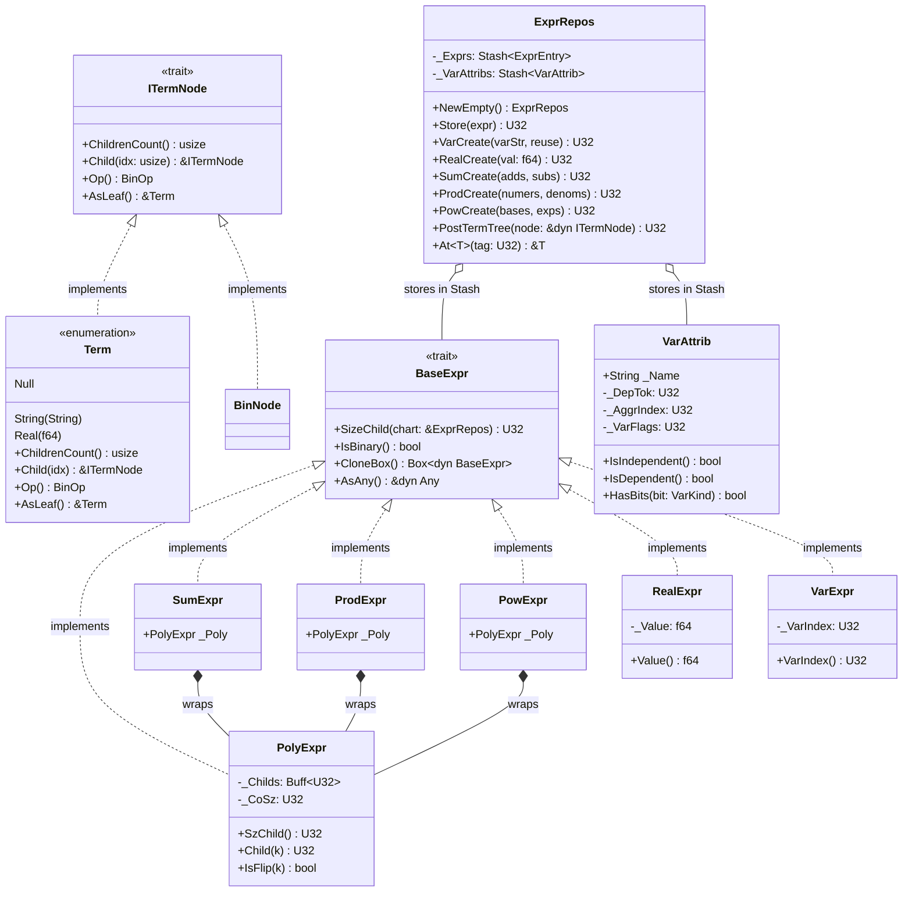
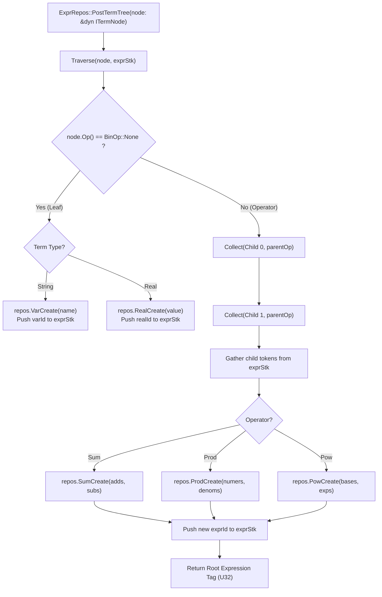

# Module Reference: `fresco`

## 1. Overview & Purpose

The `fresco` module is Kosh's **symbolic algebra and mathematical expression engine**. It provides:
1. **Symbolic Term Trees (`ITermNode`, `Term`, `TermTree!`)**: Tree-structured symbolic representations of mathematical expressions containing constants, variables, addition, subtraction, multiplication, division, and exponentiation.
2. **Flat Expression Repository (`ExprRepos`)**: Linearized storage structure that transforms arbitrary algebraic AST trees into deduplicated, indexed expression DAGs.
3. **Polynomial Representations (`PolyExpr`)**: Unified n-ary representations of sums, products, and power expressions storing child node token lists in contiguous `Buff<U32>`.
4. **Variable Attributes (`VarAttrib`, `VarKind`)**: Tracks mathematical variable classifications (scalars, primes, controls, bridges) and dependency linkages.

---

## 2. Architecture & Class Diagram



---

## 3. AST to Repository Linearization Flowchart

When an algebraic expression created with `TermTree!` is submitted via `ExprRepos::PostTermTree`, it is flattened into contiguous indices:



---

## 4. Struct & Enum Reference

### `Term`
Leaf and constant representation in symbolic term trees:
- `Null`: Empty term placeholder.
- `String(String)`: Variable identifier (e.g., `"x"`, `"alpha"`).
- `Real(f64)`: Floating-point constant value (e.g., `3.14159`).

### `ExprRepos`
Central store holding expressions and variables:
- `NewEmpty() -> Self`: Constructs empty expression repository.
- `Size(&self) -> U32`: Returns count of stored expressions.
- `Store(&mut self, expr: Box<dyn BaseExpr>) -> U32`: Appends expression and returns assigned `U32` tag.
- `VarCreate(&mut self, varStr: String, reuseFlg: bool) -> U32`: Registers variable in `_VarAttribs` and stores `VarExpr`.
- `RealCreate(&mut self, val: f64) -> U32`: Stores `RealExpr`.
- `SumCreate(&mut self, adds: Arr<'_, U32>, subs: Arr<'_, U32>) -> U32`: Creates n-ary addition/subtraction node.
- `ProdCreate(&mut self, numers: Arr<'_, U32>, denoms: Arr<'_, U32>) -> U32`: Creates n-ary multiplication/division node.
- `PowCreate(&mut self, bases: Arr<'_, U32>, exps: Arr<'_, U32>) -> U32`: Creates exponentiation node.
- `PostTermTree(&mut self, node: &dyn ITermNode) -> U32`: Recursively compiles any `ITermNode` into flat repository expressions.
- `At<T: BaseExpr>(&self, tag: U32) -> &T`: Downcasts and returns reference to expression at `tag`.
- `VarNameAt(&self, vInd: U32) -> &str`: Returns name of variable at index.

### `PolyExpr`
Generalized n-ary polynomial expression container:
- `_Childs: Buff<U32>`: Flat array of child expression indices.
- `_CoSz: U32`: Boundary index partitioning positive (additive/numerator) terms from inverted (subtractive/denominator) terms.
- `IsFlip(&self, k: U32) -> bool`: Returns `true` if index `k >= _CoSz` (indicating an inverted/negative term).

### `SumExpr`, `ProdExpr`, `PowExpr`
Thin wrappers around `PolyExpr` representing sums ($\sum$), products ($\prod$), and power towers ($a^b$).

### `RealExpr` & `VarExpr`
- `RealExpr`: Encapsulates scalar `f64` value.
- `VarExpr`: Encapsulates `_VarIndex: U32` pointing to metadata in `ExprRepos::_VarAttribs`.

### `VarAttrib` & `VarKind`
- `VarKind`: Enum defining variable classification (`Scalar = 0`, `Prime = 1`, `Control = 2`, `Bridge = 3`).
- `VarAttrib`: Stores `_Name: String`, `_DepTok: U32`, `_AggrIndex: U32`, and bit flags `_VarFlags: U32`.

---

## 5. Traits Reference

| Trait | Purpose | Key Methods |
| :--- | :--- | :--- |
| `ITermNode` | Unified interface for symbolic term AST nodes | `ChildrenCount() -> usize`, `Child(idx) -> &dyn ITermNode`, `Op() -> BinOp`, `AsLeaf() -> &Term` |
| `AsTermNode` | Coerces primitives (`char`, `&str`, `String`, `f64`) into `ITermNode` | `AsTermNode(self) -> Self::Node` |
| `BaseExpr` | Base trait for expressions stored in `ExprRepos` | `SizeChild(&self, chart: &ExprRepos) -> U32`, `IsBinary() -> bool`, `CloneBox() -> Box<dyn BaseExpr>`, `AsAny() -> &dyn Any` |

---

## 6. The `TermTree!` Macro Syntax

Constructs symbolic expression trees at compile time using standard arithmetic operators:

```rust
use kosh::TermTree;
use kosh::fresco::ExprRepos;

// Construct algebraic term tree: (x + y) * 42.0 - z^2
let tree = TermTree!(( "x" + "y" ) * 42.0 - ( "z" ^ 2.0 ));

let mut repos = ExprRepos::NewEmpty();
let rootTag = repos.PostTermTree(&tree);
```
