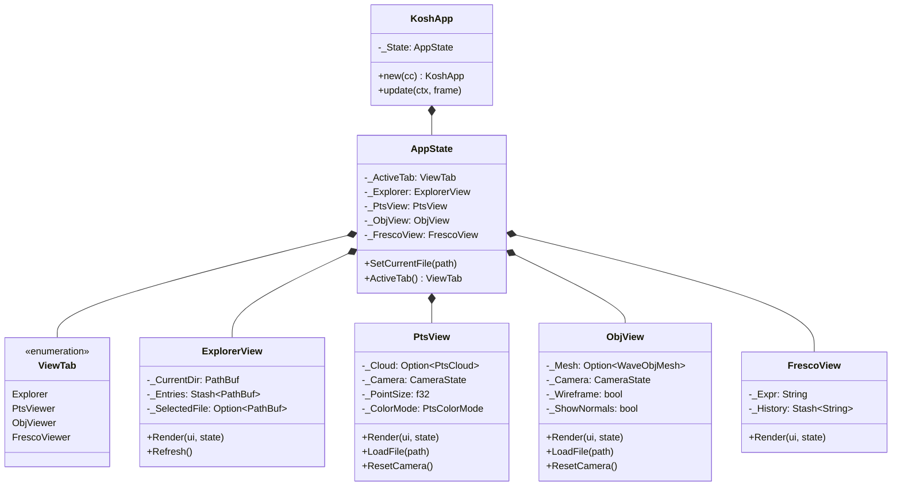

# Module Reference: `frieze`

## 1. Overview & Purpose

`frieze` is Kosh's **primary native desktop workspace and 3D visualizer**. It is built natively on **`eframe`**, **`egui`**, and **`wgpu`** to deliver instant response times, zero-copy memory rendering, and zero-IPC UI overhead.

The root binary launches `frieze` by default:

```powershell
cargo run
cargo run --release
```

The application window is titled **Kosh — Native 3D GPU Workspace**, launching at 1360 x 840 preferred resolution (minimum 800 x 600).

---

## 2. Architecture & Component Diagram



---

## 3. Directory & Source Layout

```
src/frieze/
├── mod.rs             # Module definitions, KoshApp re-export, and run() entry point
├── app.rs             # KoshApp eframe::App lifecycle, keyboard shortcuts, top bar
├── state.rs           # Shared AppState container, active file selection, theme
├── tab_bar.rs         # Navigation tab bar for switching between workspace views
├── explorer.rs        # Interactive filesystem browser with file type icons
├── pts_view.rs        # 3D Point Cloud (.pts) interactive camera viewport
├── obj_view.rs        # 3D Wavefront Mesh (.obj) interactive wireframe/solid viewport
├── fresco_view.rs     # Symbolic algebra expression evaluation and AST viewer
├── Cargo.toml         # Embedded package configuration
├── Trunk.toml         # Trunk build configuration
└── index.html         # WebAssembly entrypoint template
```

---

## 4. Workspaces & Visual Viewports

### 4.1 Explorer Panel (`explorer.rs`)
- **Filesystem Navigation**: Browse directory hierarchies with folder expansion, path history, and file selection.
- **Provider Association**: Automatically inspects file extensions to launch the appropriate viewport:
  - `.pts` -> Automatically opens `PtsView`
  - `.obj` -> Automatically opens `ObjView`
  - `.expr` / `.fresco` -> Automatically opens `FrescoView`

### 4.2 3D Point Cloud Viewport (`pts_view.rs`)
- **Direct Geometry Rendering**: Ingests `fleck::PtsCloud` directly without IPC translation.
- **Interactive Orbit Camera**:
  - **Left Click Drag**: Orbit rotation around model center.
  - **Right Click Drag / Middle Click**: Pan viewport X/Y.
  - **Scroll Wheel**: Smooth zoom.
- **Rendering Features**:
  - Axis-aligned 3D bounding box wireframe.
  - Intensity and RGB color modes.
  - Variable point size and perspective projection scaling.

### 4.3 3D Wavefront Mesh Viewport (`obj_view.rs`)
- **Mesh Ingestion**: Parses Wavefront `.obj` files via `fleck::ParseWaveObj`.
- **Display Modes**:
  - Wireframe facet rendering with depth buffering.
  - Solid face rendering with surface normals and lighting.
  - Automatic model centering and bounding sphere normalization.

### 4.4 Symbolic Expression Viewport (`fresco_view.rs`)
- **Fresco Integration**: Real-time evaluation of mathematical term trees (`fresco::ExprRepos`).
- **Interactive Expression Tree**: Inspects sub-terms, polynomial coefficients, and variable bindings.

---

## 5. Relationship to Secondary Frontends

| Dimension | `frieze` (Primary) | Legacy / Headless |
| :--- | :--- | :--- |
| **Technology** | `eframe` + `egui` (Immediate-Mode Native) | Canvas 2D / IPC |
| **Launch Command** | `cargo run` | N/A |
| **Data Ingestion** | In-Process Direct `silo::Buff` Access | IPC Serialization over `xplrcmds` |
| **Rendering Backend** | Native GPU Canvas (via `egui::Painter` / `wgpu`) | Canvas 2D on webview surface |
| **Latency** | Sub-millisecond direct draw | Frame serialization bounded |
