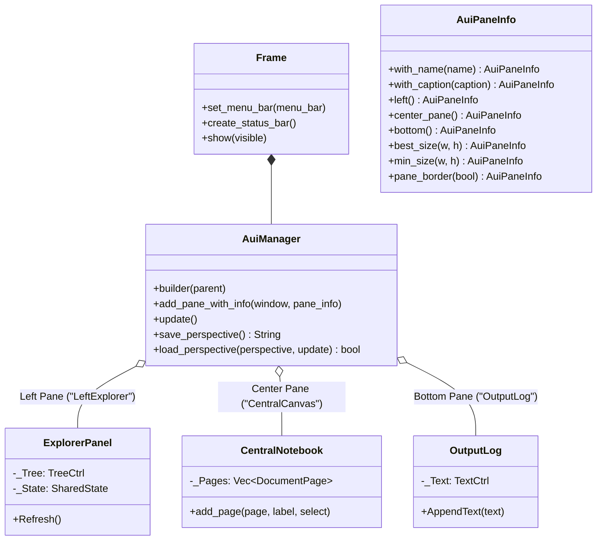

# Module Reference: `wxfrieze` (Desktop Workspace)

## 1. Overview & Purpose

`wxfrieze` is Kosh's **primary native desktop workspace and 3D visualizer**. It is built natively on **`wxdragon`** (a modern Rust binding for wxWidgets 3.2+) and **`wgpu`** to deliver instant response times, native OS look-and-feel, and dockable window management via `wxAuiManager`.

The root binary launches `wxfrieze` by default:

```powershell
cargo run
cargo run --release
```

The main window launches titled **Kosh - Native 3D GPU Workspace (wxDragon)**, at 1360 x 840 preferred resolution with customizable themes (Dark, Light, Cyberpunk, Nord).

---

## 2. Architecture & Dockable AUI Layout

`wxfrieze` uses an advanced user interface manager (`wxdragon::widgets::AuiManager`) that allows panels to be docked, floated, rearranged, and resized dynamically:



### Dockable Panes Breakdown:
1. **Left Explorer (`LeftExplorer`)**: Docked on the left side with a best size of 240px and minimum size of 150px. Houses the interactive file tree and folder browser.
2. **Central Canvas (`CentralCanvas`)**: Center pane with borders disabled. Houses the tabbed document `Notebook`, allowing multiple 3D viewports and text files to be opened simultaneously.
3. **Console Output (`OutputLog`)**: Docked at the bottom with a best size of 150px height. Displays real-time engine logs, compilation statuses, and diagnostic traces.

---

## 3. Source & Directory Layout

```
src/wxfrieze/
|-- mod.rs             # Module re-exports and wxfrieze::run() entry point
|-- app.rs             # Application setup, AuiManager construction, and tab dispatch
|-- desktop.rs         # Native MenuBar (File, View, Theme, Reset Layout)
|-- explorer.rs        # Native TreeCtrl filesystem browser with file activation
|-- pts_view.rs        # 3D Point Cloud (.pts) interactive camera viewport
|-- obj_view.rs        # 3D Wavefront Mesh (.obj) wireframe/solid viewport
|-- fresco_view.rs     # Symbolic algebra expression evaluation and AST viewer
|-- gpu_cache.rs       # WGPU graphics device, queue, and surface pipeline caching
|-- state.rs           # Shared thread-safe AppState container and theme definitions
`-- tab_bar.rs         # Active tab focus and close management
```

---

## 4. Workspaces & Visual Viewports

### 4.1 Native Explorer Panel (`explorer.rs`)
- **Filesystem Navigation**: Browse directory hierarchies with automatic root detection, folder picker dialogs (`rfd`), and tree expansion.
- **Automated Viewport Routing**: Activating a file automatically spawns the appropriate document tab inside the central `Notebook`:
  - `.pts` -> Spawns interactive 3D Point Cloud Viewport (`pts_view.rs`)
  - `.obj` -> Spawns interactive 3D Wavefront Mesh Viewport (`obj_view.rs`)
  - `.fresco` / `.frsc` -> Spawns Symbolic Algebra Viewport (`fresco_view.rs`)
  - Plain Text / Other -> Spawns MultiLine Text Viewer (`build_text_view_panel`)

### 4.2 3D Point Cloud Viewport (`pts_view.rs`)
- **Direct GPU Rendering**: Visualizes dense 3D point cloud datasets directly on native rendering canvases.
- **Interactive Orbit Camera**:
  - **Left Click Drag**: Orbit rotation around model center.
  - **Right Click Drag / Middle Click**: Pan viewport along X/Y.
  - **Scroll Wheel**: Smooth camera zoom.
- **Rendering Features**:
  - Axis-aligned 3D bounding box wireframe.
  - Variable point size, depth attenuation, and color modes.

### 4.3 3D Wavefront Mesh Viewport (`obj_view.rs`)
- **Mesh Ingestion**: Parses Wavefront `.obj` geometries via `fleck::ParseWaveObj`.
- **Display Modes**:
  - Wireframe facet rendering with depth buffering.
  - Solid face rendering with surface normals and lighting.
  - Automatic model centering and bounding box normalization.

### 4.4 Symbolic Expression Viewport (`fresco_view.rs`)
- **Fresco Integration**: Real-time evaluation of mathematical term trees (`fresco::ExprRepos`).
- **Interactive Expression Tree**: Inspects sub-terms, polynomial coefficients, and variable bindings.

---

## 5. Graphics Ownership & Architectural Boundaries

`wxfrieze` strictly adheres to Kosh's **Presentation-Only Graphics Rule**:
- **Presentation Responsibility**: `wxfrieze` manages windowing, mouse/keyboard input events, AUI pane layouts, and displays projected frames.
- **Zero Heavy Compute**: `wxfrieze` **does not** parse raw geometric point buffers directly on the main thread, calculate camera projection matrices, or perform GPU compute culling.
- **Delegation to Backend**: All geometry loading, camera state tracking, and projection passes are coordinated through `fenst` and executed across GPU/CPU hardware engines in `swarm` via `symph` compute kernels.