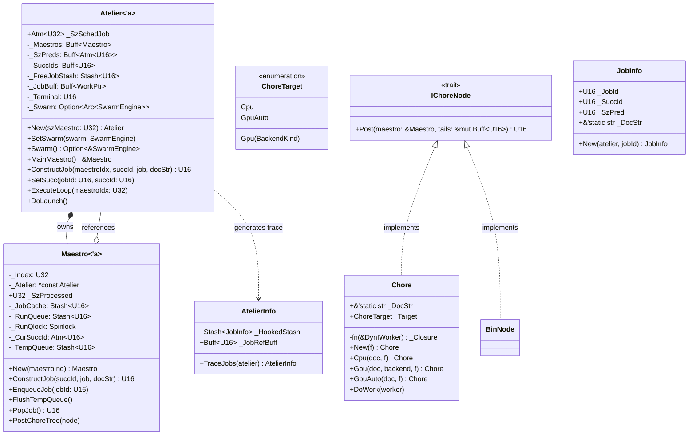
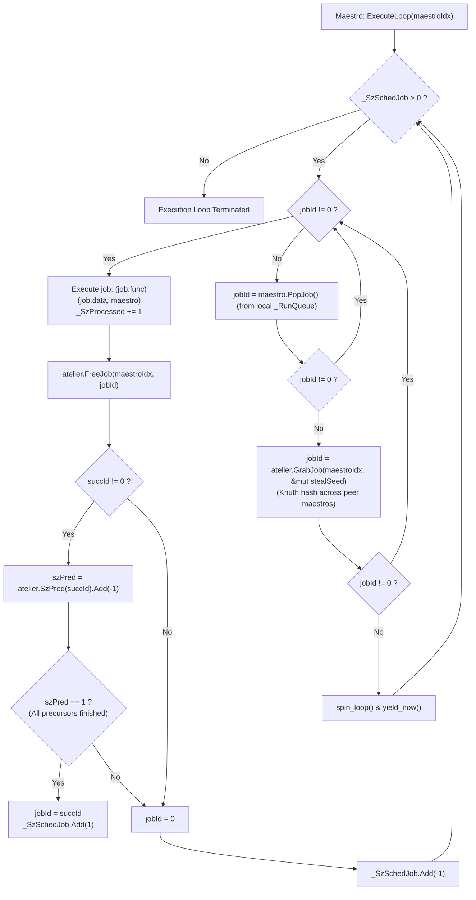
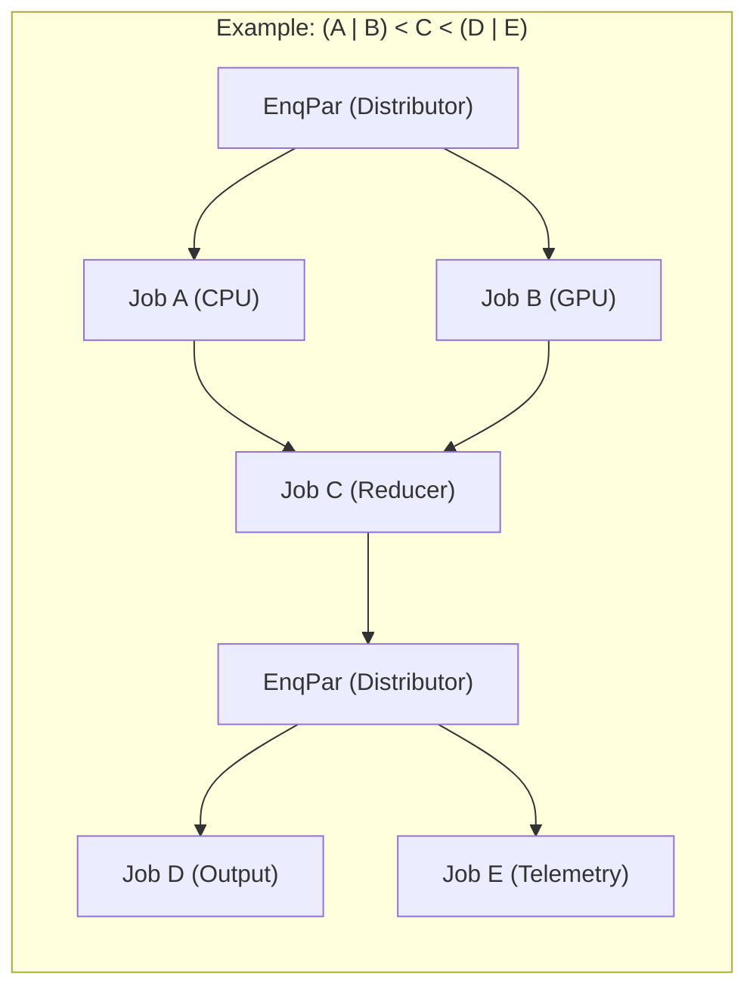

# Module Reference: `heist`

## 1. Overview & Purpose

The `heist` module is Kosh's **asynchronous workflow DAG orchestrator and work-stealing job runtime**. It provides:
1. **The `Atelier` Master Workspace**: Manages worker thread pools (`Maestro`), global job allocators, predecessor counter arrays (`_SzPreds: Buff<Atm<U16>>`), and successor routing tables (`_SuccIds: Buff<U16>`).
2. **The `Maestro` Worker**: Thread-local execution agent managing local job caches (`_JobCache`), run queues (`_RunQueue`), temporary enqueue queues (`_TempQueue`), and work-stealing from peer Maestros.
3. **Chore DAG DSL (`ChoreTree!`)**: Construct parallel (`|`) and sequential (`<`) execution graphs with automatic predecessor and successor resolution.
4. **Target Hardware Affinity (`ChoreTarget`)**: Directs individual chore tasks to host CPU worker threads, specific GPU backends (`Gpu(BackendKind)`), or auto-selected GPU compute (`GpuAuto`).

---

## 2. Architecture & Class Diagram



---

## 3. Work-Stealing & DAG Execution Flowchart



---

## 4. DAG Construction with `ChoreTree!`

The `ChoreTree!` macro translates pipeline expressions into DAG dependencies:
- **Sequence (`<`)**: `A < B` sets `A`'s successor to `B`. `B` will not execute until `A` decrements `B`'s predecessor counter to 0.
- **Parallel (`|`)**: `A | B` creates a parallel branch. Both `A` and `B` are posted to the run queue via a generated `EnqPar` distributor node.



---

## 5. Struct Reference

### `Atelier<'a>`
Workspace coordinator managing multi-threaded pipeline execution:
- `New<S: Into<U32>>(szMaestro: S) -> Self`: Initializes workspace with `szMaestro` worker threads and $2^{16}$ pre-allocated job descriptors.
- `SetSwarm(&mut self, swarm: SwarmEngine)`: Binds GPU/CPU compute engine to workspace.
- `Swarm(&self) -> Option<&SwarmEngine>`: Returns reference to bound Swarm compute engine if present.
- `MainMaestro(&self) -> &Maestro<'a>`: Returns reference to maestro 0 for DAG submission.
- `ConstructJob<M: Into<U32>, S: Into<U16>>(&self, maestroIdx: M, succId: S, job: WorkPtr<'a>, docStr: &'static str) -> U16`: Allocates a unique `jobId` from `_FreeJobStash` or thread caches and registers its successor.
- `SetSucc<J: Into<U16>, S: Into<U16>>(&self, jobId: J, succId: S)`: Sets `_SuccIds[jobId] = succId` and increments `_SzPreds[succId]` atomically.
- `DoLaunch(&self)`: Spawns worker threads via `std::thread::scope` and runs the execution loop until all tasks complete.

### `Maestro<'a>`
Worker thread executor implementing `IWorker`:
- `New<I: Into<U32>>(maestroInd: I) -> Self`: Constructs worker instance.
- `MaestroIndex(&self) -> U32`: Returns assigned worker index.
- `FromWorker<'w>(worker: &'w DynIWorker<'_>) -> &'w Self`: Safe downcasting helper from dynamic worker.
- `ConstructJob<S: Into<U16>>(&self, succId: S, job: impl IntoWorkPtr<'a>, docStr: &'static str) -> U16`: Allocates job via Atelier.
- `EnqueueJob<J: Into<U16>>(&self, jobId: J)`: Pushes job to thread-local `_TempQueue`.
- `FlushTempQueue(&self)`: Flushes temporary queue into thread-safe `_RunQueue` and increments `_SzSchedJob`.
- `PopJob(&self) -> U16`: Thread-safe pop from `_RunQueue`.
- `PostChoreTree<T: IChoreNode>(&self, node: &T)`: Recursively traverses and posts a `ChoreTree` into the scheduler.

### `Chore`
A runnable unit of work with documentation and hardware affinity:
- `New(f: fn(&DynIWorker<'_>)) -> Self`: Default CPU chore.
- `Cpu(docStr: &'static str, f: fn(&DynIWorker<'_>)) -> Self`: Explicit CPU chore.
- `Gpu(docStr: &'static str, backend: BackendKind, f: fn(&DynIWorker<'_>)) -> Self`: Chore bound to specific compute backend.
- `GpuAuto(docStr: &'static str, f: fn(&DynIWorker<'_>)) -> Self`: Chore dispatched to auto-selected compute device.

---

## 6. The `ChoreTree!` Macro Syntax

```rust
use kosh::{ChoreTree, CpuChore, GpuAutoChore};
use kosh::heist::Atelier;
use kosh::silo::U32;

let atelier = Atelier::New(U32(4));
let maestro = atelier.MainMaestro();

// Define a DAG: Run Step1 and Step2 in parallel, then aggregate in Step3, then output in Step4
let pipeline = ChoreTree!(
    (
        CpuChore!("Step1", |w| { /* CPU processing */ })
        | GpuAutoChore!("Step2", |w| { /* GPU processing */ })
    )
    < CpuChore!("Step3", |w| { /* Aggregation */ })
    < CpuChore!("Step4", |w| { /* Finalize */ })
);

maestro.PostChoreTree(&pipeline);
atelier.DoLaunch();
```
