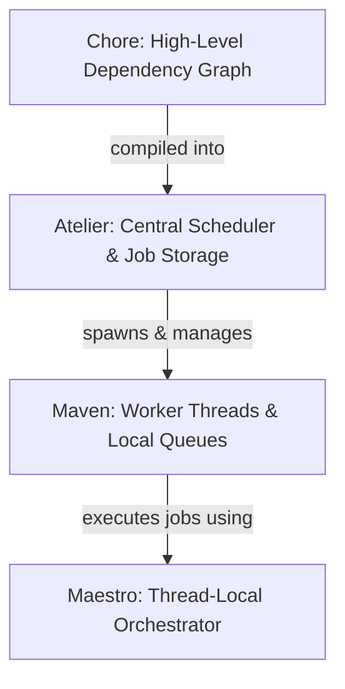

# Heist Framework

The `heist` module is a high-performance, work-stealing task scheduling and dependency resolution framework designed for parallel execution of structured jobs in Kosh. It manages a pool of worker threads, schedules jobs with predecessor/successor dependencies, and supports dynamic, graph-based execution.

---

## Architecture & Core Components

Heist is built around four central concepts:



### 1. Atelier (The Scheduler)
Defined in [atelier.rs](../src/heist/atelier.rs), `Atelier` is the central coordination engine. It:
* Manages a fixed-size thread pool running multiple `Maven` workers.
* Stores scheduled jobs in a cache-friendly, pre-allocated array of type-erased `WorkPtr`s.
* Tracks predecessors (`_SzPreds`) and successor job IDs (`_SuccIds`) to execute task DAGs (Directed Acyclic Graphs). When a job completes, it decrements the predecessor count of its successor; once that count hits 1 (meaning all dependencies are done), the successor job is automatically enqueued.

### 2. Maven (The Worker)
Defined in [maven.rs](../src/heist/maven.rs), a `Maven` represents a worker thread. It has:
* A thread-local job stash (`_JobCache`) to recycle job IDs without global lock contention.
* A synchronized run queue (`_RunQueue`) protected by a `Spinlock`.
* Work-stealing capabilities: if a worker's run queue is empty, it attempts to steal work from other Mavens using a randomized steal seed.

### 3. Maestro (The Orchestrator)
Defined in [maestro.rs](../src/heist/maestro.rs), `Maestro` is the thread-local context wrapper that implements the `IWorker` trait. 
* Every job is executed inside a `Maestro` context.
* Jobs can use `Maestro` to dynamically spawn sub-tasks, construct successor dependencies (`ConstructJob`), or enqueue bulk work (`ConstructEnqueueBulk`).

### 4. Chore & ChoreTree (Dependency Graph)
Defined in [chore.rs](../src/heist/chore.rs), `Chore` represents a unit of work that can be structured into a dependent tree (`dyn Bud<Chore>`) using the `ChoreTree!` macro.
* **Operators**:
  * `a | b`: Parallel execution (OR dependency).
  * `a < b`: Sequencing (a runs before b).
* When a chore tree is posted (`budTree.Post(&maestro)`), it compiles the tree into `WorkPtr`s with correct successor chains, and schedules them onto the `Atelier`.

---

## Example Usage

### 1. Basic Inline Job Construction
Jobs can be created directly by passing closures to `ConstructJob`:

```rust
let atelier = Atelier::New(U32(4)); // Create Atelier with 4 worker threads
let meister = atelier.Meister();
let mut jobId = U16(0);

// Define job 1
jobId = meister.ConstructJob(
    jobId, // Succesor dependency (0 means no successor)
    |_worker: &dyn IWorker| {
        println!("Job 1 executed!");
    },
);

// Define job 2 (Job 1 will only run after Job 2 completes)
jobId = meister.ConstructJob(
    jobId, // Job 1 is successor
    |_worker: &dyn IWorker| {
        println!("Job 2 executed!");
    },
);

// Enqueue starting job (Job 2)
meister.EnqueueJob(&mut jobId);
drop(meister);

// Launch execution
atelier.DoLaunch();
```

### 2. Graph-Based Dependency Resolution via `ChoreTree!`
You can construct complex tree-structured execution flows using the macro:

```rust
use crate::heist::chore::Chore;

let a = Chore::New(|_| { print!("A "); });
let b = Chore::New(|_| { print!("B "); });
let c = Chore::New(|_| { print!("C "); });

// c runs before both b and a
let budTree = crate::ChoreTree!(
    c < (b | a)
);

let atelier = Atelier::New(U32(4));
let meister = atelier.Meister();

budTree.Post(&meister);
drop(meister);

atelier.DoLaunch(); // Will print C A B (or C B A)
```

### 3. Sequential & Unthreaded Execution (`Worker`)
While the framework is designed for high-performance parallel, work-stealing execution using `Atelier` and `Maestro`, it also supports sequential, unthreaded execution.

This is achieved using the `Worker` struct (defined in [work.rs](../src/stalks/work.rs)), which is a zero-overhead, Zero-Sized Type (ZST) implementation of the `IWorker` trait. When a job or execution is scheduled using a `Worker` instance, it immediately and synchronously executes the posted job on the current thread rather than enqueuing it to a background thread pool.

This allows the exact same code (e.g. recursive algorithms using `IWorker::Post` such as parallel quicksort `DoQSort`) to run sequentially and deterministically without modification:

```rust
use crate::stalks::work::{Worker, IWorker};

let worker = Worker::New();

// Execute a job directly and synchronously on the caller's thread
worker.Post(|w: &dyn IWorker| {
    println!("Job executed sequentially!");
});
```

For example, running `DoQSort` sequentially:
```rust
let buff = Buff::Create(U32(100), |_| rand::random::<f64>());
let arr = buff.Arr();
let worker = Worker::New();

// Run quicksort sequentially on the current thread
arr.USeg().DoQSort(
    &worker,
    |i, j| arr.At(i) > arr.At(j),
    |i, j| arr.SwapAt(i, j),
);
```

