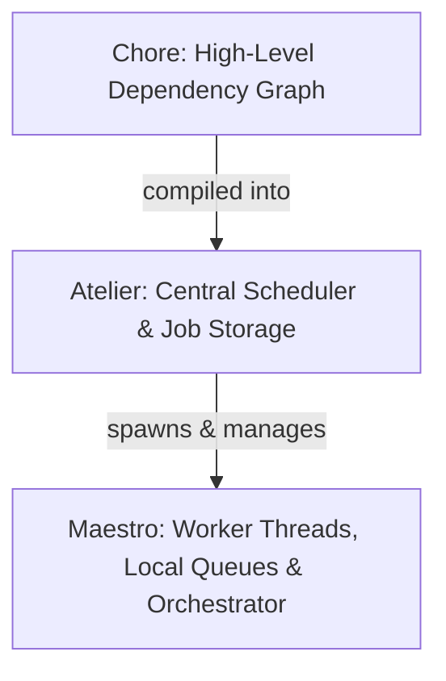

# Heist Framework

The `heist` module is a high-performance, work-stealing task scheduling and dependency resolution framework designed for parallel execution of structured jobs in Kosh. It manages a pool of worker threads, schedules jobs with predecessor/successor dependencies, and supports dynamic, graph-based execution.

## Purpose & Design Philosophy
The primary purpose of the Heist implementation is:
1. **Unthreaded Development**: Enable developers to design, develop, and debug complex recursive algorithms (such as QuickSort) in a simple, sequential, unthreaded environment using the zero-sized type (ZST) `Worker`.
2. **Seamless Scaling**: Effortlessly transition the exact same algorithm code to a multi-threaded parallel model (using `Atelier`) to match the machine's hardware capabilities and performance requirements.

> [!TIP]
> **Unified Execution Interface**:
> By abstracting all worker interactions under the `IWorker` trait, the exact same recursive sorting/task function can run sequentially on a single thread or in parallel using the work-stealing scheduling pool, with zero changes to the core logic.

---

## Architecture & Core Components

Heist is built around three central concepts:



### 1. Atelier (The Scheduler)
Defined in [atelier.rs](../src/heist/atelier.rs), `Atelier` is the central coordination engine. It:
* Manages a fixed-size thread pool running multiple `Maestro` workers.
* Stores scheduled jobs in a cache-friendly, pre-allocated array of type-erased job pointers (`WorkPtr`s).
* Tracks predecessors (`_SzPreds`) and successor job IDs (`_SuccIds`) to execute task DAGs (Directed Acyclic Graphs).
* Provides `TraceJobs` (via `AtelierInfo`) to introspect the state of all hooked and free jobs in the system.

> [!NOTE]
> **Dependency Resolution Mechanism**:
> When a job completes, it decrements the predecessor count (`_SzPreds`) of its successor (`_SuccIds`) using an atomic fetch-and-subtract operation. Once that count reaches `0` (meaning the fetch-and-decrement operation returns `1`, indicating all dependencies are done), the successor job is automatically enqueued and scheduled.

### 2. Maestro (The Worker & Orchestrator)
Defined in [maestro.rs](../src/heist/maestro.rs), a `Maestro` represents a worker thread and thread-local context wrapper that implements the `IWorker` trait. It has:
* A thread-local job stash (`_JobCache`) to recycle job IDs without global lock contention.
* A synchronized run queue (`_RunQueue`) protected by a `Spinlock`.
* **Work-Stealing capabilities**: If a worker's run queue is empty, it attempts to steal work from other Maestros using a randomized Knuth multiplicative hash steal seed.
* **Orchestration features**: Every job is executed inside a `Maestro` context. Jobs can use `Maestro` to dynamically spawn sub-tasks, construct successor dependencies (`ConstructJob`), or enqueue bulk work (`ConstructEnqueArr`).
* **Post Interface**: The `IWorker` trait defines the method `fn PostJob(&self, job: WorkPtr<'_>)`. The convenience method `Post` on `DynIWorker` accepts any `IntoWorkPtr` to easily submit tasks to both sequential and parallel workers.

> [!TIP]
> **Contention Minimization**:
> Jobs enqueued via `EnqueueJob` are first pushed to a thread-local `_TempQueue` during execution. They are only flushed to the target run queue once the current job finishes executing (`FlushTempQueue()`), drastically reducing spinlock contention.

### 3. Chore & ChoreTree (Dependency Graph)
Defined in [choretree.rs](../src/heist/choretree.rs), `Chore` represents a unit of work that can be structured into a dependent tree using the `ChoreTree!` macro.
* **Architecture**: The framework is completely independent of the stalks node framework and `INode` trait. Instead, it defines its own sequential/parallel nodes (`ChoreCatNode`, `ChoreParNode`) and a modular recursive posting system under the `IChoreNode` trait.
* **Operators**:
  * `a | b`: Parallel execution (OR dependency, constructs a `ChoreParNode`).
  * `a < b`: Sequencing (a runs before b, constructs a `ChoreCatNode`).
* When a chore tree is posted (`maestro.PostChoreTree(&choreTree)`), it compiles the tree into `WorkPtr`s with correct successor chains, and schedules them onto the `Atelier`.

---

## Example Usage

### 1. Basic Inline Job Construction
Jobs can be created directly by passing closures to `ConstructJob`. Note that `ConstructJob` takes a successor ID, a closure, and a doc string:

```rust
let atelier = Atelier::New( U32( 4));        // Create Atelier with 4 worker threads
let mainMaestro = atelier.MainMaestro();      // Access the main worker thread Maestro

// Define a job (no successor dependency, U16(0) means terminal)
let mut jobId = mainMaestro.ConstructJob( U16( 0), |_worker: &DynIWorker<'_>| {
    println!( "Job 1 executed!");
}, "Job1");

// Define job 2, chained so that job 1 runs after job 2 completes
jobId = mainMaestro.ConstructJob( jobId, |_worker: &DynIWorker<'_>| {
    println!( "Job 2 executed!");
}, "Job2");

// Enqueue the starting job (Job 2)
mainMaestro.EnqueRunJob( &jobId);

// Launch execution
atelier.DoLaunch();
```

### 2. Graph-Based Dependency Resolution via `ChoreTree!`
You can construct complex tree-structured execution flows using the macro:

```rust
let a = Chore!( "A", |_| { print!( "A "); });
let b = Chore!( "B", |_| { print!( "B "); });
let c = Chore!( "C", |_| { print!( "C "); });

// c runs before both b and a
let choreTree = crate::ChoreTree!(
    c < (b | a)
);

let atelier = Atelier::New( U32( 4));
let mainMaestro = atelier.MainMaestro();

mainMaestro.PostChoreTree( &choreTree);

atelier.DoLaunch(); // Will print C then A B (or C then B A)
```

### 3. QuickSorter 2-Way Execution (Threaded vs. Unthreaded)

A concrete application of the framework's versatility is `QuickSorter` (defined on `Arr` in [arr.rs](../src/silo/arr.rs)). It produces a job closure that can be run either sequentially on a single thread or in parallel using the work-stealing thread pool:

#### A. Threaded Execution (Work-Stealing)
Using `Atelier` and a `MainMaestro` context, the sorting tasks are scheduled dynamically across multiple worker threads:

```rust
let buff = Buff::Create( U32( 100), |_| U32( rand::random::<u32>() % 128));
let quickSorter = buff.Arr().QuickSorter( |a, b| a > b);

let atelier = Atelier::New( U32( 4)); // Spawns 4 worker threads
let mainMaestro = atelier.MainMaestro();
mainMaestro.PostJob( quickSorter.IntoWorkPtr());
atelier.DoLaunch(); // Runs quicksort in parallel
```

#### B. Unthreaded Execution (Sequential)
Using a synchronous ZST `Worker` instance, the same `quickSorter` job executes sequentially and immediately on the caller's main thread, enabling simple algorithm development and debugging in an unthreaded environment:

```rust
let buff = Buff::Create( U32( 100), |_| U32( rand::random::<u32>() % 128));
let quickSorter = buff.Arr().QuickSorter( |a, b| a > b);

let worker = Worker::New();
worker.PostJob( quickSorter.IntoWorkPtr()); // Runs quicksort sequentially
```
