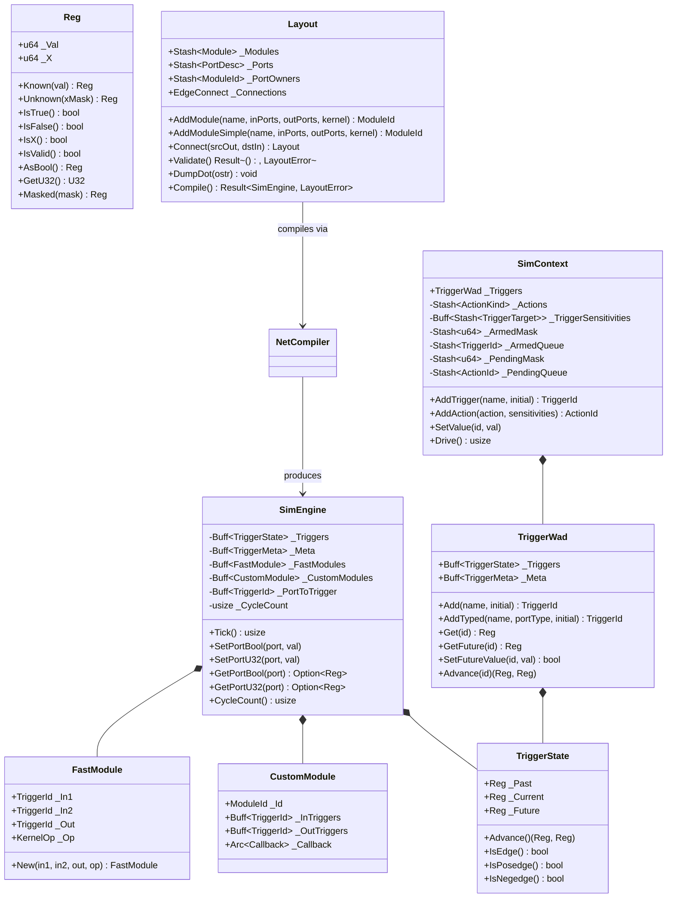

# Module Reference: `rube`

## 1. Overview & Purpose

The `rube` module is Kosh's **ultra-low-latency synchronous digital logic simulation and discrete-event dataflow framework**. It provides an end-to-end pipeline for defining netlists, performing topological net compilation, and simulating digital systems with zero heap allocation during execution.

Key design principles:
1. **Multi-Value Register Model (`Reg`)**: Unified 16-byte bit-packed register supporting 2-state and 4-state logic (0, 1, X) across Boolean, U8, U16, U32, and U64 bus widths.
2. **Hot AoS Temporal Latching (`TriggerState`)**: 48-byte contiguous state cells (`_Past`, `_Current`, `_Future`) fitting within a single 64-byte L1 cache line, completely isolated from cold metadata (`TriggerMeta`).
3. **Disjoint-Set Union (DSU) Net Compilation (`NetCompiler`)**: Merges connected input and output ports into canonical net roots in $O(P \cdot \alpha(P))$ time.
4. **Dual Execution Models**:
   - **Synchronous Engine (`SimEngine`)**: Multicycle synchronous clock-ticking with streaming fast-gate evaluation (`FastModule`) and custom module callbacks (`CustomModule`).
   - **Discrete-Event Engine (`SimContext`)**: Event-driven delta-cycle engine using 64-bit flat bitmasks, an inverted trigger sensitivity index, and zero-allocation persistent queue swap buffers.
5. **Zero `std::vec::Vec` Invariant**: All buffers, queues, and metadata use project-native `silo::Buff` and `silo::Stash`.

---

## 2. Architecture & Class Diagram



---

## 3. Core Subcomponents

### 3.1 Unified 16-Byte Register (`Reg`)
`Reg` is the universal data currency across `rube`. It packs both value bits (`_Val`) and unknown mask bits (`_X`) into two 64-bit words:
- **Known Valid**: `_X == 0`. `_Val` holds the exact value.
- **Unknown (X)**: `_X != 0`. Each set bit in `_X` marks the corresponding bit in `_Val` as undefined.
- **IEEE-1364 4-State Bitwise Operators**: Implements `Not`, `BitAnd`, `BitOr`, and `BitXor` with exact 4-state ternary propagation rules:
  - `0 & X = 0`, `1 & X = X`, `X & X = X`
  - `1 | X = 1`, `0 | X = X`, `X | X = X`
  - `!X = X`

### 3.2 Layout & Topological Net Compilation (`NetCompiler`)
1. **Declaration**: Modules and ports are declared via `Layout::AddModule` or `Layout::AddModuleSimple`.
2. **Driver Validation**: Validates 1-to-1 input driver constraints (`DuplicateInputDriver`), port directions (`InvalidPortDirection`), and port data types (`TypeMismatch`).
3. **DSU Net Aliasing**: Merges connected nets using path-compressed Disjoint Set Union ($O(P \cdot \alpha(P))$ time).
4. **Fast Kernel Inlining**: Standard logic gates (`Nand`, `And`, `Or`, `Not`, `Xor`, `Nor`, `Xnor`) are compiled into flat `FastModule` records containing direct `TriggerId` indices.

### 3.3 Synchronous Simulation Engine (`SimEngine`)
During `SimEngine::Tick()`:
- **Phase 1 (Fast Gate Streaming)**: Iterates over contiguous `FastModule` structs in L1 cache and evaluates `KernelOp::Eval(in1, in2, 1)`, streaming results directly to `_Triggers[out]._Future`.
- **Phase 2 (Custom Module Evaluation)**: Dispatches user-defined custom kernels with stack-allocated input/output buffers (for $\le 16$ ports) or `silo::Buff` (for $> 16$ ports).
- **Phase 3 (Synchronous Advance)**: Updates all trigger state cells in contiguous memory:
  $$\text{\_Past} \leftarrow \text{\_Current}, \quad \text{\_Current} \leftarrow \text{\_Future}$$

### 3.4 Event-Driven Discrete-Event Engine (`SimContext`)
`SimContext` handles asynchronous discrete-event dataflow and delta-cycle propagation:
- **Inverted Sensitivity Index**: `_TriggerSensitivities[trigger_id]` stores a dynamic array of actions sensitive to that trigger. When a trigger changes, lookups occur in $O(\text{fanout})$ time rather than linearly scanning all sensitivities.
- **Flat Bitmask Queues**: 64-bit word masks (`_ArmedMask`, `_PendingMask`) eliminate duplicate queue insertions in $O(1)$ time.
- **Zero-Allocation Delta Cycles**: `Drive()` swaps persistent queues (`_ArmedQueue` $\leftrightarrow$ `_CurrArmed`, `_PendingQueue` $\leftrightarrow$ `_CurrPending`) to avoid memory allocations during delta cycles.

---

## 4. Standard Component Library

| Component | Subsystem | Description | Primary Ports |
| :--- | :--- | :--- | :--- |
| `NandGate` | `gates` | 2-input NAND primitive | `In1`, `In2`, `Out` |
| `AndGate` | `gates` | 2-input AND primitive | `In1`, `In2`, `Out` |
| `OrGate` | `gates` | 2-input OR primitive | `In1`, `In2`, `Out` |
| `NotGate` | `gates` | 1-input Inverter primitive | `In`, `Out` |
| `XorGate` | `gates` | 2-input XOR primitive | `In1`, `In2`, `Out` |
| `NorGate` | `gates` | 2-input NOR primitive | `In1`, `In2`, `Out` |
| `XnorGate` | `gates` | 2-input XNOR primitive | `In1`, `In2`, `Out` |
| `RSLatch` | `latches` | Cross-coupled asynchronous RS latch | `S`, `R`, `Q`, `Q1` |
| `CRSLatch` | `latches` | Clock-gated RS latch | `Clk1`, `Clk2`, `S`, `R`, `Q`, `Q1` |
| `DLatch` | `latches` | Transparent level-sensitive D-latch | `D`, `DInv`, `E1`, `E2`, `Q`, `Q1` |
| `HalfAdder` | `adder` | 1-bit Half Adder (XOR + AND) | `In1`, `In2`, `Sum`, `Carry` |
| `FullAdder` | `adder` | 1-bit Full Adder (2 x HA + OR) | `SetA`, `SetB`, `SetCIn`, `Sum`, `Carry` |
| `Adder<N>` | `adder` | Parameterized N-bit ripple carry adder | `SetA(U32)`, `SetB(U32)`, `GetSum()`, `Carry()` |
| `BusAdder32` | `adder` | Word-level 32-bit arithmetic bus adder | `_A`, `_B`, `_Sum`, `_Carry` |

---

## 5. Usage Examples

### Synchronous Layout Compilation & Simulation
```rust
use crate::rube::{
    adder::Adder,
    layout::Layout,
    silo::U32,
};

let mut layout = Layout::New();
let adder = Adder::<16>::New(&mut layout, "Adder16");
let mut engine = layout.Compile().expect("Layout compilation failed");

adder.SetA(&mut engine, U32(1234));
adder.SetB(&mut engine, U32(5678));

// Advance clock ticks for ripple carry propagation
for _ in 0..48 {
    engine.Tick();
}

assert_eq!(adder.GetSum(&engine), 6912);
```

### Event-Driven Delta Propagation
```rust
use crate::rube::{
    reg::Reg,
    sim_context::{ActionKind, SimContext},
    trigger::TriggerSense,
};

let mut ctx = SimContext::New();
let in0 = ctx.AddTrigger("in0", Reg::FALSE);
let in1 = ctx.AddTrigger("in1", Reg::TRUE);

ctx.AddAction(
    ActionKind::Not { _In: in0, _Out: in1 },
    &[(in0, TriggerSense::EDGE)],
);

ctx.SetValue(in0, Reg::TRUE);
let deltaCycles = ctx.Drive();

assert_eq!(ctx.GetValue(in1), Reg::FALSE);
```
