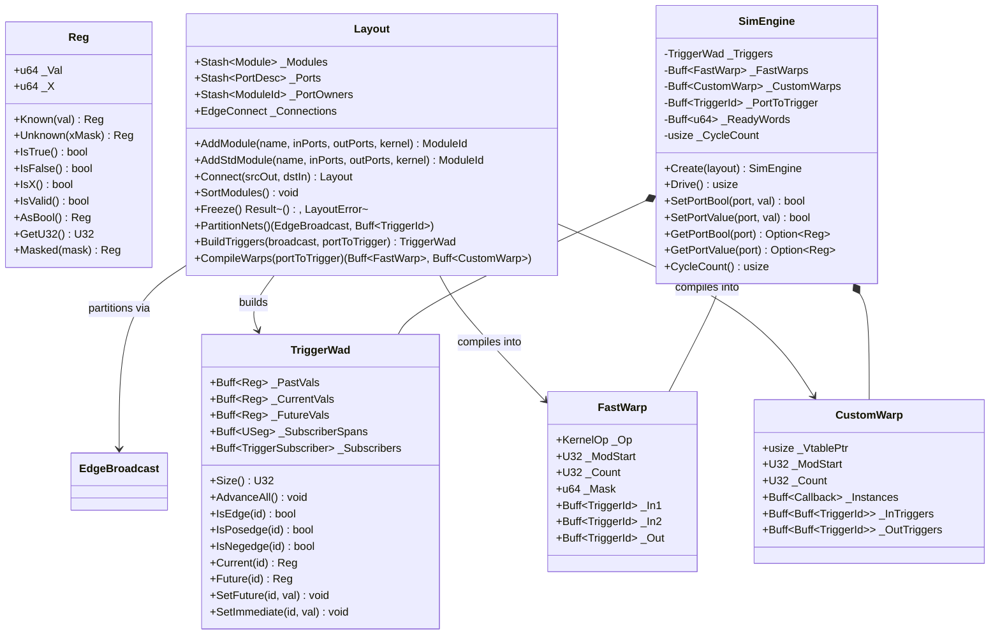

# Module Reference: `rube`

## 1. Overview & Purpose

The `rube` module is Kosh's **ultra-low-latency synchronous digital logic simulation and SIMT execution engine**. It provides an end-to-end framework for declaring hardware netlists, performing topological net compilation, and simulating digital systems with zero heap allocation during the simulation hot path.

Key architectural highlights:
1. **Unified Register Currency (`Reg`)**: 16-byte bit-packed register supporting 2-state and 4-state IEEE-1364 logic (0, 1, X) across Boolean, U8, U16, U32, and U64 bus widths.
2. **Structure-of-Arrays Temporal Storage (`TriggerWad`)**: Contiguous arrays for temporal states (`_PastVals`, `_CurrentVals`, `_FutureVals`) and subscriber spans (`_SubscriberSpans`, `_Subscribers`) maximizing L1 cache locality.
3. **Graph Broadcast Net Partitioning (`EdgeBroadcast`)**: Merges connected input and output ports into canonical net trigger IDs using breadth-first CSR traversal.
4. **SIMT Warp Execution Pipeline**:
   - **`Layout::Freeze` Step 1**: Automatically sorts modules by opcode for fast primitive gates and by closure `vtable` pointer for custom behavioral blocks.
   - **`FastWarp` & `CustomWarp`**: Batched Structure-of-Arrays (SoA) execution blocks eliminating dynamic opcode switching.
   - **64-Lane Word Predication (`_ReadyWords`)**: Bit-packed readiness tracking (8x memory compression) enabling the engine to skip 64 inactive gates in a single CPU cycle.
5. **Zero `std::vec::Vec` Invariant**: All buffers and metadata use project-native `silo::Buff` and `silo::Stash`.
6. **VCD Waveform I/O (`vcd`, `vcdio`)**: Full IEEE-1364 Value Change Dump (VCD) writer and zero-heap `ShardTree` parser.
7. **Rich Standard Component Library**: Built-in primitives for standard logic gates (`NandGate`, `AndGate`, `XorGate`, etc.), latches (`DLatch`, `CRSLatch`, `RSLatch`), adders (`HalfAdder`, `FullAdder`, `Adder<N>`, `BusAdder32`), and synchronous memory queues (`Fifo`).

---

## 2. Architecture & Class Diagram



---

## 3. Core Subsystems

### 3.1 Unified 16-Byte Register (`Reg`)
`Reg` is the universal data currency across `rube`. It packs data value bits (`_Val`) and unknown mask bits (`_X`) into two 64-bit words:
- **Known Valid**: `_X == 0`. `_Val` holds the exact integer or boolean value.
- **Unknown (X)**: `_X != 0`. Marked bits indicate high-impedance or uninitialized states.
- **Ternary Operators**: Implements `Not`, `BitAnd`, `BitOr`, and `BitXor` according to IEEE-1364 4-state logic propagation rules.

### 3.2 Layout & Topological Net Partitioning
1. **Declaration**: Modules and ports are added via `Layout::AddModule` or `Layout::AddStdModule`.
2. **Pure Top-Down Container DAG**: The `Layout` maintains a zero-overhead structural hierarchy via `_SubModules`. Modules can act as containers for other modules without reverse `_Parent` links, allowing identical sub-blocks to be shared or grouped across multiple functional bounds in a Directed Acyclic Graph (DAG) without memory bloat.
3. **Freeze & Compilation**:
   - **Step 1 (Module Sorting)**: Sorts all modules by `KernelKind::ClassKey()`, clustering primitive gates by opcode and custom closures by `vtable` pointer. Structural hierarchies are remapped identically. Containers are ignored in compilation.
   - **Step 2 (CSR Graph Compaction)**: Compacts `EdgeConnect` into CSR binary-search segments.
   - **Step 3 (Validation)**: Verifies 1-to-1 driver rules and port type matching.
4. **Net Partitioning (`EdgeBroadcast`)**: Traverses connected nets using `EdgeBroadcast::DoBroadcast` to produce canonical `TriggerId` group assignments for every port.

### 3.3 SIMT Warp Simulation Engine (`SimEngine`)
During `SimEngine::Drive()`:
- **Phase 1 (Resolve Readiness)**: Evaluates changed trigger edges (`_Triggers.IsEdge`) and updates `_ReadyWords: Buff<u64>` bitmasks.
- **Phase 2 (Fast Warp SIMT Execution)**: Scans 64-lane `_ReadyWords`. Inactive 64-gate blocks are skipped in 1 CPU instruction. Active lanes execute homogenous opcode kernels (`FastWarp`) with zero branch switching.
- **Phase 3 (Custom Warp Execution)**: Executes `CustomWarp` closures in contiguous blocks, maximizing L1 instruction cache and branch target buffer (BTB) hit rates.
- **Phase 4 (Temporal Advance)**: Synchronously advances all temporal state cells (`_PastVals <- _CurrentVals`, `_CurrentVals <- _FutureVals`).

### 3.4 VCD Waveform I/O (`vcd`, `vcdio`)
- **`VcdWriter`**: Generates standard IEEE-1364 VCD traces capturing time steps, scopes, and signal changes.
- **`VcdParser`**: High-performance streaming VCD parser implemented using `shard::ShardTree` grammar combinators.

---

## 4. Standard Component Library

| Component | Subsystem | Description | Primary Ports |
| :--- | :--- | :--- | :--- |
| `NandGate` | `gates` | 2-input NAND primitive | `In1`, `In2`, `Out` |
| `AndGate` | `gates` | 2-input AND primitive | `In1`, `In2`, `Out` |
| `OrGate` | `gates` | 2-input OR primitive | `In1`, `In2`, `Out` |
| `NotGate` | `gates` | 1-input Inverter primitive | `In`, `Out` |
| `XorGate` | `gates` | 2-input XOR primitive | `In1`, `In2`, `Out` |
| `NorGate` | `gates` | 2-input NOR primitive | `In1`, `In2`, `Out` |
| `XnorGate` | `gates` | 2-input XNOR primitive | `In1`, `In2`, `Out` |
| `RSLatch` | `latches` | Cross-coupled asynchronous RS latch | `S`, `R`, `Q`, `Q1` |
| `CRSLatch` | `latches` | Clock-gated RS latch | `Clk1`, `Clk2`, `S`, `R`, `Q`, `Q1` |
| `DLatch` | `latches` | Transparent level-sensitive D-latch | `D`, `DInv`, `E1`, `E2`, `Q`, `Q1` |
| `HalfAdder` | `adder` | 1-bit Half Adder (XOR + AND) | `In1`, `In2`, `Sum`, `Carry` |
| `FullAdder` | `adder` | 1-bit Full Adder (2 x HA + OR) | `SetA`, `SetB`, `SetCIn`, `Sum`, `Carry` |
| `Adder<N>` | `adder` | Parameterized N-bit ripple carry adder | `SetA(U32)`, `SetB(U32)`, `GetSum()`, `Carry()` |
| `BusAdder32` | `adder` | Word-level 32-bit arithmetic bus adder | `_A`, `_B`, `_Sum`, `_Carry` |
| `Fifo` | `fifo` | Synchronous FWFT FIFO with configurable width/depth | `Clk`, `Reset`, `Push`, `Pop`, `DataIn`, `DataOut`, `Empty`, `Full` |

---

## 5. Usage Example

```rust
use crate::rube::{
    adder::Adder,
    engine::SimEngine,
    layout::Layout,
    reg::Reg,
    silo::U32,
};

let mut layout = Layout::New();
let adder = Adder::<16>::New(&mut layout, "Adder16");
layout.Freeze().expect("Layout freeze and validation failed");

let mut engine = SimEngine::Create(&layout);

adder.SetA(&mut engine, U32(1234));
adder.SetB(&mut engine, U32(5678));

// Advance simulation clock cycles
for _ in 0..48 {
    engine.Drive();
}

assert_eq!(adder.GetSum(&engine), 6912);
```
