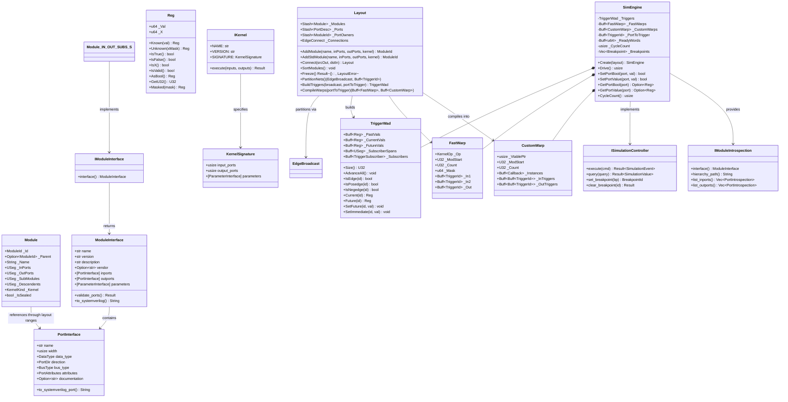

# Module Reference: `rube`

## 1. Overview & Purpose

The `rube` module is Kosh's **ultra-low-latency synchronous digital logic simulation and SIMT execution engine**. It provides an end-to-end framework for declaring hardware netlists, performing topological net compilation, and simulating digital systems with zero heap allocation during the simulation hot path.

**Current Version**: 2.0 (Runtime Module Architecture with EDA Compatibility Roadmap)

Key architectural highlights:
1. **Unified Register Currency (`Reg`)**: 16-byte bit-packed register supporting 2-state and 4-state IEEE-1364 logic (0, 1, X) across Boolean, U8, U16, U32, and U64 bus widths.
2. **Runtime Module Hierarchy (`Module`)**: Module records use runtime `USeg` ranges into layout-owned port and submodule storage. Modules can be sealed during layout construction, with the current implementation enforcing the sealed state through runtime checks.
3. **Structure-of-Arrays Temporal Storage (`TriggerWad`)**: Contiguous arrays for temporal states (`_PastVals`, `_CurrentVals`, `_FutureVals`) and subscriber spans (`_SubscriberSpans`, `_Subscribers`) maximizing L1 cache locality.
4. **Graph Broadcast Net Partitioning (`EdgeBroadcast`)**: Merges connected input and output ports into canonical net trigger IDs using breadth-first CSR traversal.
5. **SIMT Warp Execution Pipeline**:
   - **`Layout::Freeze` Step 1**: Automatically sorts modules by opcode for fast primitive gates and by closure `vtable` pointer for custom behavioral blocks.
   - **`FastWarp` & `CustomWarp`**: Batched Structure-of-Arrays (SoA) execution blocks eliminating dynamic opcode switching.
   - **64-Lane Word Predication (`_ReadyWords`)**: Bit-packed readiness tracking (8x memory compression) enabling the engine to skip 64 inactive gates in a single CPU cycle.
6. **Type-Safe Kernel System (`IKernel`)**: Trait-based kernel signatures and runtime slice validation, alongside the existing fast, behavioral, custom, coroutine, and trait kernel kinds.
7. **Rich Module Interfaces (`IModuleInterface`)**: Static self-documenting module contracts with SystemVerilog export and introspection support. VHDL export and broader EDA integration remain future work.
8. **Native Simulation Storage**: Core simulation buffers use project-native `silo::Buff` and `silo::Stash`; boundary APIs such as introspection and breakpoint control may use standard collections.
9. **VCD Waveform I/O (`vcd`, `vcdio`)**: Full IEEE-1364 Value Change Dump (VCD) writer and zero-heap `ShardTree` parser.
10. **Rich Standard Component Library**: Built-in primitives for standard logic gates (`NandGate`, `AndGate`, `XorGate`, etc.), latches (`DLatch`, `CRSLatch`, `RSLatch`), adders (`HalfAdder`, `FullAdder`, `Adder<N>`, `BusAdder32`), and synchronous memory queues (`Fifo`).

---

## 2. Architecture: Runtime Module Hierarchy

### 2.1 Runtime Module Architecture

Rube's current module representation is a runtime layout record. The layout owns the actual port and submodule collections; each module stores compact `USeg` ranges into those collections. This keeps module records small and allows a single layout to contain heterogeneous modules.

```rust
pub struct Module {
    pub _Id: ModuleId,
    pub _Parent: Option<ModuleId>,
    pub _Name: String,

    // Ranges into layout-owned port and module storage
    pub _InPorts: USeg,
    pub _OutPorts: USeg,
    pub _SubModules: USeg,
    pub _Descendents: USeg,
    pub _Kernel: KernelKind,
    pub _IsSealed: bool,
}
```

**Current properties**:
- Port and submodule counts are runtime values represented by compact segments.
- Sealing is a layout-construction state enforced by runtime assertions, not a Rust type-state transition.
- The layout owns shared storage, so the module record does not embed port or submodule arrays.
- The runtime representation supports heterogeneous modules and the later compilation of modules into specialized warp arrays.

### 2.2 Module Lifecycle

```
1. Layout::AddModule or Layout::AddStdModule
    ↓ Create a Module with runtime port ranges

2. Layout construction {
         .AddModule(...);
         .Connect(...);
         .AddSubModule(...);
     }

3. SealModule(module_id)
    ↓ Mark the runtime module as sealed and validate construction rules

4. Layout::Freeze()
    ↓ Partition nets, validate connections, sort modules, and compile warps
```

---

## 2.3 Architecture & Class Diagram

## 2.3 Architecture & Class Diagram



---

## 3. Core Subsystems

## 3. Core Subsystems

### 3.1 Runtime Module Hierarchy (`Module`)
Modules are layout records with runtime-sized ranges into shared storage:
- **Input ports** (`_InPorts: USeg`): range of external input port records
- **Output ports** (`_OutPorts: USeg`): range of external output port records
- **Submodules** (`_SubModules: USeg`): range of child module IDs
- **Descendents** (`_Descendents: USeg`): range used for hierarchy traversal
- **Kernel** (`_Kernel: KernelKind`): fast, behavioral, custom, coroutine, or trait-backed behavior
- **Sealing** (`_IsSealed: bool`): runtime construction state checked by layout operations

This representation does not provide compile-time port-count validation or a type-state `Construction`/`Sealed` distinction. Its advantage is that one layout can own compact, heterogeneous module records while `Layout::Freeze()` compiles them into specialized net and warp data structures.

### 3.2 Module Interface System (`IModuleInterface`, `ModuleInterface`)
**Purpose**: Self-documenting modules with automatic HDL export

```rust
pub struct ModuleInterface {
    pub name: &'static str,
    pub version: &'static str,
    pub description: &'static str,
    pub vendor: Option<&'static str>,
    pub inports: &'static [PortInterface],
    pub outports: &'static [PortInterface],
    pub parameters: &'static [ParameterInterface],
}

pub struct PortInterface {
    pub name: &'static str,
    pub width: usize,
    pub data_type: DataType,
    pub direction: PortDir,
    pub bus_type: BusType,
    pub attributes: PortAttributes,  // is_clock, is_reset, is_valid, etc.
    pub documentation: Option<&'static str>,
}

pub trait IModuleInterface {
    fn interface() -> &'static ModuleInterface;
}
```

**Capabilities**:
- ✅ Export module to SystemVerilog/VHDL with full port definitions
- ✅ Document module interface (version, vendor, description)
- ✅ Rich port metadata (clock/reset/valid signals recognized)
- ✅ Zero runtime allocation (all static const)
- ✅ Query at runtime via introspection API

**Example**:
```rust
const ADDER_INTERFACE: ModuleInterface = ModuleInterface {
    name: "bus_adder_32",
    version: "1.0.0",
    description: "32-bit binary adder",
    inports: &[
        PortInterface { name: "a", width: 32, data_type: DataType::Logic(32), ... },
        PortInterface { name: "b", width: 32, data_type: DataType::Logic(32), ... },
    ],
    outports: &[
        PortInterface { name: "sum", width: 32, data_type: DataType::Logic(32), ... },
        PortInterface { name: "carry", width: 1, data_type: DataType::Bool, ... },
    ],
};

// Auto-generates:
// module bus_adder_32 (
//     input [31:0] a,
//     input [31:0] b,
//     output [31:0] sum,
//     output carry
// );
```

### 3.3 Type-Safe Kernel System (`IKernel`)
**Purpose**: Replace string-based kernel registry with type-safe, validated kernels

```rust
pub struct KernelSignature {
    pub input_ports: usize,
    pub output_ports: usize,
}

pub trait IKernel: Send + Sync {
    const NAME: &'static str;
    const VERSION: &'static str;
    const SIGNATURE: KernelSignature;

    fn execute(&self, inputs: &[Reg], outputs: &mut [Reg]) -> Result<(), KernelError>;
}
```

**Benefits**:
- ✅ Explicit kernel signatures with runtime input/output slice validation
- ✅ Self-documenting kernel interfaces
- ✅ Type-safe kernel composition
- ✅ Enables kernel parameters and factories
- ✅ No more magic string-based lookups

**Example**:
```rust
pub struct BusAdder32;

impl IKernel for BusAdder32 {
    const NAME: &'static str = "bus_adder_32";
    const VERSION: &'static str = "1.0.0";
    const SIGNATURE: KernelSignature = KernelSignature {
        input_ports: 2,
        output_ports: 2,
    };

    fn execute(&self, inputs: &[Reg], outputs: &mut [Reg]) -> Result<(), KernelError> {
        // Signature validation ensures inputs.len() == 2, outputs.len() == 2
        let a = inputs[0].Val();
        let b = inputs[1].Val();
        outputs[0] = Reg::FromU32(U32((a + b) as u32));
        outputs[1] = Reg::FromBool((a + b) > u32::MAX as u64);
        Ok(())
    }
}
```

### 3.4 Simulation Control Protocol (`ISimulationController`)
**Purpose**: Enable external control and introspection during simulation

```rust
pub enum SimulationCommand {
    Run(usize),              // Run N cycles
    Step(usize),             // Step N cycles and pause
    Pause,                   // Pause immediately
    Reset,                   // Reset to initial state
    Query(SimulationQuery),  // Query state
}

pub enum SimulationEvent {
    Paused,
    Completed,
    BreakpointHit(BreakpointId),
    Error(String),
}

pub trait ISimulationController {
    fn execute(&mut self, cmd: SimulationCommand) -> Result<SimulationEvent, SimulationError>;
    fn query(&self, query: SimulationQuery) -> Result<SimulationValue, SimulationError>;
    fn set_breakpoint(&mut self, bp: Breakpoint) -> BreakpointId;
    fn clear_breakpoint(&mut self, bp_id: BreakpointId) -> Result<(), SimulationError>;
}
```

**Features**:
- ✅ Step simulation N cycles at a time
- ✅ Pause/resume simulation
- ✅ Query cycle count and port values
- ✅ Set breakpoints on port changes, cycle counts
- ✅ Probe signals for waveform collection
- ✅ Reset simulation to initial state

**Performance**: ≤1% overhead when not using breakpoints

### 3.5 Module Introspection (`IModuleIntrospection`)
**Purpose**: Runtime queries of module structure and hierarchy

```rust
pub trait IModuleIntrospection {
    fn interface(&self) -> &'static ModuleInterface;
    fn hierarchy_path(&self) -> String;     // e.g., "top.pipeline.stage1"
    fn list_inports(&self) -> Vec<PortIntrospection>;
    fn list_outports(&self) -> Vec<PortIntrospection>;
    fn get_submodules(&self) -> Vec<ModuleIntrospection>;
}
```

**Enables**:
- ✅ Debugger integration (pause on hierarchy path)
- ✅ Waveform trace tools (automated port discovery)
- ✅ UVM-style reflection queries
- ✅ Verification framework integration

### 3.6 Unified 16-Byte Register (`Reg`)
`Reg` is the universal data currency across `rube`. It packs data value bits (`_Val`) and unknown mask bits (`_X`) into two 64-bit words:
- **Known Valid**: `_X == 0`. `_Val` holds the exact integer or boolean value.
- **Unknown (X)**: `_X != 0`. Marked bits indicate high-impedance or uninitialized states.
- **Ternary Operators**: Implements `Not`, `BitAnd`, `BitOr`, and `BitXor` according to IEEE-1364 4-state logic propagation rules.

### 3.7 Layout & Topological Net Partitioning
1. **Declaration**: Modules and ports are added via `Layout::AddModule` or `Layout::AddStdModule`.
2. **Pure Top-Down Container DAG**: The `Layout` maintains a zero-overhead structural hierarchy via `_SubModules`. Modules can act as containers for other modules without reverse `_Parent` links, allowing identical sub-blocks to be shared or grouped across multiple functional bounds in a Directed Acyclic Graph (DAG) without memory bloat.
3. **Freeze & Compilation**:
   - **Step 1 (Module Sorting)**: Sorts all modules by `KernelKind::ClassKey()`, clustering primitive gates by opcode and custom closures by `vtable` pointer. Structural hierarchies are remapped identically. Containers are ignored in compilation.
   - **Step 2 (CSR Graph Compaction)**: Compacts `EdgeConnect` into CSR binary-search segments.
   - **Step 3 (Validation)**: Verifies 1-to-1 driver rules and port type matching.
4. **Net Partitioning (`EdgeBroadcast`)**: Traverses connected nets using `EdgeBroadcast::DoBroadcast` to produce canonical `TriggerId` group assignments for every port.

### 3.8 SIMT Warp Simulation Engine (`SimEngine`)
During `SimEngine::Drive()`:
- **Phase 1 (Resolve Readiness)**: Evaluates changed trigger edges (`_Triggers.IsEdge`) and updates `_ReadyWords: Buff<u64>` bitmasks.
- **Phase 2 (Fast Warp SIMT Execution)**: Scans 64-lane `_ReadyWords`. Inactive 64-gate blocks are skipped in 1 CPU instruction. Active lanes execute homogenous opcode kernels (`FastWarp`) with zero branch switching.
- **Phase 3 (Custom Warp Execution)**: Executes `CustomWarp` closures in contiguous blocks, maximizing L1 instruction cache and branch target buffer (BTB) hit rates.
- **Phase 4 (Temporal Advance)**: Synchronously advances all temporal state cells (`_PastVals <- _CurrentVals`, `_CurrentVals <- _FutureVals`).

### 3.9 VCD Waveform I/O (`vcd`, `vcdio`)
- **`VcdWriter`**: Generates standard IEEE-1364 VCD traces capturing time steps, scopes, and signal changes.
- **`VcdParser`**: High-performance streaming VCD parser implemented using `shard::ShardTree` grammar combinators.

---

## 4. EDA Compatibility Roadmap

Rube is evolving to be fully compatible with industry Electronic Design Automation (EDA) tools and verification frameworks. This roadmap outlines the phases:

### Phase 0: Validation & Setup (Week 1)
- ✅ Validate runtime port metadata and layout construction
- ✅ Test `PortInterface` and module interface metadata
- ⏳ Performance baseline measurements remain to be completed
- **Status**: Partially complete

### Phase 1: Module Interface Standards (Weeks 2-3)
- ✅ `ModuleInterface` + `IModuleInterface` trait implemented
- ✅ Static port metadata and module introspection implemented
- ✅ SystemVerilog export implemented through `ToSystemVerilog()`
- ⏳ VHDL export remains pending
- **Status**: Mostly complete; remaining work is VHDL output and broader tool integration
- **Benefits**: Self-documenting modules, automated HDL generation, reflection APIs
- **See**: `EDA_PHASE1_IMPLEMENTATION.md`

### Phase 2: Type-Safe Kernel System (Weeks 4-6)
- ✅ Define `IKernel` trait with `KernelSignature`
- ⏳ Migrate all standard kernels to `IKernel`
- ⏳ **PENDING**: Replace string-based registry with type-safe `KernelRegistry`
- ⏳ **PENDING**: Create deprecation wrapper for backward compatibility
- **Benefits**: Explicit kernel contracts and type-safe composition
- **See**: `EDA_IMPLEMENTATION_CHECKLIST.md` Phase 2

### Phase 3: Simulation Control Protocol (Weeks 7-9)
- ⏳ **PENDING**: Implement `ISimulationController` trait
- ⏳ **PENDING**: Add pause/resume/step commands
- ⏳ **PENDING**: Implement breakpoint system
- ⏳ **PENDING**: Add probe/watchpoint system
- **Benefits**: Debugger integration, external simulation control
- **See**: `EDA_IMPLEMENTATION_CHECKLIST.md` Phase 3

### Phase 4: DPI/VPI & Co-Simulation (Weeks 10-13)
- ⏳ **PENDING**: Implement `ISimulationSocket` trait
- ⏳ **PENDING**: Create DPI/VPI wrapper layer
- ⏳ **PENDING**: Enable Verilog co-simulation
- ⏳ **PENDING**: Add verification hook system
- **Benefits**: Seamless Verilog/VHDL integration, mixed-language simulation
- **See**: `EDA_IMPLEMENTATION_CHECKLIST.md` Phase 4

### Phase 5: Module Packaging (Weeks 14-15)
- ⏳ **PENDING**: Implement `ModulePackage` manifest system
- ⏳ **PENDING**: Create TOML-based package format
- ⏳ **PENDING**: Add version management and dependencies
- ⏳ **PENDING**: Implement package loader
- **Benefits**: IP core distribution, version management, dependency resolution
- **See**: `EDA_IMPLEMENTATION_CHECKLIST.md` Phase 5

**Total Effort**: ~15 weeks for full EDA integration (phases can overlap)
**Performance Target**: ≤2% simulation overhead for all EDA features
**Backward Compatibility**: 100% - existing code continues to work

**Documentation**:
- `CONST_GENERIC_ANALYSIS.md` - Type-state design rationale
- `HIERARCHICAL_MODULE_FRAMEWORK.md` - Module hierarchy design
- `EDA_COMPATIBILITY_EVALUATION.md` - Complete gap analysis
- `EDA_IMPLEMENTATION_CHECKLIST.md` - Detailed task breakdown
- `EDA_PHASE1_IMPLEMENTATION.md` - Phase 1 practical guide

---

## 5. Standard Component Library

| Component | Subsystem | Description | Primary Ports |
| :--- | :--- | :--- | :--- |
| `NandGate` | `gates` | 2-input NAND primitive | `In1`, `In2`, `Out` |
| `AndGate` | `gates` | 2-input AND primitive | `In1`, `In2`, `Out` |
| `OrGate` | `gates` | 2-input OR primitive | `In1`, `In2`, `Out` |
| `NotGate` | `gates` | 1-input Inverter primitive | `In`, `Out` |
| `XorGate` | `gates` | 2-input XOR primitive | `In1`, `In2`, `Out` |
| `NorGate` | `gates` | 2-input NOR primitive | `In1`, `In2`, `Out` |
| `XnorGate` | `gates` | 2-input XNOR primitive | `In1`, `In2`, `Out` |
| `RSLatch` | `latches` | Cross-coupled asynchronous RS latch | `S`, `R`, `Q`, `Q1` |
| `CRSLatch` | `latches` | Clock-gated RS latch | `Clk1`, `Clk2`, `S`, `R`, `Q`, `Q1` |
| `DLatch` | `latches` | Transparent level-sensitive D-latch | `D`, `DInv`, `E1`, `E2`, `Q`, `Q1` |
| `HalfAdder` | `adder` | 1-bit Half Adder (XOR + AND) | `In1`, `In2`, `Sum`, `Carry` |
| `FullAdder` | `adder` | 1-bit Full Adder (2 x HA + OR) | `SetA`, `SetB`, `SetCIn`, `Sum`, `Carry` |
| `Adder<N>` | `adder` | Parameterized N-bit ripple carry adder | `SetA(U32)`, `SetB(U32)`, `GetSum()`, `Carry()` |
| `BusAdder32` | `adder` | Word-level 32-bit arithmetic bus adder | `_A`, `_B`, `_Sum`, `_Carry` |
| `Fifo` | `fifo` | Synchronous FWFT FIFO with configurable width/depth | `Clk`, `Reset`, `Push`, `Pop`, `DataIn`, `DataOut`, `Empty`, `Full` |

---

## 6. Usage Examples

### 6.1 Classic Layout-Based Simulation (Traditional Approach)

```rust
use crate::rube::{
    adder::Adder,
    engine::SimEngine,
    layout::Layout,
    reg::Reg,
    silo::U32,
};

let mut layout = Layout::New();
let adder = Adder::<16>::New(&mut layout, "Adder16");
layout.Freeze().expect("Layout freeze and validation failed");

let mut engine = SimEngine::Create(&layout);

adder.SetA(&mut engine, U32(1234));
adder.SetB(&mut engine, U32(5678));

// Advance simulation clock cycles
for _ in 0..48 {
    engine.Drive();
}

assert_eq!(adder.GetSum(&engine), 6912);
```

### 6.2 Hierarchical Module with Layout-Owned Runtime Records

```rust
use crate::rube::{
    module::Module,
    kernel::IKernel,
    interface::{ModuleInterface, IModuleInterface},
};

// Define a pipeline adder with 2 inputs, 1 output, 3 internal submodules
pub struct AdderPipeline;

impl IModuleInterface for AdderPipeline {
    fn interface() -> &'static ModuleInterface {
        &ADDER_PIPELINE_INTERFACE
    }
}

let mut layout = Layout::New();
let stage1 = BusAdder32::New(&mut layout, "Stage1", None);
let stage2 = DLatch::New(&mut layout, "Stage2", None);
let stage3 = DLatch::New(&mut layout, "Stage3", None);

// Connect modules through layout-owned ports and nets.
layout.Connect(stage1.Out(), stage2.In())?;
layout.Connect(stage2.Out(), stage3.In())?;
layout.SealModule(stage1.Id());
layout.SealModule(stage2.Id());
layout.SealModule(stage3.Id());
layout.Freeze()?;
// Output:
// module adder_pipeline (
//     input [31:0] data_in,
//     output [31:0] result
// );
```

### 6.3 Simulation Control with Breakpoints (Phase 3+)

```rust
use crate::rube::sim_ctrl::{
    ISimulationController, SimulationCommand, BreakpointTarget,
};

let mut engine = SimEngine::Create(&layout)?;

// Set a breakpoint on a specific cycle
let bp_id = engine.set_breakpoint(Breakpoint {
    target: BreakpointTarget::CycleCount(50),
    condition: None,
});

// Run simulation until breakpoint
match engine.execute(SimulationCommand::Run(100))? {
    SimulationEvent::BreakpointHit(id) if id == bp_id => {
        println!("Paused at cycle 50");

        // Query current state
        let cycle = engine.query(SimulationQuery::CycleCount)?;
        println!("Current cycle: {:?}", cycle);

        // Resume with stepping
        engine.execute(SimulationCommand::Step(5))?;
    }
    _ => {}
}
```

### 6.4 Module Introspection (Phase 1+)

```rust
use crate::rube::introspect::IModuleIntrospection;

let module = AdderPipeline;

// Get interface documentation
let interface = module.interface();
println!("Module: {}", interface.name);
println!("Version: {}", interface.version);
println!("Description: {}", interface.description);

// List ports
for port in module.list_inports() {
    println!("Input: {} ({} bits)", port.name, port.width);
}

for port in module.list_outports() {
    println!("Output: {} ({} bits)", port.name, port.width);
}

// Get hierarchy path
println!("Path: {}", module.hierarchy_path());
// Output: "top.pipeline.stage1"
```

---

## 7. Performance Characteristics

### Simulation Throughput
- **Hot-Path Zero-Allocation**: `SimEngine::Drive()` uses no heap allocations
- **SIMT Throughput**: 64-lane predication enables skipping blocks of inactive gates
- **Performance target**: 100M+ gate operations per second is a design target, not a measured repository benchmark
- **Cache Efficiency**: SoA storage maximizes L1 cache hit rates

### Memory Overhead
- **Module records**: Compact runtime IDs, `USeg` ranges, kernel kind, and sealing state; exact size depends on target and field layout
- **Trigger Storage**: One 16-byte `Reg` per trigger (past, current, future state)

### Introspection Performance (Phase 1+)
- **Interface Query**: O(1) for static interface metadata
- **Port Lookup**: O(n) where n = port count (typically <20)
- **Hierarchy Path**: O(depth), computed on demand
- **Breakpoint Overhead**: <1% when not firing (single hash lookup per cycle)

### Parallel and Heterogeneous Execution
- **CPU parallelism**: `Drive_Parallel()` is an opt-in Heist/Atelier path that chunks warp arrays with `CpuSpawnQuell!` and composes them with `ChoreTree!`.
- **Current safety boundary**: The parallel path uses a shared engine pointer for worker callbacks; partition ownership and determinism require continued validation and are not compile-time guarantees.
- **GPU status**: `swarm`/`symph` provide independent CPU/GPU abstractions and portable shader experiments, but GPU dispatch is not currently connected to `SimEngine::Drive()`.
- **Benchmark status**: CPU scaling and GPU speedups remain to be measured with representative Rube circuits.

---

## 8. Common Patterns & Best Practices

### Pattern 1: Hierarchical Module Composition
```rust
let mut layout = Layout::New();
let pipeline = layout.AddContainer("Pipeline");
let adder = BusAdder32::New(&mut layout, "Adder", Some(pipeline));
layout.Connect(adder.Out(), pipeline.In())?;
layout.SealModule(pipeline);
layout.Freeze()?;
```

### Pattern 2: Testing with RubeTest_XXXX
```rust
pub struct RubeTest_AdderPipeline;

impl RubeTest_AdderPipeline {
    pub fn New() -> Result<Layout, HierarchyError> {
        let mut layout = Layout::New();
        let pipeline = AdderPipeline::New()?;
        layout.AddModule("DUT", pipeline)?;
        // Add testbench submodules
        Ok(layout)
    }
}
```

### Pattern 3: Custom Kernels Implementing IKernel
```rust
pub struct MyCustomKernel;

impl IKernel for MyCustomKernel {
    const NAME: &'static str = "my_custom_kernel";
    const VERSION: &'static str = "1.0.0";
    const SIGNATURE: KernelSignature = KernelSignature {
        input_ports: 2,
        output_ports: 1,
    };

    fn execute(&self, inputs: &[Reg], outputs: &mut [Reg]) -> Result<(), KernelError> {
        // Custom behavior
        Ok(())
    }
}
```

---

## 9. Troubleshooting & FAQ

**Q: How are module sizes represented?**
A: The current `Module` stores runtime `USeg` ranges into layout-owned port and submodule storage. `Layout::Freeze()` validates and compiles these records into simulation structures.

**Q: What does sealing do?**
A: `SealModule()` marks a module as no longer under construction. The current implementation tracks this with `_IsSealed` and runtime checks; it is not a compile-time type-state distinction.

**Q: How do I migrate existing code to the new IKernel system?**
A: See the deprecation wrapper in Phase 2. Existing `KernelKind::Custom("string")` code continues to work. Implement `IKernel` for new kernels and use `KernelKind::Trait(Arc::new(...))`.

**Q: Can I use Rube with Verilog simulators?**
A: Phase 4 adds DPI/VPI support. Until then, you can export generated SystemVerilog module definitions (Phase 1) and integrate manually.

**Q: What's the performance impact of module interfaces?**
A: Interface metadata is static, while introspection materializes small query results. Port listing is O(n), where n is the number of interface ports.

---

## 10. Related Documentation

- `RubePerformancePlan.md` - Measured optimization plan for serial, Heist CPU, SIMD, and future Swarm/Symph GPU execution
- `CONST_GENERIC_ANALYSIS.md` - Historical design analysis; verify examples against the runtime module implementation
- `HIERARCHICAL_MODULE_FRAMEWORK.md` - Hierarchical encapsulation design
- `EDA_COMPATIBILITY_EVALUATION.md` - Industry standards alignment
- `EDA_IMPLEMENTATION_CHECKLIST.md` - Phase-by-phase tasks
- `EDA_PHASE1_IMPLEMENTATION.md` - Phase 1 practical implementation guide
- `VISUAL_SUMMARY.md` - Architecture diagrams and comparisons

---

## 11. Version History

| Version | Release | Key Features |
|---------|---------|---|
| **2.0** | 2026-Q3 | Runtime module records, warp compilation, module interfaces, type-safe kernel trait support |
| **1.5** | 2026-Q2 | Earlier layout and warp architecture |
| **1.0** | 2026-Q1 | Initial flat netlist architecture, SIMT execution, VCD I/O |


