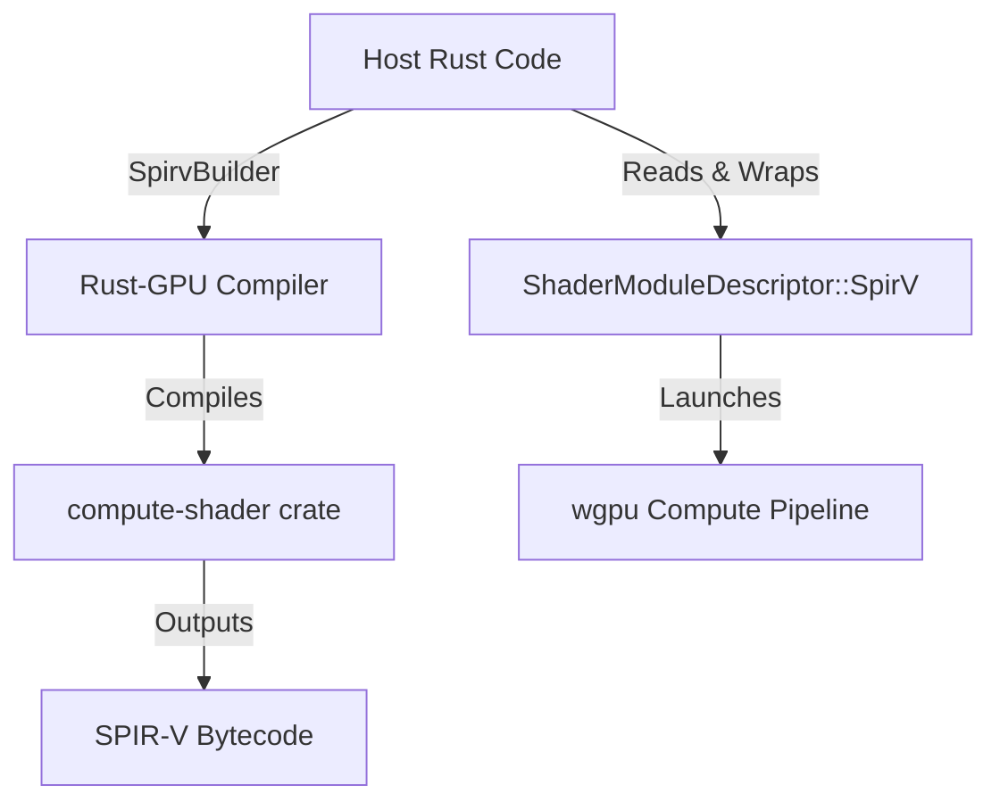

# Rust-GPU SPIR-V Shader Integration

This page documents the integration of **Rust-GPU** within the `Kosh` project. Rust-GPU allows compiling Rust code directly to SPIR-V, enabling the host and shader code to share logic, types, and mathematical operations (e.g., using `glam`) in a type-safe, unified manner.

---

## Architecture Overview

Instead of writing shader logic in WebGPU Shading Language (WGSL), Kosh supports compiling a secondary crate—[compute-shader](file:///c:/Work/Taregna/Kosh/compute-shader)—directly to Vulkan-compliant SPIR-V bytecode. The host code dynamically invokes the compiler during test execution, reads the generated bytecode, and submits it to `wgpu` pipelines.



---

## 1. Shader Crate Structure (`compute-shader`)

The GPU code resides in the [compute-shader](file:///c:/Work/Taregna/Kosh/compute-shader/) workspace crate:

### Cargo Configuration ([Cargo.toml](file:///c:/Work/Taregna/Kosh/compute-shader/Cargo.toml))
- **`crate-type`**: Configured as both `lib` and `cdylib` to allow building as a compiler backend artifact.
- **Dependencies**: Uses `spirv-std` with the `glam_0_33` feature enabled, exposing standard vector and matrix types to the GPU.

### Shader Logic ([lib.rs](file:///c:/Work/Taregna/Kosh/compute-shader/src/lib.rs))
- **`#![cfg_attr(target_arch = "spirv", no_std)]`**: Runs in `#![no_std]` environment when targeted for the GPU.
- **`#[spirv(compute(threads(64)))]`**: Denotes a compute shader entry point with a local workgroup size of 64 threads.
- **Buffers**: Exposes bindings as normal slice reference inputs/outputs:
  ```rust
  #[spirv(compute(threads(64)))]
  pub fn main_cs(
      #[spirv(global_invocation_id)] id: UVec3,
      #[spirv(storage_buffer, descriptor_set = 0, binding = 0)] input: &[u32],
      #[spirv(storage_buffer, descriptor_set = 0, binding = 1)] output: &mut [u32],
  )
  ```

---

## 2. Host Integration & Dynamic Compilation

In [src/swarm/_tests.rs](file:///c:/Work/Taregna/Kosh/src/swarm/_tests.rs), the `TestRustGpuComputeExample` function orchestrates dynamic compilation:

### Build Invocation
```rust
let  	compileResult = spirv_builder::SpirvBuilder::new( "compute-shader", "spirv-unknown-vulkan1.1")
    .build()
    .unwrap();
```
- Calls `spirv-builder` to download and sync the custom compiler toolchain.
- Compiles the crate to `spirv-unknown-vulkan1.1`.

### Bytecode Retrieval
```rust
let  	modulePath = match compileResult.module {
    spirv_builder::ModuleResult::SingleModule( p) => p,
    spirv_builder::ModuleResult::MultiModule( m) => m.into_iter().next().unwrap().1,
};
let  	spirvData = std::fs::read( modulePath).unwrap();
let  	spirv = std::borrow::Cow::Owned( wgpu::util::make_spirv_raw( &spirvData).into_owned());
```
- Resolves the output binary path from the compiler result.
- Reads raw bytes from disk and converts them into `wgpu::ShaderSource::SpirV`.

### Pipeline Submission
- Pipeline creation references the `main_cs` entry point:
  ```rust
  let  	pipeline = device.create_compute_pipeline( &wgpu::ComputePipelineDescriptor {
      label: Some( "collatz_rec_pipeline"),
      layout: Some( &pipelineLayout),
      module: &shader,
      entry_point: Some( "main_cs"),
      compilation_options: Default::default(),
      cache: None,
  });
  ```

---

## 3. MSVC Linker Workaround (LNK1189)

On Windows platforms using the MSVC toolchain, compiling `rustc_codegen_spirv` (the compiler plugin used to compile the shader) can exceed the PE/COFF limit of 65,535 symbols because of dependencies on huge internal compiler structures.

### The Fix
To compile successfully on Windows, Kosh applies two strategies:

1. **Alternative Linker**: The target configuration in [.cargo/config.toml](file:///c:/Work/Taregna/Kosh/.cargo/config.toml) is set to use the LLVM Linker (`rust-lld.exe`):
   ```toml
   [target.x86_64-pc-windows-msvc]
   linker = "rust-lld.exe"
   ```
2. **Release Profile Compilation**: Build with the release profile (`--release`). By default, release builds compile without debug symbols, reducing the symbol export table below the 65,535 limit.

---

## How to Run & Verify

Run the GPU test suite in release mode:
```bash
cargo test --release -- --nocapture swarm::TestRustGpuComputeExample
```

The output will confirm successful compilation and computation of the Collatz sequence records:
```
TestRustGpuComputeExample: Computed Collatz records up to 1048576 ✓
test swarm::_tests::TestRustGpuComputeExample ... ok
```
