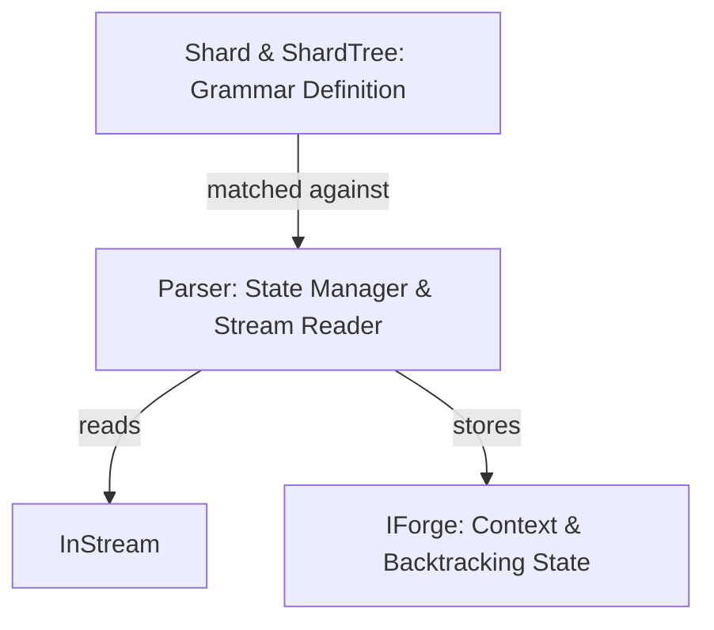

# Segue Framework

The `segue` module is a high-performance, backtracking recursive descent parser framework designed for Kosh. It provides a modular grammar definition system using a tree of shards and an efficient parsing engine with state tracking for backtracking.

## Purpose & Design Philosophy
1. **Expressive Grammar**: Enable developers to define complex grammars easily using Rust macros (`ShardTree!`) and operators (`<` for concatenation, `|` for alternation).
2. **Efficient Backtracking**: Provide a robust state management system (via `IForge`) to seamlessly handle failed matches and backtrack without deep copying the input stream.
3. **DRY & Modular Forges**: Boilerplate is minimized through macros like `ImplForgeBase!`, and structural redundancies are eliminated by combining similar node types (e.g. `LeafForge`, `CompositeForge`).

> [!TIP]
> **Unified Parsing Interface**:
> By abstracting all grammar matching under the `IGrammar` trait, the parser can handle characters, strings, character sets, and complex nested tree structures uniformly.

---

## Architecture & Core Components

Segue is built around three central concepts:



### 1. Parser (The Engine)
Defined in [parser.rs](../src/segue/parser.rs), `Parser` is the core matching engine. It:
* Wraps an `InStream` to read input tokens (characters/bytes) buffered dynamically via `Stash`.
* Maintains a type-erased `Stash` (stack) of `IForge` pointers to track the parsing context downwards from the root to the active leaf. The `IForge` pointers are transmuted to `'static` lifetimes before being stashed to deliberately break a **cyclic drop-check (`dropck`) dependency** between the `Parser` and its `Forge` contexts. 
* Safely reclaims memory by implementing `Drop`, which walks the `_Stash` and correctly deallocates the erased raw `IForge` pointers.
* Provides the `ParseTree<T: IForgeable>` method to generically parse any abstract tree of nodes by calling `T::Forge` on the leaf nodes. This decouples the `Parser` from concrete implementations like `Shard`.

### 2. IForge (The Context)
Defined in [parser.rs](../src/segue/parser.rs), `IForge` represents a linked list of contexts for the current parse tree path. To minimize boilerplate, standard methods (`Parent`, `Parser`, `Deposit`) are auto-generated for implementations using the `ImplForgeBase!` macro.
* **Context Tracking**: Every node creates a context and pushes it to the parser's stash. To maximize code reuse:
  * **`LeafForge`** handles all scalar token matching (`String`, `Charset`).
  * **`CompositeForge`** handles all nested node operations (Concatenation `<` and Alternation `|`), dispatching logic based on its `_Mode: ChildOp`.
* **Backtracking**: It records the `Marker` in the stream. If a match fails, the stream is rolled back `InStream().RollTo(startMark)`.
* **Ancestor Traversal**: Provides `FindAncestor` to navigate up the context tree, useful for complex context-sensitive parsing rules.
* **Digests**: Successful matches use the `EmitDigest` helper to deposit a `Digest` (start and end markers) to their parent forge, allowing upper levels to extract matched sub-strings.

### 3. Shard & ShardTree (The Grammar)
Defined in [shard.rs](../src/segue/shard.rs), `Shard` represents a leaf node in the grammar tree.
* **Types**: Supports matching a specific `String` or a custom `Charset`.
* **Tree Construction**: The `ShardTree!` macro compiles a tree of `DynINode`s.
  * `a < b`: Concatenation (a must match, followed by b).
  * `a | b`: Alternation (if a fails, backtrack and try b).
* **IForgeable**: `Shard` implements the `IForgeable` trait, providing the `Forge` method which constructs and returns a `LeafForge` raw pointer. This allows `Parser::ParseTree` to dynamically allocate context for shards without hardcoded downcasting.
* **IGrammar**: All these types, including the `DynINode` tree, implement the `IGrammar` trait, which defines the `Match` method.

---

## Example Usage

### 1. Basic String and Charset Matching
You can directly match primitive grammar components against a parser:

```rust
let data = [U8(b'h'), U8(b'e'), U8(b'l'), U8(b'l'), U8(b'o')];
let arr = Arr::from(&data[..]);
let mut stream = InStream::FromArr(arr);
let mut parser = Parser::New(&mut stream);

// Using a primitive string
assert!("hello".Match(&mut parser));
```

### 2. Complex Grammar with ShardTree
You can construct complex tree-structured grammars using the macro and operators:

```rust
let data = [U8(b'a'), U8(b'b'), U8(b'c'), U8(b'd')];
let arr = Arr::from(&data[..]);
let mut stream = InStream::FromArr(arr);
let mut parser = Parser::New(&mut stream);

// Grammar: match "ab" followed by "cd", OR match "a" followed by "bc"
let tree = crate::ShardTree!( ( "ab" < "cd" ) | ( "a" < "bc" ) );
let dynNode: &DynINode<'_> = &tree;

assert!(dynNode.Match(&mut parser));
```
