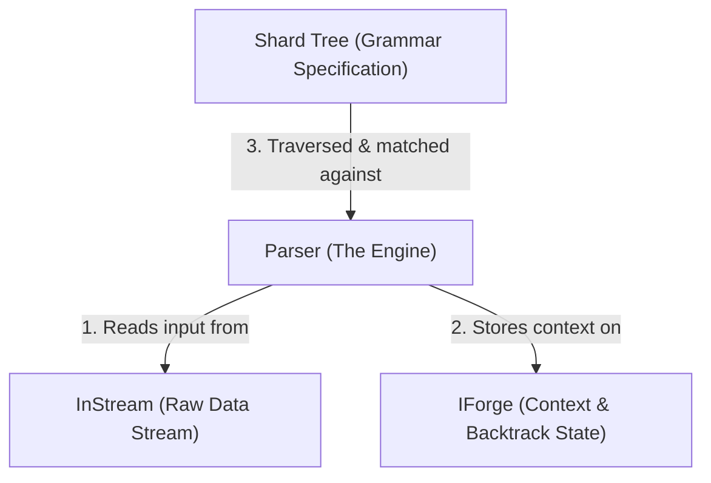

# Segue Framework

The `segue` module is a high-performance, backtracking recursive descent parser framework designed specifically for Kosh. It combines a declarative, macro-driven grammar definition system with an execution engine engineered around type-erased state tracking, manual memory reclamation, and strict decoupling.

---

## Design Philosophy

The architecture of Segue is governed by three major design goals:

1. **Declarative Grammar Definitions**: Developers define grammars intuitively using Rust macros (`ShardTree!`) and standard operators (such as `<` for sequential concatenation, and `|` for alternative branches).
2. **Zero-Copy Backtracking**: Failed matches roll back the parser state and rewind the input stream via lightweight state objects (`IForge`) without copying or duplicating the underlying stream buffers.
3. **Decoupled Engine & AST**: The core parsing engine does not have compile-time knowledge of concrete AST node types (like `Shard`). Instead, it communicates via abstract traits (`IForgeable`, `IGrammar`), enabling the framework to support entirely new grammar trees seamlessly.

---

## High-Level Architecture

The framework splits responsibilities cleanly between the engine, the grammatical specification, and the execution context:



### 1. Parser: The Engine

Defined in [parser.rs](../src/segue/parser.rs), the `Parser` orchestrates the traversal of the grammar tree against the input stream.

* **Stream Orchestration**: It wraps an `InStream`, which acts as a cursor over the input tokens. The stream provides a `Marker` interface allowing the parser to mark positions and rewind to them when backtracking.
* **Context Stash (`_Stash`)**: The parser maintains a stack (via `Stash`) of raw pointers to `IForge` contexts. This tracks the current DFS parsing path from the root of the grammar tree down to the active leaf.
* **Breaking the Cyclic Drop-Check (`dropck`)**:
  Because `IForge` contexts borrow references from the `Parser` (specifically, they reference the parser's lifetime), a direct compile-time implementation would create a cyclic lifetime dependency. Under Rust's borrow checker, this cycle prevents the `Parser` from being dropped while stashed contexts exist, and vice-versa.
  To bypass this limit safely, Segue **transmutes the stashed `IForge` pointers to `'static` lifetimes** before pushing them onto the `_Stash`.
* **Manual Deallocation**: Since stashed pointers are cast to `'static`, Rust's automatic drop compiler logic will not run on them. To prevent memory leaks, `Parser` implements a custom `Drop` trait. When the parser goes out of scope, its `Drop` implementation walks the `_Stash` stack, casts the raw pointers back to their true lifetimes, and manually deallocates them.
* **Decoupled Execution (`ParseTree`)**:
  Rather than hardcoding downcasts to concrete types (such as `Shard`), the parser implements the generic `ParseTree<T: IForgeable>` method. It traverses a generic tree of `DynINode`s, and whenever it hits a leaf node, it delegates the instantiation of the appropriate matching context to the leaf via `T::Forge(selfPtr)`.

### 2. IForge: The Parsing Context & Backtracking State

Defined in [parser.rs](../src/segue/parser.rs), `IForge` is a trait that represents the parsing state of a specific node in the tree. 

* **Hierarchical Linked List**: Each `IForge` maintains a parent pointer (`Parent()`), effectively forming a parent-linked tree representing the active path.
* **Auto-Generated Boilerplate**: Standard boilerplate operations (like parent links, parser references, and default digest routing) are generated using the `ImplForgeBase!` macro.
* **Context Varieties**:
  * **`LeafForge`**: Instantiated when matching scalar terminal values (such as specific string patterns or character sets). It delegates to the leaf's matching logic.
  * **`CompositeForge`**: Instantiated for binary operators (Concatenation `<` or Alternation `|`). It manages the routing between children. For example, in Alternation mode, if the left child fails to match, `CompositeForge` rewinds the stream and dispatches the right child.
  * **`ActionForge`**: Attaches an execution action (`Attrib::Action`) that fires on successful match execution.
* **Backtracking Execution**: When created, a forge captures the current stream marker. If the match fails, the forge rolls back the stream:
  ```rust
  self.Parser().InStream().RollTo(startMark);
  ```
* **Ancestor Traversal**: Provides `FindAncestor` to navigate up the context tree, useful for complex context-sensitive parsing rules.
* **Digests & Digest Deposition**: When a node successfully matches a substring, it calls `EmitDigest` which bubbles a `Digest` containing `(start_marker, end_marker)` up to its parent forge. This digest propagation allows ancestor nodes to extract matched string segments.

### 3. Shard & ShardTree: The Grammar Specification

Defined in [shard.rs](../src/segue/shard.rs), this component defines the declarative syntax of the grammar.

* **`Shard` (Terminal Leaves)**: Represents either a literal string (`Shard::String`) or a byte filter class (`Shard::Charset`).
* **`IForgeable` Decoupling**:
  `Shard` implements the `IForgeable` trait:
  ```rust
  impl IForgeable for Shard {
      fn Forge<'a, 'p, 's, R>(&'a self, parser: *mut Parser<'p, 's, R>) -> *mut (dyn IForge<'p, 'p, 's, R> + 'p) {
          // returns a newly allocated LeafForge context
      }
  }
  ```
  This is the key interface that allows `Parser::ParseTree` to remain generic and clean of concrete downcasting.
* **Tree Construction (`ShardTree!`)**:
  This macro builds a nested tree of nodes (`DynINode<Shard>`) representing the grammar structure. It leverages operator overloading for structure construction:
  * `a < b`: Sequences (Concatenation)
  * `a | b`: Choice (Alternation)
  * `* a`: Repetition (0 or more times, attaching a `Repeat(USeg(0,0))` attribute)
  * `+ a`: Repetition (1 or more times, attaching a `Repeat(USeg(1,0))` attribute)

---

## Walkthrough: Anatomy of a Match

To understand how the engine works, let us walk through matching the grammar `( "ab" | "ac" )` against the input stream `"ac"`.

### Phase 1: Context Allocation (Parsing the Tree)

1. The grammar tree is passed to `parser.ParseTree::<Shard>(&tree)`.
2. The parser traverses the tree depth-first.
3. For the choice node (`|`), it allocates a `CompositeForge` with `ChildOp::Choice` mode.
4. For the leaf nodes `"ab"` and `"ac"`, it calls `leaf.Forge(selfPtr)` (via `IForgeable`), which allocates two `LeafForge` contexts.
5. All constructed forge pointers are pushed to the `Stash` in the parser.

### Phase 2: Matching Execution

1. The root `CompositeForge` executes `MatchNode()`.
2. Since it is in `Choice` mode, it first triggers `MatchNode()` on the left `LeafForge` representing `"ab"`.
3. The left `LeafForge` reads from the stream:
   * It records `startMark` (position 0).
   * It attempts to match `"ab"`. It reads `'a'` (ok), then reads `'c'` (failed, expected `'b'`).
   * It rolls the stream back to `startMark` (position 0) and returns `false`.
4. The `CompositeForge` receives `false` from the left child.
5. It rewinds the stream again to the choice start marker (position 0) to ensure a clean state, and dispatches the right `LeafForge` representing `"ac"`.
6. The right `LeafForge` reads from the stream:
   * It records `startMark` (position 0).
   * It reads `'a'` (ok), then reads `'c'` (ok).
   * It matches successfully, consumes 2 bytes, and returns `true`.
7. The `CompositeForge` receives `true` from the right child, propagates `true` to the parser, and emits a `Digest` representing the matched bounds `0..2`.

---

## Example Usage

### 1. Simple Token Matching
Matching basic primitive string leaves directly against the stream:

```rust
use crate::segue::parser::Parser;
use crate::segue::shard::Shard;
use crate::flux::instream::InStream;

let mut stream = InStream::from("hello");
let mut parser = Parser::New(&mut stream);

// Direct matching of terminal strings
assert!("hello".Match(&mut parser));
```

### 2. Macro-Driven Tree Grammar (With Backtracking)
Constructing a grammar with alternation and checking backtracking capabilities:

```rust
use crate::segue::parser::Parser;
use crate::segue::shard::Shard;
use crate::stalks::DynINode;
use crate::flux::instream::InStream;

let mut stream = InStream::from("acd");
let mut parser = Parser::New(&mut stream);

// Grammar: Match ("ab" followed by "cd") OR ("ac" followed by "d")
// InStream has "acd". First branch ("ab") will fail and backtrack, 
// then second branch ("ac" < "d") will successfully match.
let tree = crate::ShardTree!( ( "ab" < "cd" ) | ( "ac" < "d" ) );
let dynNode: &DynINode<'_> = &tree;

assert!(dynNode.Match(&mut parser));
```
