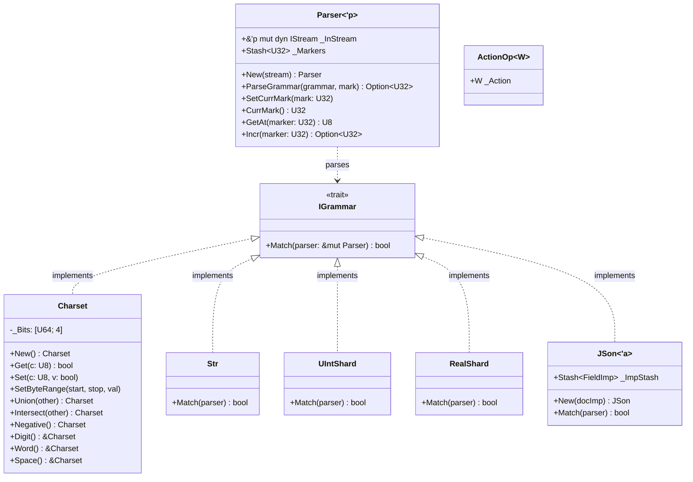
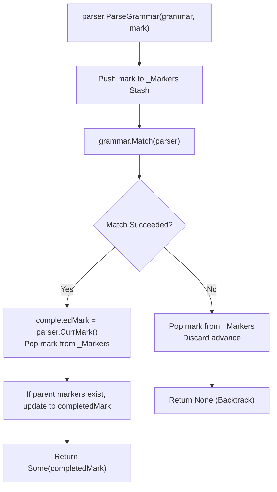

# Module Reference: `shard`

## 1. Overview & Purpose

The `shard` module is Kosh's ultra-fast **recursive-descent grammar and parser engine**. Key capabilities include:
1. **Zero-Box Grammar DSL (`ShardTree!`)**: Defines complex context-free and regular grammars as concrete generic structs instantiated directly on the stack.
2. **256-Bit Set Algebra (`Charset`)**: Bitset character filter supporting union, intersection, negation, range queries, and standard POSIX classes (`:digit:`, `:alpha:`, `:alnum:`, `:word:`, `:space:`).
3. **Optimized Token Leaves**: Inlined parsers for unsigned integers (`UInt`), signed integers (`Int`), hexadecimal values (`Hex`), IEEE floating-point numbers (`Real`), double-quoted strings (`Str`), and whitespace (`WSpc`).
4. **Grammar Combinators**:
   - `BinShard<L, R>`: Sequence (`<`) and alternation (`|`).
   - `RepeatShard<C>`: Quantifiers (`*` 0..*, `+` 1..*, `?` 0..1) parameterized with `USeg`.
   - `ActionShard<C, W>`: Semantic action callbacks invoked upon successful rule match.
5. **Streaming JSON Parser (`JSon<'a>`)**: Event-driven streaming JSON tokenizer and structural parser binding directly to `flux` data types.

---

## 2. Architecture & Data Structures



---

## 3. Parsing & Backtracking Flowchart



---

## 4. Struct & Type Reference

### `Parser<'p>`
Tracks input stream state and a stack of rollback markers:
- `New(stream: &'p mut dyn IStream) -> Self`: Initializes parser over input stream.
- `ParseGrammar(grammar: &(impl IGrammar + ?Sized), mark: U32) -> Option<U32>`: Pushes `mark`, attempts grammar match, rolls back on failure, or commits and returns new marker on success.
- `CurrMark(&self) -> U32`: Returns the current stream byte offset.
- `SetCurrMark(&mut self, mark: U32)`: Updates the current stream offset.
- `GetAt(&mut self, marker: U32) -> U8`: Fetches single byte at `marker`.
- `Incr(&mut self, marker: U32) -> Option<U32>`: Advances offset by 1 if within bounds.

### `Charset`
A 256-bit bitset (four `U64` words) representing arbitrary ASCII/byte character classes:
- **Bit Logic**: Byte `c` is mapped to word `c / 64` and bit `c % 64`.
- `New() -> Self`: Initializes empty bitset.
- `FromFilter(filter: fn(U8) -> bool) -> Self`: Initializes from boolean predicate.
- `from(spec: &[u8]) -> Self`: Parses bracket expressions (e.g., `b"a-zA-Z0-9_"` or `b":alnum:"`).
- `Get<C: Into<U8>>(&self, c: C) -> bool`: Tests membership in $O(1)$ time.
- `Set<C: Into<U8>>(&mut self, c: C, v: bool)`: Sets or clears bit for character `c`.
- `SetByteRange<C: Into<U8>>(&mut self, start: C, stop: C, value: bool)`: Sets inclusive character range.
- `Union(&self, other: &Charset) -> Self`: Bitwise OR across all 4 words.
- `Intersect(&self, other: &Charset) -> Self`: Bitwise AND across all 4 words.
- `Negative(&self) -> Self` / `!charset`: Inverts all 256 bits.
- **Predefined Classes**: `All()`, `Digit()`, `NonDigit()`, `Word()`, `NonWord()`, `AlphaNum()`, `Ascii()`, `Blank()`, `EndLine()`, `Cntrl()`, `Graph()`, `Print()`, `Punct()`, `Space()`, `NonSpace()`, `Alpha()`, `Upper()`, `Lower()`, `XDigit()`, `DotAll()`.

### Token Leaves
- `Str`: Matches standard quoted strings with escape sequences (`"..."`).
- `UInt` / `UIntShard`: Matches unsigned decimal integer strings (`[0-9]+`).
- `Int` / `IntShard`: Matches signed decimal integer strings (`[+-]?[0-9]+`).
- `Hex` / `HexShard`: Matches hexadecimal strings with optional prefix (`[+-]?(0x|0X)?[0-9a-fA-F]+`).
- `Real` / `RealShard`: Matches floating-point numbers with optional sign, fraction, and exponent (`[+-]?[0-9]+(\.[0-9]+)?([eE][+-]?[0-9]+)?`).
- `WSpc`: Matches one or more whitespace characters (`[ \t\n\r\x0B\x0C]+`).

### Combinators (Type Aliases)
- **`RepeatShard<C> = UniNode<C, USeg>`**: Repeats child grammar `C` according to interval `USeg`. Supports `*` (0..$\infty$), `+` (1..$\infty$), and `?` (0..1).
- **`ActionShard<C, W> = UniNode<C, ActionOp<W>>`**: Executes notification closure `W: INotify` passing the matched slice `Arr<'_, U8>` when `C` matches.
- **`BinShard<L, R> = BinNode<L, R>`**:
  - `BinOp::Less` (`<`): Sequence — matches `_Left`, then matches `_Right` from left's end marker.
  - `BinOp::Bor` (`|`): Alternation — attempts `_Left`; if unsuccessful, attempts `_Right` from the original marker.

### `JSon<'a>`
Streaming JSON parser driven by `FieldImp<'a>`:
- `New(docImp: FieldImp<'a>) -> Self`: Constructs JSON parser targeting import sink.
- `MatchObject(&self, parser: &mut Parser) -> bool`: Recursively parses object key-value pairs (`"key": value`).
- `MatchValue(&self, parser: &mut Parser) -> bool`: Parses primitive tokens, nested objects, or nested arrays.

---

## 5. Traits Reference

| Trait | Purpose | Key Methods |
| :--- | :--- | :--- |
| `IGrammar` | Core parsing interface for all grammar rules | `Match(&self, parser: &mut Parser) -> bool` |
| `INotify` | Action callback invoked on grammar rule match | `DoNotify(&mut self, matched: Arr<'_, U8>) -> bool` |

---

## 6. The `ShardTree!` Macro Syntax

The `ShardTree!` macro translates declarative grammar expressions into typed AST structures:

```rust
// Matches a quoted string, followed by whitespace, colon, whitespace, and a real number with callback
let grammar = ShardTree!(
    Str[ |key| { println!("Key: {}", key); true } ]
    < ?WSpc
    < ':'
    < ?WSpc
    < Real[ |val| { println!("Val: {}", val); true } ]
);
```
