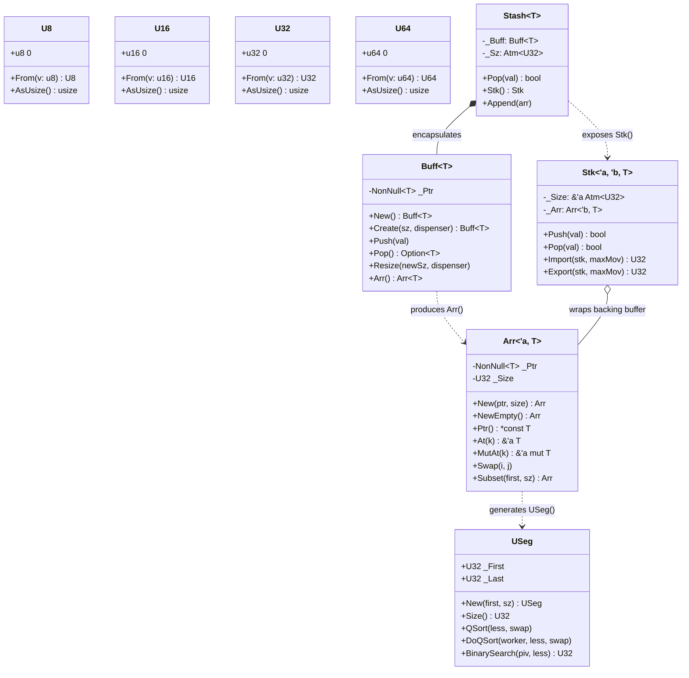
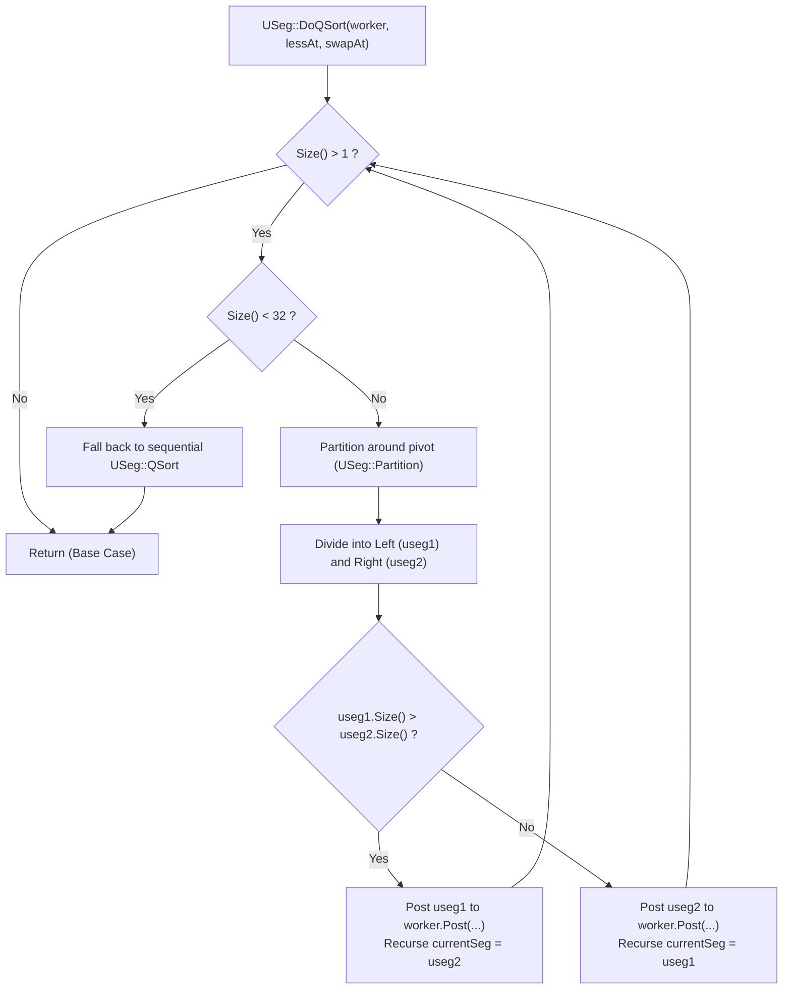

# Module Reference: `silo`

## 1. Overview & Purpose

The `silo` module is Kosh's memory, collection, and numeric foundation. It provides:
1. **Custom Unsigned Numerics (`U8`, `U16`, `U32`, `U64`)**: Transparent numeric types with wrapping arithmetic, atomic bridges, explicit size conversions, and bitwise set operations.
2. **Buffer & Slice Abstractions**:
   - `Buff<T>`: Owns contiguous heap memory allocated via `std::alloc` with panic-safe initialization guards (`InitGuard`, `ResizeGuard`).
   - `Arr<'a, T>`: Lightweight, zero-copy, copyable slice wrapper pointing to contiguous memory with lifetime bounds.
   - `Stk<'a, 'b, T>`: Lock-free atomic stack backed by an `Arr<'b, T>` and an atomic size marker `Atm<U32>`.
   - `Stash<T>`: Growable stack combining `Buff<T>` and `Atm<U32>`.
   - `USeg`: Unsigned range/segment `[_First, _Last]` for intervals, slices, iteration, and parallel quicksort partitioning.
3. **Zero-Cost Pointer & Type Casting**: Extension traits for type transmutes (`ICastExt`), raw pointer lifetime coercion (`IPtrExt`, `IConstPtrExt`), and raw byte slice views (`ISliceExt`).

---

## 2. Architecture & Data Structures

---

## 3. Quicksort & Partitioning Flowchart

`USeg` and `Arr` provide parallel and sequential QuickSort implementations without allocating stack arrays:

---

## 4. Struct Reference

### `U8`, `U16`, `U32`, `U64`
Transparent wrappers (`#[repr(transparent)]`) providing wrapping arithmetic and conversions:
- **Constants**: `_X` (MAX), `_0` (0), `_1` (1), `U32::_16Sz` ($2^{16} = 65536$).
- **Methods**:
  - `From(v: $prim) -> Self`: Constructor from primitive.
  - `Get(self) -> $prim`: Unwraps the primitive.
  - `AsUsize(self) -> usize`: Converts to `usize` for indexing.
  - `FromUsize(v: usize) -> Self`: Converts from `usize`.
  - `AsU16()`, `AsU32()`, `AsU64()`: Explicit zero-cost widening.
- **Traits Implemented**: `Add`, `Sub`, `Mul`, `Div`, `Rem`, `BitAnd`, `BitOr`, `BitXor`, `Shl`, `Shr`, `Neg`, `Not`, `AddAssign`, `SubAssign`, `Deref`, `Display`, `AtomicInt`.

### `Buff<T>`
An owned, growable heap array managed via `std::alloc`:
- `New() -> Self`: Creates a zero-capacity dangling buffer.
- `Create<S, Dispenser>(sz: S, dispenser: Dispenser) -> Self`: Allocates memory and initializes elements with `dispenser(index: U32)`. Protected against unwinding panics via `InitGuard`.
- `Push(&mut self, val: T)`: Reallocates and appends `val`.
- `Pop(&mut self) -> Option<T>`: Removes and drops the last element, shrinking memory if empty.
- `Resize<Dispenser>(&mut self, newSize: U32, dispenser: Dispenser)`: Resizes in-place using `realloc` with `ResizeGuard` panic safety.
- `ExtendFromSlice(&mut self, slice: &[T]) where T: Copy`: Fast memcpy extension.
- `Arr<'a>(&self) -> Arr<'a, T>`: Borrows buffer as an `Arr`.

### `Arr<'a, T>`
A lightweight, Copy-enabled, non-owning slice reference (`_Ptr: NonNull<T>`, `_Size: U32`):
- `New<S>(ptr: NonNull<T>, size: S) -> Self`: Creates an `Arr`.
- `NewEmpty() -> Self`: Creates a zero-length dangling slice.
- `LifeFix<'b>(self) -> Arr<'b, T>`: Coerces lifetime bounds when safe.
- `At<K>(&self, k: K) -> &'a T`: Immutable index lookup.
- `MutAt<K>(&self, k: K) -> &'a mut T`: Mutable index lookup via pointer arithmetic.
- `Swap<I, J>(&self, i: I, j: J)`: Swaps two elements in-place.
- `LSnip<C>(&self, count: C) -> Arr<'a, T>`: Trims `count` elements from the left.
- `RSnip<C>(&self, count: C) -> Arr<'a, T>`: Trims `count` elements from the right.
- `Subset<F, Sz>(&self, first: F, sz: Sz) -> Arr<'a, T>`: Windowed sub-slice.

### `Stk<'a, 'b, T>`
Lock-free, fixed-capacity stack backed by `Arr<'b, T>` with atomic CAS size pointer `_Size: &'a Atm<U32>`:
- `Push(&self, v: T) -> bool`: Atomically writes data at the top and advances size via CAS.
- `Pop(&self, val: &mut T) -> bool`: Decrements size via CAS and swaps out the element.
- `Import<M>(&self, stk: &Stk<T>, maxMov: M) -> U32 where T: Copy`: Atomically transfers up to `maxMov` items from `stk` into `self`.
- `Export<M>(&self, stk: &Stk<T>, maxMov: M) -> U32 where T: Copy`: Atomically transfers up to `maxMov` items from `self` into `stk`.

### `Stash<T>`
Growable stack container encapsulating `_Buff: Buff<T>` and `_Sz: Atm<U32>`:
- `New() -> Self`: Creates empty stash.
- `Create<Sz, SzStk, Dispenser>(sz: Sz, szStk: SzStk, dispenser: Dispenser) -> Self`: Pre-allocates buffer.
- `Stk(&self) -> Stk<'_, '_, T>`: Obtains a lock-free `Stk` view of active elements.
- `Push(&mut self, val: T) where T: Copy`: Pushes value, doubling buffer if capacity is exceeded.
- `Append(&mut self, arr: Arr<'_, T>) where T: Copy`: Appends slice with single reallocation.
- `TopMut(&self) -> Option<&mut T>`: Returns mutable reference to the top element.

### `USeg`
Unsigned index interval `[_First, _Last]` (`_First: U32`, `_Last: U32`):
- `New(first, sz) -> Self`: Constructs interval `[first, first + sz - 1]`.
- `NewInf(first) -> Self`: Constructs an empty/infinite right-bound interval.
- `First(&self) -> U32`, `Last(&self) -> U32`, `End(&self) -> U32`, `Mid(&self) -> U32`, `Size(&self) -> U32`.
- `IsWithin(&self, v: U32) -> bool`: Checks if value falls within interval.
- `LSnip(count) -> Self`, `RSnip(count) -> Self`: Trims boundaries.
- `Traverse<F>(&self, lambda: F)`: Forward iteration over interval.
- `TraverseRev<F>(&self, lambda: F)`: Reverse iteration.
- `Span<F>(&self, lambda: F) -> bool`: Short-circuiting predicate scan.
- `QSort(lessAt, swapAt)`: Sequential in-place quicksort.
- `DoQSort(worker, lessAt, swapAt)`: Parallel work-stealing quicksort.
- `LowerBound(lessFn) -> U32`, `UpperBound(lessFn) -> U32`, `LocateBound(lessFn) -> USeg`, `BinarySearch(piv, lessAt) -> U32`.

---

## 5. Traits Reference

| Trait | Purpose | Key Methods |
| :--- | :--- | :--- |
| `IAccess<'a, T>` | Read-only indexed collection access | `Size() -> U32`, `At(k) -> &'a T`, `IsEmpty()`, `First()`, `Last()`, `USeg()`, `Span()`, `Traverse()`, `Iter()` |
| `IArr<'a, T>` | Mutable array operations on top of `IAccess` | `Ptr() -> *const T`, `MutAt(k) -> &'a mut T`, `SetAt(k, a)`, `SwapAt(k, a)`, `Swap(i, j)`, `SwapFrom(...)`, `LSnip()`, `RSnip()`, `Subset()`, `QuickSorter(less)` |
| `ICastExt` | Zero-cost type transmute with runtime size assertion | `Cast<U>(self) -> U` |
| `IPtrExt` | Casts `*mut T` to `*mut U` (fat pointer lifetime transmutation) | `CastLife<U>(self) -> *mut U` |
| `IConstPtrExt` | Casts `*const T` to `*const U` | `CastLife<U>(self) -> *const U` |
| `IPtrRefExt<T>` | Dereferences `*mut T` to `&'a mut T` | `MutRef<'a>(self) -> &'a mut T` |
| `IConstPtrRefExt<T>`| Dereferences `*const T` to `&'a T` | `Ref<'a>(self) -> &'a T` |
| `IPtrAtExt<T>` | Pointer offset dereferencing | `RefAt<'a>(self, idx) -> &'a T`, `MutRefAt<'a>(self, idx) -> &'a mut T` |
| `ISliceExt` | Casts slices between types and raw bytes | `CastSlice(&self) -> &[u8]`, `CastSliceFrom<U>(&self) -> &[U]`, `CastSliceMut<U>(&mut self) -> &mut [U]` |
| `Xplod<Dst, N>` | Deconstructs composite unsigned integers into arrays | `Xplod(self) -> [Dst; N]` (e.g. `U32 -> [U16; 2]` or `[U8; 4]`) |

---

## 6. Macros Reference

- **`Buff![ elem1, elem2, ... ]` / `Buff![ elem ; count ]`**: Constructs an initialized `Buff<T>`.
- **`Stash![ expr; for item in iter; if cond ]`**: List comprehension macro collecting evaluated elements into a `Stash<T>`.
- **`ImplUIntTraits!( $type, $prim, $atomic, $asPrim )`**: Generates full arithmetic, casting, display, deref, and `AtomicInt` implementations for transparent integer wrappers.
