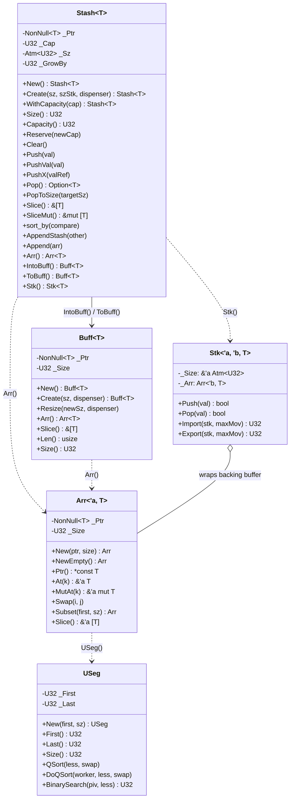
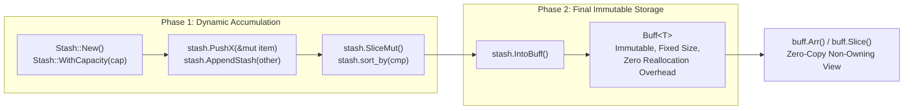
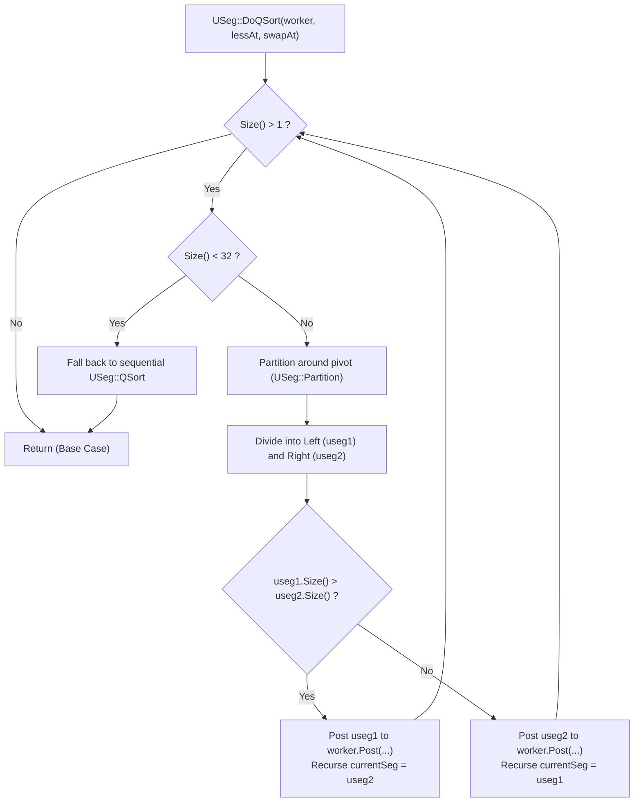

# Module Reference: `silo`

## 1. Overview & Purpose

The `silo` module is Kosh's **foundational memory management and custom numerical type system**. It is designed around three core principles:
1. **Two-Stage Memory Pipeline (`Stash` & `Buff`)**: Strict separation between dynamic, growable heap accumulation (`Stash<T>`) and immutable, fixed-size final storage (`Buff<T>`).
2. **Zero `std::vec::Vec` Invariant**: `std::vec::Vec` is completely eliminated from the codebase to guarantee deterministic allocation profiles, cache locality, and explicit ownership boundaries.
3. **Transparent Unsigned Numerics (`U8`, `U16`, `U32`, `U64`)**: Zero-cost `#[repr(transparent)]` unsigned integer wrappers that enforce wrapping arithmetic, prevent inadvertent implicit sign/widening bugs, and interoperate seamlessly with atomic atomics (`Atm<T>`).

---

## 2. Architecture & Class Diagram

---

## 3. Two-Stage Memory Lifecycle Pipeline

### Why Separation Matters
1. **`Stash<T>`**: Optimized for high-throughput mutation. Backed by raw non-null memory pointers with geometric capacity expansion, amortized O(1) append performance, and atomic `Stk` view sharing across worker threads.
2. **`Buff<T>`**: Optimized for long-term read-only retention. Holds exact buffer allocations with zero unused capacity, preventing memory leaks and allocator fragmentation in cache hierarchies.

---

## 4. Quicksort & Partitioning Flowchart

`USeg` and `Arr` provide parallel and sequential QuickSort implementations without allocating stack arrays:

---

## 5. Struct Reference

### `U8`, `U16`, `U32`, `U64`
Transparent wrappers (`#[repr(transparent)]`) providing wrapping arithmetic and conversions:
- **Constants**: `_X` (MAX), `_0` (0), `_1` (1), `U32::_16Sz` (65536).
- **Methods**:
  - `From(v: $prim) -> Self`: Constructor from primitive.
  - `Get(self) -> $prim`: Unwraps the primitive.
  - `AsUsize(self) -> usize`: Converts to `usize` for indexing.
  - `FromUsize(v: usize) -> Self`: Converts from `usize`.
  - `AsU16()`, `AsU32()`, `AsU64()`: Explicit zero-cost widening.
- **Traits Implemented**: `Add`, `Sub`, `Mul`, `Div`, `Rem`, `BitAnd`, `BitOr`, `BitXor`, `Shl`, `Shr`, `Neg`, `Not`, `AddAssign`, `SubAssign`, `Deref`, `Display`, `AtomicInt`.

### `Stash<T>`
Growable dynamic heap buffer with amortized O(1) capacity growth:
- `New() -> Self`: Creates empty stash with zero initial capacity.
- `WithCapacity<C: Into<U32>>(cap: C) -> Self`: Preallocates capacity.
- `WithCapacityVal<C: Into<U32>>(cap: C, fillVal: T) -> Self where T: Clone`: Preallocates and initializes elements.
- `Size(&self) -> U32`: Returns current active item count.
- `Capacity(&self) -> U32`: Returns total allocated slot capacity.
- `Reserve(&mut self, newCap: U32)`: Grows backing allocation to at least `newCap`.
- `Push(&mut self, val: T)`: Pushes value by value, doubling capacity if full.
- `PushX(&mut self, val: &mut T) where T: Default`: Moves element from mutable reference via `std::mem::take`.
- `Pop(&mut self) -> Option<T>`: Pops top element, decrementing size.
- `PopToSize(&mut self, targetSz: U32)`: Drops elements until count reaches `targetSz`.
- `Slice(&self) -> &[T]`: Borrows active elements as standard slice.
- `SliceMut(&mut self) -> &mut [T]`: Borrows active elements as mutable slice.
- `sort_by<F>(&mut self, compare: F)`: In-place sorting of active elements.
- `AppendStash(&mut self, other: Stash<T>)`: Moves all elements from `other` into `self`.
- `Arr(&self) -> Arr<'_, T>`: Produces non-owning `Arr` slice.
- `IntoBuff(self) -> Buff<T>`: Consumes stash and transfers exact allocation to `Buff<T>` with zero copying.
- `ToBuff(&self) -> Buff<T> where T: Clone`: Clones active items into an immutable `Buff<T>`.
- `Stk(&self) -> Stk<'_, '_, T>`: Exposes an atomic lock-free `Stk` view over capacity.

### `Buff<T>`
Owned immutable fixed-size heap buffer:
- `New() -> Self`: Creates dangling zero-capacity buffer.
- `Create<S, Dispenser>(sz: S, dispenser: Dispenser) -> Self`: Allocates fixed size and initializes elements with `dispenser(index: U32)`.
- `Resize<Dispenser>(&mut self, newSize: U32, dispenser: Dispenser)`: Resizes allocation in-place using `realloc` with `ResizeGuard` unwind safety.
- `Arr<'a>(&self) -> Arr<'a, T>`: Borrows buffer as an `Arr`.
- `Slice(&self) -> &[T]`: Borrows buffer as standard slice.
- `Len(&self) -> usize`: Returns element count as `usize`.
- `Size(&self) -> U32`: Returns element count as `U32`.

### `Arr<'a, T>`
A lightweight, Copy-enabled, non-owning slice reference (`_Ptr: NonNull<T>`, `_Size: U32`):
- `New<S>(ptr: NonNull<T>, size: S) -> Self`: Creates an `Arr`.
- `NewEmpty() -> Self`: Creates a zero-length dangling slice.
- `LifeFix<'b>(self) -> Arr<'b, T>`: Coerces lifetime bounds when safe.
- `At<K>(&self, k: K) -> &'a T`: Immutable index lookup.
- `MutAt<K>(&self, k: K) -> &'a mut T`: Mutable index lookup via pointer arithmetic.
- `Swap<I, J>(&self, i: I, j: J)`: Swaps two elements in-place.
- `LSnip<C>(&self, count: C) -> Arr<'a, T>`: Trims `count` elements from the left.
- `RSnip<C>(&self, count: C) -> Arr<'a, T>`: Trims `count` elements from the right.
- `Subset<F, Sz>(&self, first: F, sz: Sz) -> Arr<'a, T>`: Windowed sub-slice.

### `Stk<'a, 'b, T>`
Lock-free, fixed-capacity stack backed by `Arr<'b, T>` with atomic CAS size pointer `_Size: &'a Atm<U32>`:
- `Push(&self, v: T) -> bool`: Atomically writes data at the top and advances size via CAS.
- `Pop(&self, val: &mut T) -> bool`: Decrements size via CAS and swaps out the element.
- `Import<M>(&self, stk: &Stk<T>, maxMov: M) -> U32 where T: Copy`: Atomically transfers up to `maxMov` items from `stk` into `self`.
- `Export<M>(&self, stk: &Stk<T>, maxMov: M) -> U32 where T: Copy`: Atomically transfers up to `maxMov` items from `self` into `stk`.

### `USeg`
Unsigned index interval `[_First, _Last]` (`_First: U32`, `_Last: U32`):
- `New(first, sz) -> Self`: Constructs interval `[first, first + sz - 1]`.
- `NewInf(first) -> Self`: Constructs an empty/infinite right-bound interval.
- `First(&self) -> U32`, `Last(&self) -> U32`, `End(&self) -> U32`, `Mid(&self) -> U32`, `Size(&self) -> U32`.
- `IsWithin(&self, v: U32) -> bool`: Checks if value falls within interval.
- `LSnip(count) -> Self`, `RSnip(count) -> Self`: Trims boundaries.
- `Traverse<F>(&self, lambda: F)`: Forward iteration over interval.
- `TraverseRev<F>(&self, lambda: F)`: Reverse iteration.
- `Span<F>(&self, lambda: F) -> bool`: Short-circuiting predicate scan.
- `QSort(lessAt, swapAt)`: Sequential in-place quicksort.
- `DoQSort(worker, lessAt, swapAt)`: Parallel work-stealing quicksort.
- `LowerBound(lessFn) -> U32`, `UpperBound(lessFn) -> U32`, `LocateBound(lessFn) -> USeg`, `BinarySearch(piv, lessAt) -> U32`.

---

## 6. Traits Reference

| Trait | Purpose | Key Methods |
| :--- | :--- | :--- |
| `IAccess<'a, T>` | Read-only indexed collection access | `Size() -> U32`, `At(k) -> &'a T`, `IsEmpty()`, `First()`, `Last()`, `USeg()`, `Span()`, `Traverse()`, `Iter()` |
| `IArr<'a, T>` | Mutable array operations on top of `IAccess` | `Ptr() -> *const T`, `MutAt(k) -> &'a mut T`, `SetAt(k, a)`, `SwapAt(k, a)`, `Swap(i, j)`, `SwapFrom(...)`, `LSnip()`, `RSnip()`, `Subset()`, `QuickSorter(less)` |
| `ICastExt` | Zero-cost type transmute with runtime size assertion | `Cast<U>(self) -> U` |
| `IPtrExt` | Casts `*mut T` to `*mut U` (fat pointer lifetime transmutation) | `CastLife<U>(self) -> *mut U` |
| `IConstPtrExt` | Casts `*const T` to `*const U` | `CastLife<U>(self) -> *const U` |
| `IPtrRefExt<T>` | Dereferences `*mut T` to `&'a mut T` | `MutRef<'a>(self) -> &'a mut T` |
| `IConstPtrRefExt<T>`| Dereferences `*const T` to `&'a T` | `Ref<'a>(self) -> &'a T` |
| `IPtrAtExt<T>` | Pointer offset dereferencing | `RefAt<'a>(self, idx) -> &'a T`, `MutRefAt<'a>(self, idx) -> &'a mut T` |
| `ISliceExt` | Casts slices between types and raw bytes | `CastSlice(&self) -> &[u8]`, `CastSliceFrom<U>(&self) -> &[U]`, `CastSliceMut<U>(&mut self) -> &mut [U]` |
| `Xplod<Dst, N>` | Deconstructs composite unsigned integers into arrays | `Xplod(self) -> [Dst; N]` (e.g. `U32 -> [U16; 2]` or `[U8; 4]`) |

---

## 7. Macros Reference

- **`Buff![ elem1, elem2, ... ]` / `Buff![ elem ; count ]`**: Constructs an initialized immutable `Buff<T>`.
- **`Stash![ expr; for item in iter; if cond ]`**: List comprehension macro collecting evaluated elements into a `Stash<T>`.
- **`ImplUIntTraits!( $type, $prim, $atomic, $asPrim )`**: Generates full arithmetic, casting, display, deref, and `AtomicInt` implementations for transparent integer wrappers.
