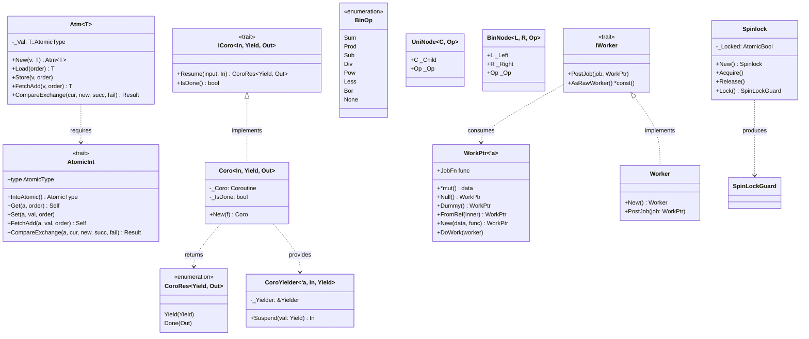
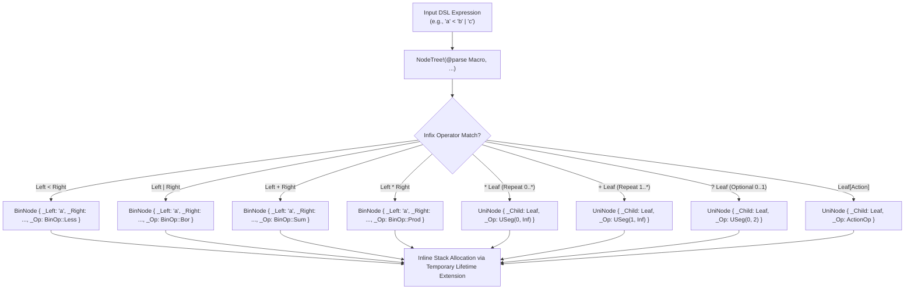

# Module Reference: `stalks`

## 1. Overview & Purpose

The `stalks` module is Kosh's foundation for **concurrency primitives**, **AST node tree representations**, **stackful coroutines**, and **job execution scheduling**. It provides:
1. **Generic Atomics & Spinlocks**: `Atm<T>` encapsulates any atomic type implementing `AtomicInt`, paired with low-overhead RAII `Spinlock` synchronization.
2. **Universal AST Node System**: `UniNode<C, Op>` (unary nodes) and `BinNode<L, R, Op>` (binary nodes) parameterized with `BinOp` (`Sum`, `Prod`, `Sub`, `Div`, `Pow`, `Less`, `Bor`, `None`).
3. **The `NodeTree!` Macro Engine**: A declarative meta-macro enabling zero-allocation recursive tree DSLs across `ShardTree!`, `TermTree!`, and `ChoreTree!`.
4. **Fast Stackful Coroutines (`Coro`)**: `Coro<In, Yield, Out>` and `ICoro` wrapping `corosensei` for zero-heap cooperative fibers with virtual stack management.
5. **Work & Worker Abstractions**: `WorkPtr<'a>` (type-erased lightweight execution pointer), `IWork` trait, `IWorker` trait, and `DynIWorker` scheduling bridge.

---

## 2. Architecture & Class Diagram

---

## 3. NodeTree Macro AST Expansion Pipeline

The `NodeTree!` macro coordinates recursive descent operator precedence parsing during compilation:

---

## 4. Struct & Enum Reference

### `Atm<T: AtomicInt>`
Safe generic atomic integer wrapper:
- `New(v: T) -> Self`: Wraps `v` in its corresponding standard atomic integer (`AtomicU8`, `AtomicU16`, `AtomicU32`, `AtomicU64`, `AtomicUsize`, etc.).
- `Load(&self, order: Ordering) -> T`: Loads value with specified atomic memory ordering.
- `Store<K: Into<T>>(&self, v: K, order: Ordering)`: Stores value with specified ordering.
- `Get(&self) -> T` / `Set<K: Into<T>>(&self, v: K)`: Convenience methods using `Ordering::SeqCst`.
- `FetchAdd<K: Into<T>>(&self, v: K, order: Ordering) -> T`: Atomically adds `v` and returns the prior value.
- `CompareExchange<K: Into<T>>(&self, current: K, newVal: K, success: Ordering, failure: Ordering) -> Result<T, T>`: Compare-and-swap loop primitive.

### `Spinlock` & `SpinLockGuard<'a>`
Fast, low-latency spinlock built on `AtomicBool` and `std::hint::spin_loop`:
- `New() -> Self`: Constructs an unlocked spinlock.
- `Acquire(&self)`: Busy-waits until lock acquisition succeeds using `compare_exchange_weak`.
- `Release(&self)`: Stores `false` with `Ordering::Release`.
- `Lock(&self) -> SpinLockGuard<'_>`: Acquires the spinlock and returns an RAII guard that automatically calls `Release()` upon drop.

### `BinOp`
Numeric and grammar binary operator enum (`#[repr(u64)]`):
- `Sum` (0): Addition `+`
- `Prod` (1): Multiplication `*`
- `Sub` (2): Subtraction `-`
- `Div` (3): Division `/`
- `Pow` (4): Exponentiation `^`
- `None` (5): Leaf/Null operator
- `Less` (6): Sequence / Precedence `<`
- `Bor` (7): Alternation / Bitwise OR `|`

### `UniNode<C, Op>`
Unary AST node encapsulating a single child `_Child: C` and an operator payload `_Op: Op`.
- Used extensively for repetition (`UniNode<C, USeg>`) and semantic actions (`UniNode<C, ActionOp<W>>`).

### `BinNode<L, R, Op = BinOp>`
Binary AST node encapsulating `_Left: L`, `_Right: R`, and `_Op: Op`.
- Forms typed binary expression trees at compile time without heap indirections.

### `Coro<In, Yield, Out>` (implements `ICoro<In, Yield, Out>`)
A stackful coroutine instance wrapping `corosensei`:
- `New<F>(f: F) -> Self where F: FnOnce(CoroYielder<'_, In, Yield>, In) -> Out + Send + 'static`: Constructs a stackful coroutine.
- `Resume(&mut self, input: In) -> CoroRes<Yield, Out>`: Resumes execution of the coroutine.
- `IsDone(&self) -> bool`: Returns `true` if the coroutine has completed execution.

### `CoroRes<Yield, Out>`
Result of resuming a `Coro`:
- `Yield(Yield)`: The coroutine suspended with an intermediate value.
- `Done(Out)`: The coroutine completed execution with a final return value.

### `CoroYielder<'a, In, Yield>`
Passed to the coroutine closure to enable suspension:
- `Suspend(&self, val: Yield) -> In`: Suspends execution, yields `val` to caller, and receives the next input upon resume.

### `WorkPtr<'a>`
A type-erased job descriptor containing a raw data pointer `_Data: *mut ()` and a typed function pointer `_Func: for<'r> fn(data: *mut (), worker: &'r DynIWorker<'r>)`:
- `Null() -> Self`: Creates a no-op null work pointer.
- `Dummy() -> Self`: Creates a non-null placeholder marker.
- `FromRef<T: IWork + 'a>(inner: &'a mut T) -> Self`: Constructs a `WorkPtr` borrowing `inner`.
- `New(data: *mut (), func: JobFn) -> Self`: Constructs a `WorkPtr` with explicit data pointer and execution function.
- `DoWork(&self, worker: &DynIWorker<'_>)`: Invokes the underlying job closure with the active worker context.

### `Worker`
A reference sequential implementation of `IWorker` executing posted jobs immediately on the caller thread:
- `New() -> Self`: Creates a new worker instance.
- `PostJob(&self, job: WorkPtr<'_>)`: Invokes `job.DoWork(self)` synchronously.

---

## 5. Traits Reference

| Trait | Purpose | Key Methods |
| :--- | :--- | :--- |
| `AtomicInt` | Unifies standard atomic integer types | `IntoAtomic()`, `Get()`, `Set()`, `FetchAdd()`, `CompareExchange()` |
| `INode` | Marker trait for all AST tree nodes | Implemented blanket for all `T: ?Sized` |
| `ICoro<In, Yield, Out>` | Operational interface for stackful coroutines | `Resume(&mut self, input: In) -> CoroRes<Yield, Out>`, `IsDone(&self) -> bool` |
| `IWork` | Represents an executable unit of work | `DoWork(&mut self, worker: &DynIWorker<'_>)` |
| `IntoWorkPtr<'a>` | Converts closures and `IWork` implementors into `WorkPtr<'a>` | `IntoWorkPtr(self) -> WorkPtr<'a>` |
| `IWorker` | Trait for job executors and schedulers | `PostJob(&self, job: WorkPtr<'_>)`, `AsRawWorker() -> *const ()` |

---

## 6. Macros Reference

- **`NodeTree!( @parse $macro, $( $tokens )+ )`**: Core meta-macro engine responsible for parsing token streams, respecting infix operator precedence (`+`, `-`, `*`, `/`, `^`, `<`, `|`), prefix operators (`*`, `+`, `?`), action brackets (`[ action ]`), and generating nested `BinNode` and `UniNode` struct trees.
- **`Coro!( |$yielder, $input| $body )`**: Creates a stackful `Coro` coroutine instance with input and yielder arguments.
- **`Coro!( |$yielder| $body )`**: Creates a stackful `Coro` ignoring the input argument.
