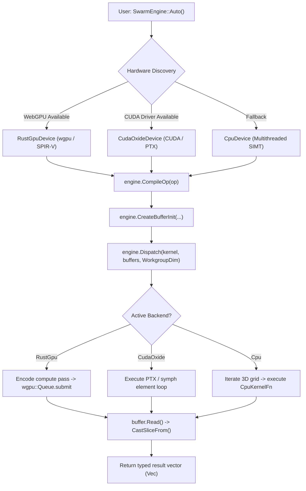

# Module Reference: `swarm` & `symph`

## 1. Overview & Purpose

The `swarm` and `symph` subsystems provide Kosh with a **unified, cross-platform heterogeneous compute platform**. Key capabilities include:
1. **Hardware Abstraction Layer (`swarm::traits`)**: Common traits (`IComputeDevice`, `IComputeBuffer`, `IComputeKernel`) unifying CPU multithreading, Rust-GPU (WebGPU/Vulkan), and Cuda-Oxide (CUDA driver/PTX).
2. **Enum-Dispatched Compute (`SwarmEngine`, `SwarmDevice`, `SwarmBuffer`, `SwarmKernel`)**: Eliminates dynamic virtual table lookup on critical dispatch loops.
3. **Pure Rust SPIR-V Shaders (`symph`)**: A portable crate that uses `#![no_std]` for SPIR-V builds and the standard library for host builds. It contains mathematical PRNGs, Collatz step counters, and SIMT kernel functions compiled for CPU execution and SPIR-V bytecodes via `rust-gpu`.
4. **Standard Compute Library (`StandardOp`)**: Out-of-the-box operations for vector doubling, vector addition, Collatz sequence generation, and 3D point cloud synthesis.

---

## 2. Architecture & Device Abstraction

```mermaid
classDiagram
    class IComputeDevice {
        <<trait>>
        +Backend() BackendKind
        +CreateBuffer(label, size, usage) Result~Box~IComputeBuffer~~
        +CreateBufferInit(label, data, usage) Result~Box~IComputeBuffer~~
        +CompileKernel(label, entryPoint, source) Result~Box~IComputeKernel~~
        +Dispatch(kernel, buffers, dim) Result
        +Synchronize() Result
    }

    class IComputeBuffer {
        <<trait>>
        +Size() U64
        +Label() &str
        +Write(data) Result
        +Read() Result~Vec~u8~~
    }

    class IComputeKernel {
        <<trait>>
        +Name() &str
        +Backend() BackendKind
    }

    class SwarmEngine {
        -device: SwarmDevice
        +New(backend) SwarmEngine
        +Auto() SwarmEngine
        +RunDouble(data) Buff~f32~
        +RunVectorAdd(a, b) Buff~f32~
        +RunCollatz(input) Buff~u32~
        +RunPointCloud(numPoints, spirv) Buff~[f32; 3]~
    }

    class SwarmDevice {
        <<enumeration>>
        Cpu(CpuDevice)
        RustGpu(RustGpuDevice)
        CudaOxide(CudaOxideDevice)
    }

    class SwarmBuffer {
        <<enumeration>>
        Cpu(CpuBuffer)
        RustGpu(RustGpuBuffer)
        CudaOxide(CudaOxideBuffer)
    }

    class SwarmKernel {
        <<enumeration>>
        Cpu(CpuKernel)
        RustGpu(RustGpuKernel)
        CudaOxide(CudaOxideKernel)
    }

    IComputeDevice <|.. SwarmDevice : implements
    IComputeDevice <|.. CpuDevice : implements
    IComputeDevice <|.. RustGpuDevice : implements
    IComputeDevice <|.. CudaOxideDevice : implements

    IComputeBuffer <|.. SwarmBuffer : implements
    IComputeBuffer <|.. CpuBuffer : implements
    IComputeBuffer <|.. RustGpuBuffer : implements
    IComputeBuffer <|.. CudaOxideBuffer : implements

    IComputeKernel <|.. SwarmKernel : implements
    IComputeKernel <|.. CpuKernel : implements
    IComputeKernel <|.. RustGpuKernel : implements
    IComputeKernel <|.. CudaOxideKernel : implements

    SwarmEngine *-- SwarmDevice : delegates
```

---

## 3. Kernel Dispatch & Execution Pipeline

---

## 4. `symph` Kernel Library (`src/symph/src/lib.rs`)

The `symph` crate is compiled as a `#![no_std]` module when targeting SPIR-V via `rust-gpu`:

| Function / Entrypoint | Target | Signature / Description |
| :--- | :--- | :--- |
| `wang_hash(seed: u32) -> u32` | Shared | High-performance integer PRNG hash using bit shifts and multiplicative constants. |
| `hash_to_float(h: u32) -> f32` | Shared | Normalizes 24-bit hash to $[0.0, 1.0)$ floating point value. |
| `collatz(n: u32) -> Option<u32>` | Shared | Computes Collatz trajectory step count with overflow guards. |
| `double_elem(idx, data)` | Shared | Element doubling: `data[idx] *= 2.0`. |
| `vector_add_elem(idx, a, b, out)` | Shared | Vector addition: `out[idx] = a[idx] + b[idx]`. |
| `collatz_elem(idx, in, out)` | Shared | Collatz sequence computation: `out[idx] = collatz(in[idx])`. |
| `pointcloud_elem(idx, out)` | Shared | Pseudo-random 3D point generator in $[-20, 20]^3$. |
| `camera_transform_elem(idx, in, params, out)` | Shared | 3D point cloud camera transformation, perspective projection, and depth scaling. |
| `frustum_cull_elem(idx, in, planes, out)` | Shared | Frustum plane bounding test for camera culling. |
| `pts_pointcloud_cs` | SPIR-V (GPU) | WebGPU compute shader dispatching 64 threads per workgroup to generate 3D `Vec4` points. |
| `camera_transform_cs` | SPIR-V (GPU) | WebGPU compute shader projecting 3D points with camera pan, zoom, and rotation parameters. |
| `frustum_cull_cs` | SPIR-V (GPU) | WebGPU compute shader testing 3D points against 6 camera frustum planes. |
| `scene_vs` | SPIR-V (GPU) | Hardware vertex shader projecting 3D vertices to NDC coordinates and calculating point size and depth color. |
| `scene_fs` | SPIR-V (GPU) | Hardware fragment shader rendering anti-aliased glowing point sprites directly on rasterizer. |

---

## 5. Struct Reference

### `SwarmEngine`
High-level compute orchestrator:
- `New(backend: BackendKind) -> Result<Self, SwarmError>`: Explicitly creates engine bound to `Cpu`, `RustGpu`, or `CudaOxide`.
- `Auto() -> Self`: Automatically queries available hardware (Vulkan/WebGPU $\to$ CUDA $\to$ CPU fallback).
- `CompileOp(&self, op: StandardOp) -> Result<Box<dyn IComputeKernel>, SwarmError>`: Compiles built-in operation for active device.
- `RunDouble(&self, data: &[f32]) -> Result<Buff<f32>, SwarmError>`: Doubles vector in-place.
- `RunVectorAdd(&self, a: &[f32], b: &[f32]) -> Result<Buff<f32>, SwarmError>`: Adds two float buffers.
- `RunCollatz(&self, input: &[u32]) -> Result<Buff<u32>, SwarmError>`: Computes Collatz sequence.
- `RunPointCloud(&self, numPoints: U32, spirvBytes: Option<&[u8]>) -> Result<Buff<[f32; 3]>, SwarmError>`: Synthesizes 3D point cloud dataset.
- `RunCameraTransform(&self, points: &[[f32; 3]], camParams: &[f32; 13], spirvBytes: Option<&[u8]>) -> Result<Buff<[f32; 6]>, SwarmError>`: Accelerates 3D camera transformation and perspective projection across GPU/CPU backends.

### `RustGpuDevice` & `RustGpuBuffer` & `RustGpuKernel`
WebGPU backend powered by `wgpu`:
- `Init() -> Result<Self, SwarmError>`: Requests high-performance adapter and device.
- `CreateBufferInit(...)`: Creates GPU storage buffer via `BufferInitDescriptor`.
- `CompileKernel(...)`: Compiles either WGSL or raw SPIR-V bytecodes into a `ComputePipeline`.
- `Dispatch(...)`: Encodes compute passes and submits command buffers to the GPU queue.
- `Read(...)`: Stages GPU storage buffer to mapped CPU memory.

### `CudaOxideDevice` & `CudaOxideBuffer` & `CudaOxideKernel`
CUDA driver & PTX backend:
- Executes element-wise kernels via shared `symph` algorithms with PTX translation headers.

### `CpuDevice` & `CpuBuffer` & `CpuKernel`
Multithreaded CPU SIMT runtime:
- Executes `CpuKernelFn` closures across available logical CPU cores using 64-element SIMT chunks.

---

## 6. Traits Reference

| Trait | Purpose | Key Methods |
| :--- | :--- | :--- |
| `IComputeDevice` | Compute hardware management and kernel dispatch | `Backend()`, `CreateBuffer()`, `CreateBufferInit()`, `CompileKernel()`, `Dispatch()`, `Synchronize()` |
| `IComputeBuffer` | Host and device storage buffer memory interface | `Size()`, `Label()`, `Write()`, `Read()`, `AsAny()` |
| `IComputeKernel` | Executable compiled shader or CPU closure | `Name()`, `Backend()`, `AsAny()` |
| `IGpuOp` | Helper trait extending `wgpu::Device` with convenient buffer lifecycle helpers | `Init()`, `BufferInit()`, `ReadBuffer()` |
